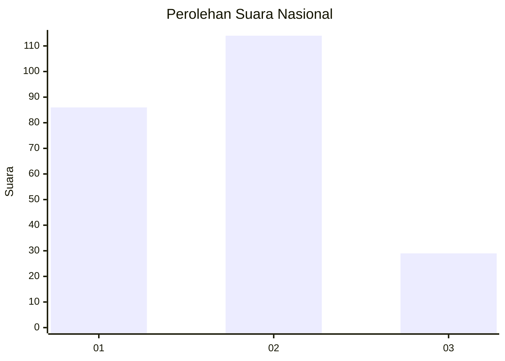
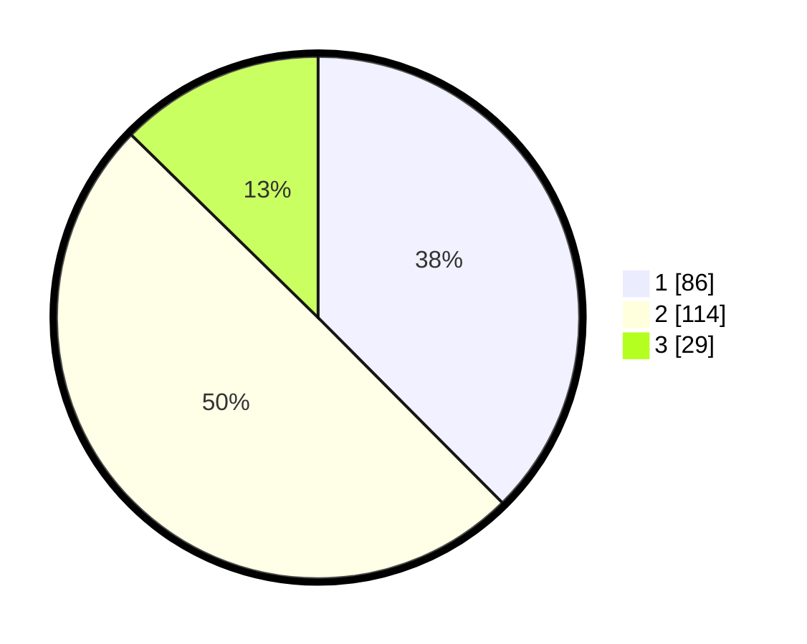

# Hasil

## Grafik

## Tabel

| No.    | Nama Paslon    | Suara | Suara (raw) | Persentase |
|:------ |:-------------- | -----:| -----------:| ----------:|
| 100025 | ANIES MUHAIMIN | 86    | [86][p-1]   | 37,55      |
| 100026 | PRABOWO GIBRAN | 114   | [114][p-2]  | 49,78      |
| 100027 | GANJAR MAHFUD  | 29    | [29][p-3]   | 12,66      |

[p-1]: https://github.com/gigit-pemilu/pemilu-2024/blob/main/pilpres/hitung-suara/sub/31-dki-jakarta/sub/74-jakarta-selatan/sub/05-kebayoran-lama/sub/1001-kebayoran-lama-utara/sub/047-tps/sub/paslon-1.txt
[p-2]: https://github.com/gigit-pemilu/pemilu-2024/blob/main/pilpres/hitung-suara/sub/31-dki-jakarta/sub/74-jakarta-selatan/sub/05-kebayoran-lama/sub/1001-kebayoran-lama-utara/sub/047-tps/sub/paslon-2.txt
[p-3]: https://github.com/gigit-pemilu/pemilu-2024/blob/main/pilpres/hitung-suara/sub/31-dki-jakarta/sub/74-jakarta-selatan/sub/05-kebayoran-lama/sub/1001-kebayoran-lama-utara/sub/047-tps/sub/paslon-3.txt

## Foto C Plano

https://sirekap-obj-formc.kpu.go.id/df08/pemilu/ppwp/31/74/05/10/01/3174051001047-20240214-220205--9548f34b-6a94-4ac6-af5f-f243cb054202.jpg

https://sirekap-obj-formc.kpu.go.id/df08/pemilu/ppwp/31/74/05/10/01/3174051001047-20240214-220048--0f83f75f-40cc-4636-8efb-e67e7ba503c2.jpg

https://sirekap-obj-formc.kpu.go.id/df08/pemilu/ppwp/31/74/05/10/01/3174051001047-20240214-193325--2f1fe50b-4f0b-4031-8c3b-7e85314faead.jpg

## Metadata

| Key        | Value               |
| ---------- | ------------------- |
| Time Stamp | 2024-02-24 22:31:28 |

