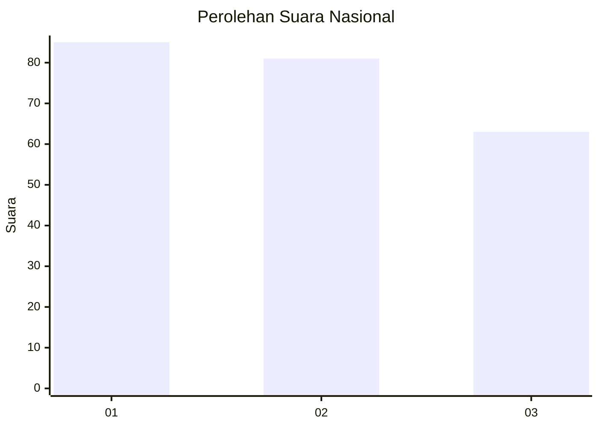
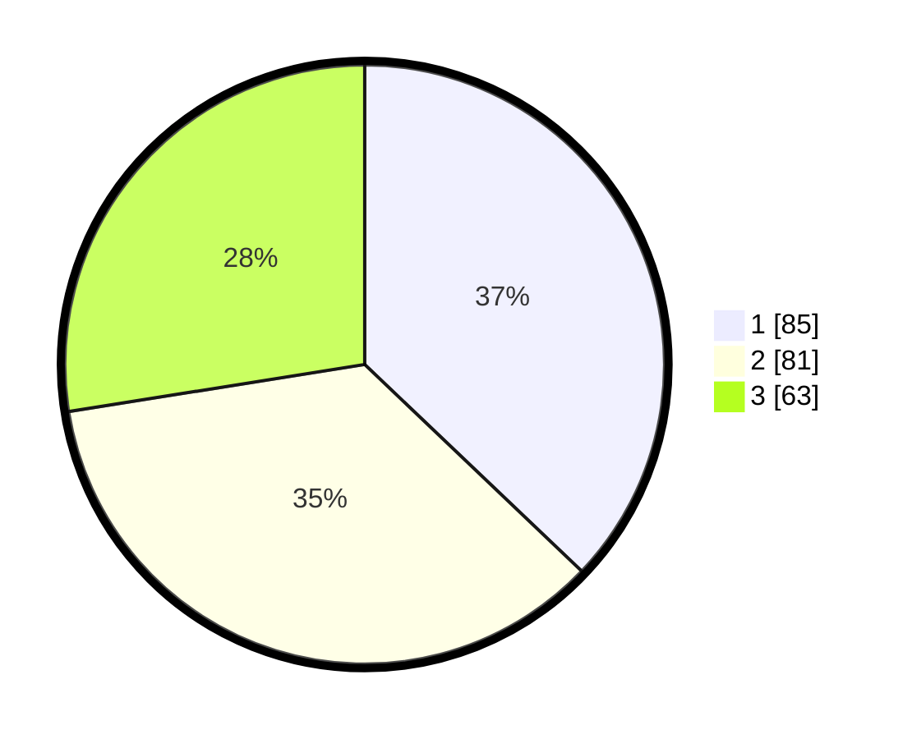

# Hasil

## Grafik

## Tabel

| No.    | Nama Paslon    | Suara | Suara (raw) | Persentase |
|:------ |:-------------- | -----:| -----------:| ----------:|
| 100025 | ANIES MUHAIMIN | 85    | [85][p-1]   | 37,12      |
| 100026 | PRABOWO GIBRAN | 81    | [81][p-2]   | 35,37      |
| 100027 | GANJAR MAHFUD  | 63    | [63][p-3]   | 27,51      |

[p-1]: https://github.com/gigit-pemilu/pemilu-2024/blob/main/pilpres/hitung-suara/sub/31-dki-jakarta/sub/74-jakarta-selatan/sub/05-kebayoran-lama/sub/1001-kebayoran-lama-utara/sub/057-tps/sub/paslon-1.txt
[p-2]: https://github.com/gigit-pemilu/pemilu-2024/blob/main/pilpres/hitung-suara/sub/31-dki-jakarta/sub/74-jakarta-selatan/sub/05-kebayoran-lama/sub/1001-kebayoran-lama-utara/sub/057-tps/sub/paslon-2.txt
[p-3]: https://github.com/gigit-pemilu/pemilu-2024/blob/main/pilpres/hitung-suara/sub/31-dki-jakarta/sub/74-jakarta-selatan/sub/05-kebayoran-lama/sub/1001-kebayoran-lama-utara/sub/057-tps/sub/paslon-3.txt

## Foto C Plano

https://sirekap-obj-formc.kpu.go.id/8412/pemilu/ppwp/31/74/05/10/01/3174051001057-20240214-210438--78cff19b-ec31-40eb-a75e-b2be2101d77e.jpg

https://sirekap-obj-formc.kpu.go.id/8412/pemilu/ppwp/31/74/05/10/01/3174051001057-20240214-211004--67184d7e-0f5e-43d1-a1cf-16f93d4bcc12.jpg

https://sirekap-obj-formc.kpu.go.id/8412/pemilu/ppwp/31/74/05/10/01/3174051001057-20240214-211714--1784c1e1-ada5-442a-be8f-e2217da41eee.jpg

## Metadata

| Key        | Value               |
| ---------- | ------------------- |
| Time Stamp | 2024-02-24 22:31:28 |

