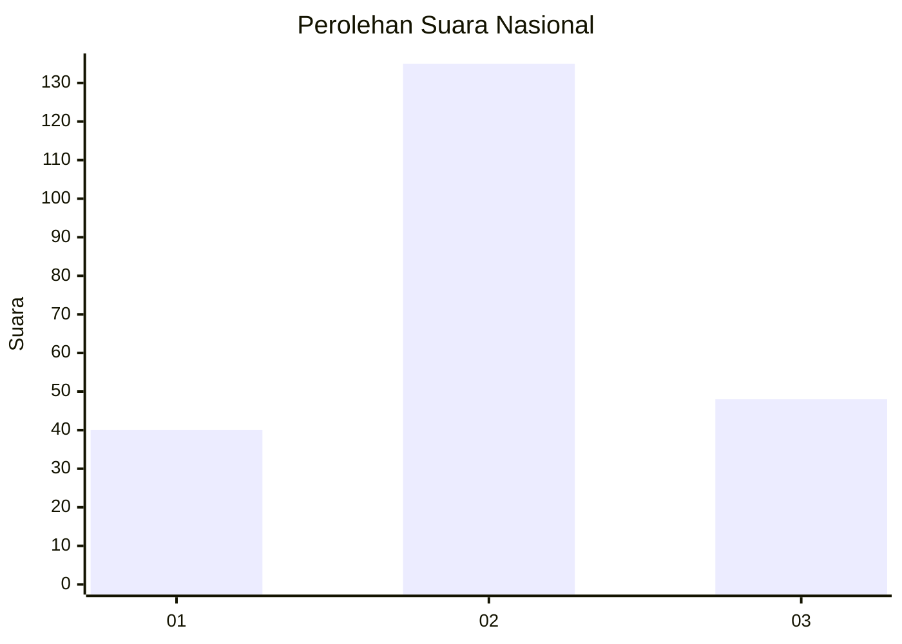
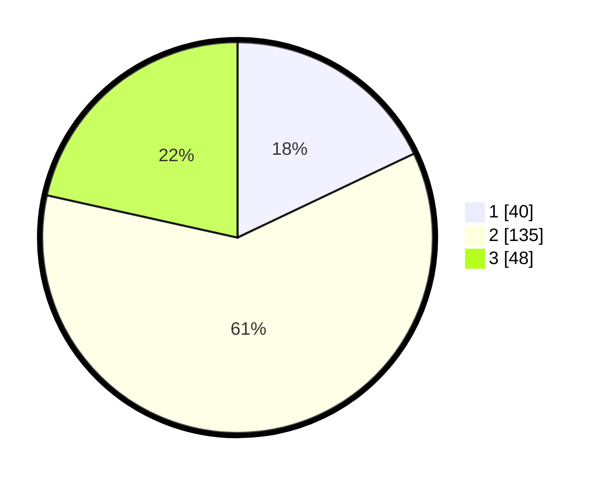

# Hasil

## Grafik

## Tabel

| No.    | Nama Paslon    | Suara | Suara (raw) | Persentase |
|:------ |:-------------- | -----:| -----------:| ----------:|
| 100025 | ANIES MUHAIMIN | 40    | [40][p-1]   | 17,94      |
| 100026 | PRABOWO GIBRAN | 135   | [135][p-2]  | 60,54      |
| 100027 | GANJAR MAHFUD  | 48    | [48][p-3]   | 21,52      |

[p-1]: https://github.com/gigit-pemilu/pemilu-2024/blob/main/pilpres/hitung-suara/sub/31-dki-jakarta/sub/74-jakarta-selatan/sub/05-kebayoran-lama/sub/1001-kebayoran-lama-utara/sub/076-tps/sub/paslon-1.txt
[p-2]: https://github.com/gigit-pemilu/pemilu-2024/blob/main/pilpres/hitung-suara/sub/31-dki-jakarta/sub/74-jakarta-selatan/sub/05-kebayoran-lama/sub/1001-kebayoran-lama-utara/sub/076-tps/sub/paslon-2.txt
[p-3]: https://github.com/gigit-pemilu/pemilu-2024/blob/main/pilpres/hitung-suara/sub/31-dki-jakarta/sub/74-jakarta-selatan/sub/05-kebayoran-lama/sub/1001-kebayoran-lama-utara/sub/076-tps/sub/paslon-3.txt

## Foto C Plano

https://sirekap-obj-formc.kpu.go.id/62ea/pemilu/ppwp/31/74/05/10/01/3174051001076-20240215-004635--635ff060-271f-4573-a56c-c13f80eb123a.jpg

https://sirekap-obj-formc.kpu.go.id/62ea/pemilu/ppwp/31/74/05/10/01/3174051001076-20240215-004833--82737e52-896b-4ea9-9546-c86e14725909.jpg

https://sirekap-obj-formc.kpu.go.id/62ea/pemilu/ppwp/31/74/05/10/01/3174051001076-20240215-005505--50a3ea5b-3df2-4be1-a469-270fc53df19d.jpg

## Metadata

| Key        | Value               |
| ---------- | ------------------- |
| Time Stamp | 2024-02-25 12:00:00 |

