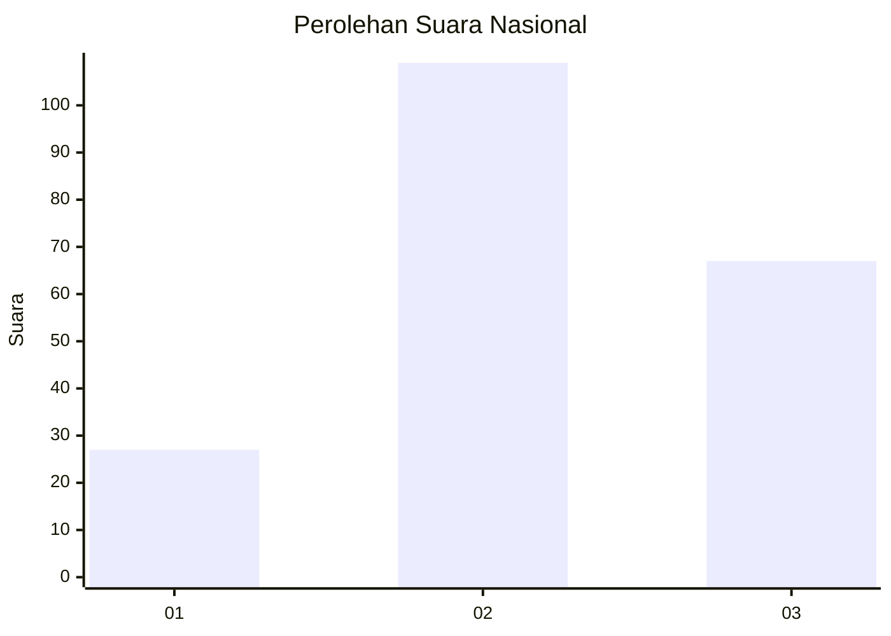
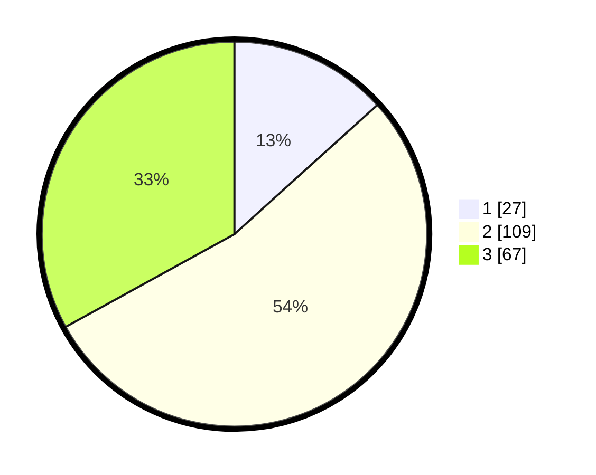

# Hasil

## Grafik

## Tabel

| No.    | Nama Paslon    | Suara | Suara (raw) | Persentase |
|:------ |:-------------- | -----:| -----------:| ----------:|
| 100025 | ANIES MUHAIMIN | 27    | [27][p-1]   | 13,30      |
| 100026 | PRABOWO GIBRAN | 109   | [109][p-2]  | 53,69      |
| 100027 | GANJAR MAHFUD  | 67    | [67][p-3]   | 33,00      |

[p-1]: https://github.com/gigit-pemilu/pemilu-2024/blob/main/pilpres/hitung-suara/sub/31-dki-jakarta/sub/74-jakarta-selatan/sub/05-kebayoran-lama/sub/1001-kebayoran-lama-utara/sub/078-tps/sub/paslon-1.txt
[p-2]: https://github.com/gigit-pemilu/pemilu-2024/blob/main/pilpres/hitung-suara/sub/31-dki-jakarta/sub/74-jakarta-selatan/sub/05-kebayoran-lama/sub/1001-kebayoran-lama-utara/sub/078-tps/sub/paslon-2.txt
[p-3]: https://github.com/gigit-pemilu/pemilu-2024/blob/main/pilpres/hitung-suara/sub/31-dki-jakarta/sub/74-jakarta-selatan/sub/05-kebayoran-lama/sub/1001-kebayoran-lama-utara/sub/078-tps/sub/paslon-3.txt

## Foto C Plano

https://sirekap-obj-formc.kpu.go.id/c054/pemilu/ppwp/31/74/05/10/01/3174051001078-20240215-170753--8c69414e-0188-4978-8d24-89406ee4b258.jpg

https://sirekap-obj-formc.kpu.go.id/c054/pemilu/ppwp/31/74/05/10/01/3174051001078-20240215-170858--2669203b-fb09-4536-bb4e-d6cd5ac5762b.jpg

https://sirekap-obj-formc.kpu.go.id/c054/pemilu/ppwp/31/74/05/10/01/3174051001078-20240215-170943--431405e2-c2cb-4f31-b8db-86842fe32b3c.jpg

## Metadata

| Key        | Value               |
| ---------- | ------------------- |
| Time Stamp | 2024-02-24 22:31:28 |

