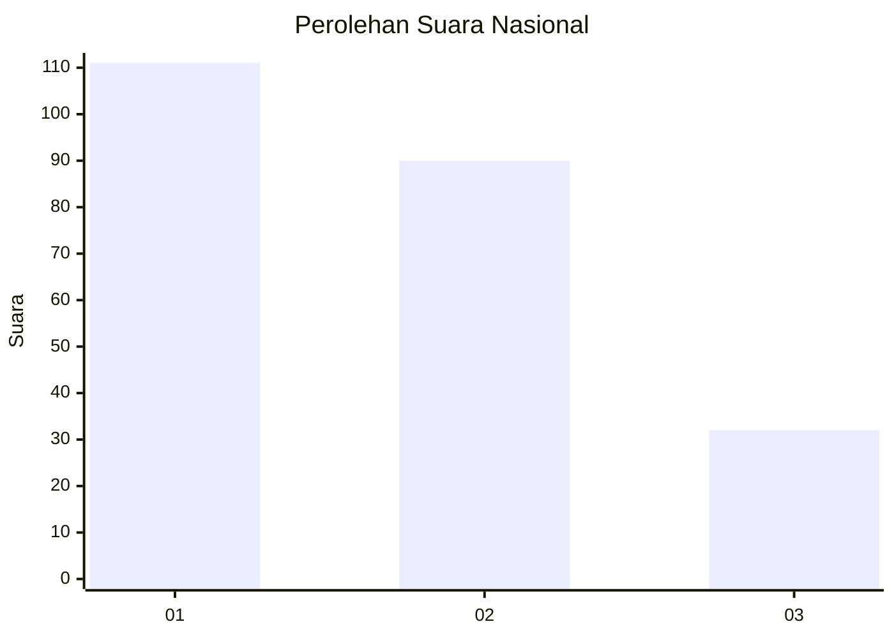
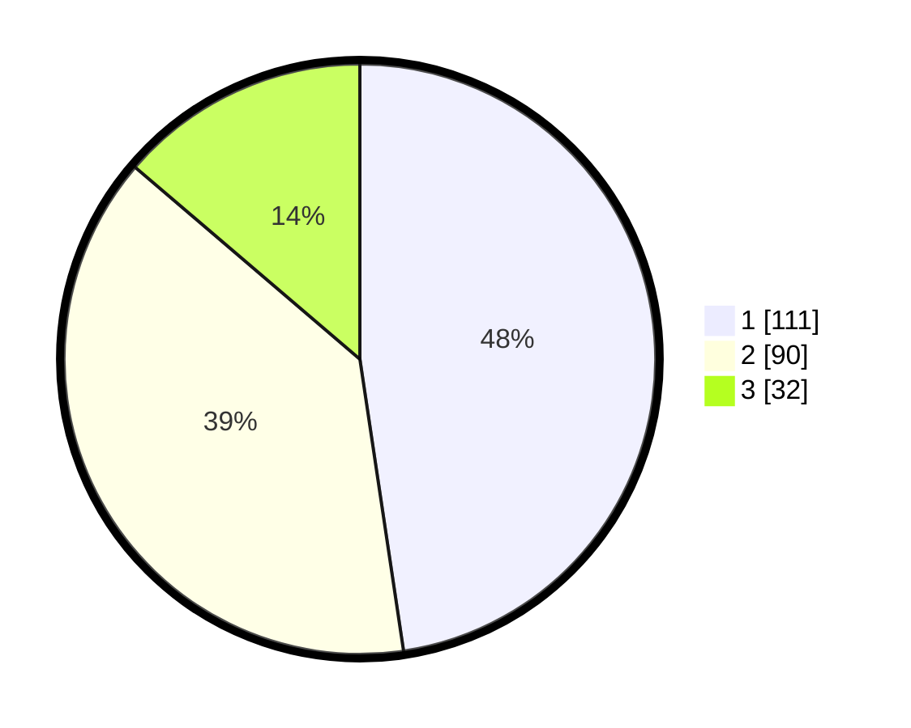

# Hasil

## Grafik

## Tabel

| No.    | Nama Paslon    | Suara | Suara (raw) | Persentase |
|:------ |:-------------- | -----:| -----------:| ----------:|
| 100025 | ANIES MUHAIMIN | 111   | [111][p-1]  | 47,64      |
| 100026 | PRABOWO GIBRAN | 90    | [90][p-2]   | 38,63      |
| 100027 | GANJAR MAHFUD  | 32    | [32][p-3]   | 13,73      |

[p-1]: https://github.com/gigit-pemilu/pemilu-2024/blob/main/pilpres/hitung-suara/sub/31-dki-jakarta/sub/74-jakarta-selatan/sub/05-kebayoran-lama/sub/1001-kebayoran-lama-utara/sub/084-tps/sub/paslon-1.txt
[p-2]: https://github.com/gigit-pemilu/pemilu-2024/blob/main/pilpres/hitung-suara/sub/31-dki-jakarta/sub/74-jakarta-selatan/sub/05-kebayoran-lama/sub/1001-kebayoran-lama-utara/sub/084-tps/sub/paslon-2.txt
[p-3]: https://github.com/gigit-pemilu/pemilu-2024/blob/main/pilpres/hitung-suara/sub/31-dki-jakarta/sub/74-jakarta-selatan/sub/05-kebayoran-lama/sub/1001-kebayoran-lama-utara/sub/084-tps/sub/paslon-3.txt

## Foto C Plano

https://sirekap-obj-formc.kpu.go.id/0036/pemilu/ppwp/31/74/05/10/01/3174051001084-20240214-220841--e5cd5c86-5f4a-46dc-aa6e-6fa2d7d9e630.jpg

https://sirekap-obj-formc.kpu.go.id/0036/pemilu/ppwp/31/74/05/10/01/3174051001084-20240214-220723--e12dd8ce-8b3f-42df-adb7-7d2513b2d48f.jpg

https://sirekap-obj-formc.kpu.go.id/0036/pemilu/ppwp/31/74/05/10/01/3174051001084-20240214-220833--149812f6-01e2-4c56-87c1-921247ecee7c.jpg

## Metadata

| Key        | Value               |
| ---------- | ------------------- |
| Time Stamp | 2024-02-24 22:31:28 |

