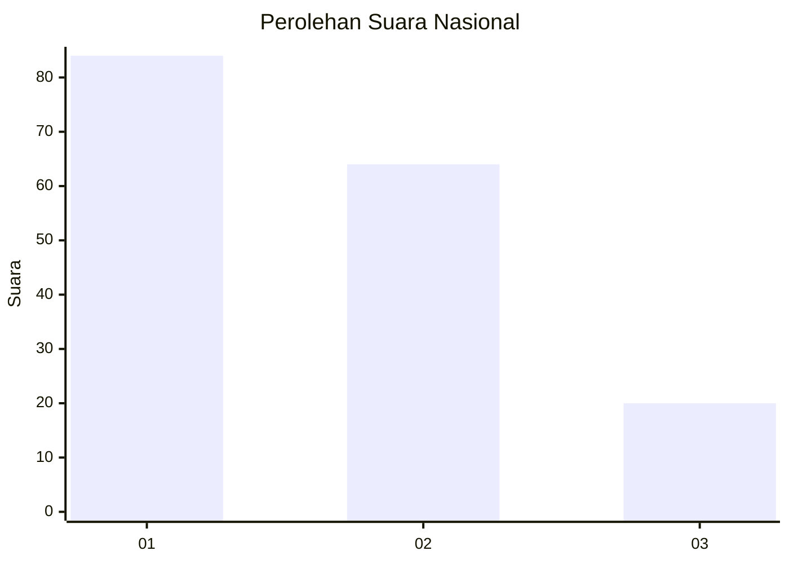
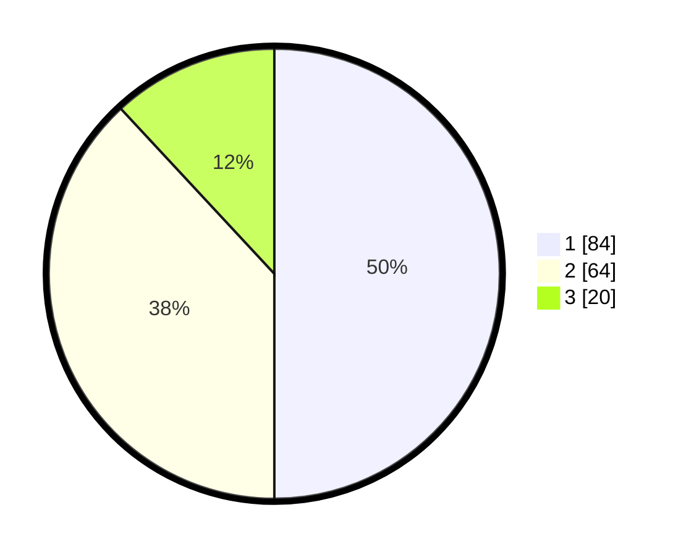

# Hasil

## Grafik

## Tabel

| No.    | Nama Paslon    | Suara | Suara (raw) | Persentase |
|:------ |:-------------- | -----:| -----------:| ----------:|
| 100025 | ANIES MUHAIMIN | 84    | [84][p-1]   | 50,00      |
| 100026 | PRABOWO GIBRAN | 64    | [64][p-2]   | 38,10      |
| 100027 | GANJAR MAHFUD  | 20    | [20][p-3]   | 11,90      |

[p-1]: https://github.com/gigit-pemilu/pemilu-2024/blob/main/pilpres/hitung-suara/sub/31-dki-jakarta/sub/74-jakarta-selatan/sub/05-kebayoran-lama/sub/1001-kebayoran-lama-utara/sub/088-tps/sub/paslon-1.txt
[p-2]: https://github.com/gigit-pemilu/pemilu-2024/blob/main/pilpres/hitung-suara/sub/31-dki-jakarta/sub/74-jakarta-selatan/sub/05-kebayoran-lama/sub/1001-kebayoran-lama-utara/sub/088-tps/sub/paslon-2.txt
[p-3]: https://github.com/gigit-pemilu/pemilu-2024/blob/main/pilpres/hitung-suara/sub/31-dki-jakarta/sub/74-jakarta-selatan/sub/05-kebayoran-lama/sub/1001-kebayoran-lama-utara/sub/088-tps/sub/paslon-3.txt

## Foto C Plano

https://sirekap-obj-formc.kpu.go.id/70d4/pemilu/ppwp/31/74/05/10/01/3174051001088-20240214-230423--1f049186-1aaa-4552-a2ed-3d9ba4ecbe18.jpg

https://sirekap-obj-formc.kpu.go.id/70d4/pemilu/ppwp/31/74/05/10/01/3174051001088-20240214-230550--6fbfcb06-3d54-4d44-87f5-d222bcef4f24.jpg

https://sirekap-obj-formc.kpu.go.id/70d4/pemilu/ppwp/31/74/05/10/01/3174051001088-20240214-230714--5b12c9bd-f3ee-4383-ad51-10378e8ebccc.jpg

## Metadata

| Key        | Value               |
| ---------- | ------------------- |
| Time Stamp | 2024-02-25 21:00:00 |

