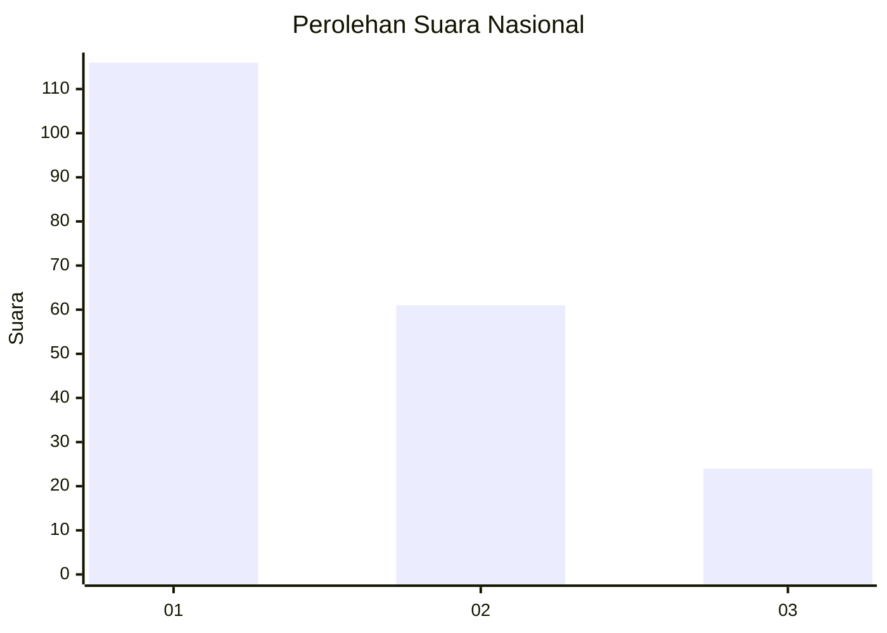
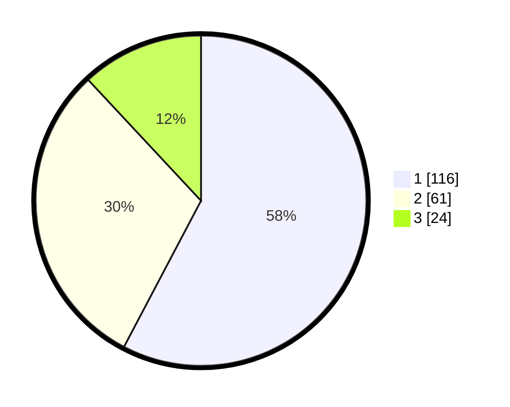

# Hasil

## Grafik

## Tabel

| No.    | Nama Paslon    | Suara | Suara (raw) | Persentase |
|:------ |:-------------- | -----:| -----------:| ----------:|
| 100025 | ANIES MUHAIMIN | 116   | [116][p-1]  | 57,71      |
| 100026 | PRABOWO GIBRAN | 61    | [61][p-2]   | 30,35      |
| 100027 | GANJAR MAHFUD  | 24    | [24][p-3]   | 11,94      |

[p-1]: https://github.com/gigit-pemilu/pemilu-2024/blob/main/pilpres/hitung-suara/sub/31-dki-jakarta/sub/74-jakarta-selatan/sub/05-kebayoran-lama/sub/1001-kebayoran-lama-utara/sub/091-tps/sub/paslon-1.txt
[p-2]: https://github.com/gigit-pemilu/pemilu-2024/blob/main/pilpres/hitung-suara/sub/31-dki-jakarta/sub/74-jakarta-selatan/sub/05-kebayoran-lama/sub/1001-kebayoran-lama-utara/sub/091-tps/sub/paslon-2.txt
[p-3]: https://github.com/gigit-pemilu/pemilu-2024/blob/main/pilpres/hitung-suara/sub/31-dki-jakarta/sub/74-jakarta-selatan/sub/05-kebayoran-lama/sub/1001-kebayoran-lama-utara/sub/091-tps/sub/paslon-3.txt

## Foto C Plano

https://sirekap-obj-formc.kpu.go.id/1237/pemilu/ppwp/31/74/05/10/01/3174051001091-20240215-025426--bb1bd47e-3617-4cb9-9d7f-b734562ad53c.jpg

https://sirekap-obj-formc.kpu.go.id/1237/pemilu/ppwp/31/74/05/10/01/3174051001091-20240215-025625--dad65f97-b449-46c4-a36b-0e6992aea594.jpg

https://sirekap-obj-formc.kpu.go.id/1237/pemilu/ppwp/31/74/05/10/01/3174051001091-20240215-025723--cf4040c5-af16-4421-9814-3b0c80e43085.jpg

## Metadata

| Key        | Value               |
| ---------- | ------------------- |
| Time Stamp | 2024-02-24 22:31:28 |

