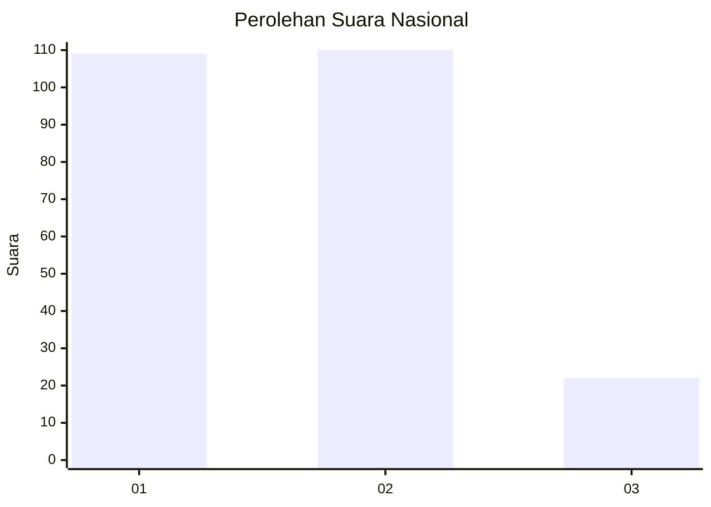
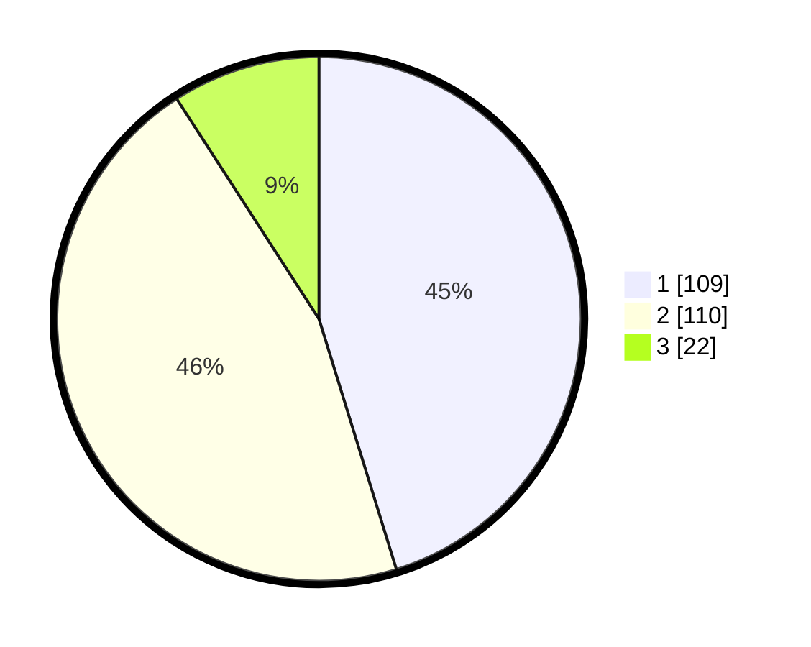

# Hasil

## Grafik

## Tabel

| No.    | Nama Paslon    | Suara | Suara (raw) | Persentase |
|:------ |:-------------- | -----:| -----------:| ----------:|
| 100025 | ANIES MUHAIMIN | 109   | [109][p-1]  | 45,23      |
| 100026 | PRABOWO GIBRAN | 110   | [110][p-2]  | 45,64      |
| 100027 | GANJAR MAHFUD  | 22    | [22][p-3]   | 9,13       |

[p-1]: https://github.com/gigit-pemilu/pemilu-2024/blob/main/pilpres/hitung-suara/sub/31-dki-jakarta/sub/74-jakarta-selatan/sub/05-kebayoran-lama/sub/1001-kebayoran-lama-utara/sub/101-tps/sub/paslon-1.txt
[p-2]: https://github.com/gigit-pemilu/pemilu-2024/blob/main/pilpres/hitung-suara/sub/31-dki-jakarta/sub/74-jakarta-selatan/sub/05-kebayoran-lama/sub/1001-kebayoran-lama-utara/sub/101-tps/sub/paslon-2.txt
[p-3]: https://github.com/gigit-pemilu/pemilu-2024/blob/main/pilpres/hitung-suara/sub/31-dki-jakarta/sub/74-jakarta-selatan/sub/05-kebayoran-lama/sub/1001-kebayoran-lama-utara/sub/101-tps/sub/paslon-3.txt

## Foto C Plano

https://sirekap-obj-formc.kpu.go.id/4dd1/pemilu/ppwp/31/74/05/10/01/3174051001101-20240214-212638--0fdbfb02-0c96-4a12-989a-067c1789e91b.jpg

https://sirekap-obj-formc.kpu.go.id/4dd1/pemilu/ppwp/31/74/05/10/01/3174051001101-20240214-213640--82ec2640-fec0-4773-bdf8-f798e020fb6b.jpg

https://sirekap-obj-formc.kpu.go.id/4dd1/pemilu/ppwp/31/74/05/10/01/3174051001101-20240214-213740--d3ae3568-01e9-43bd-a85e-d92b1a5ed4a1.jpg

## Metadata

| Key        | Value               |
| ---------- | ------------------- |
| Time Stamp | 2024-02-24 22:31:28 |

