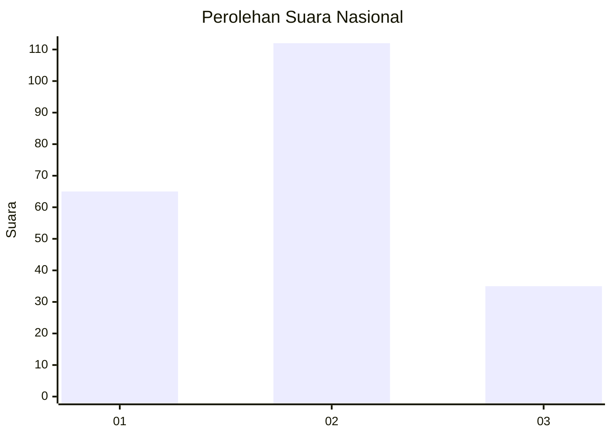
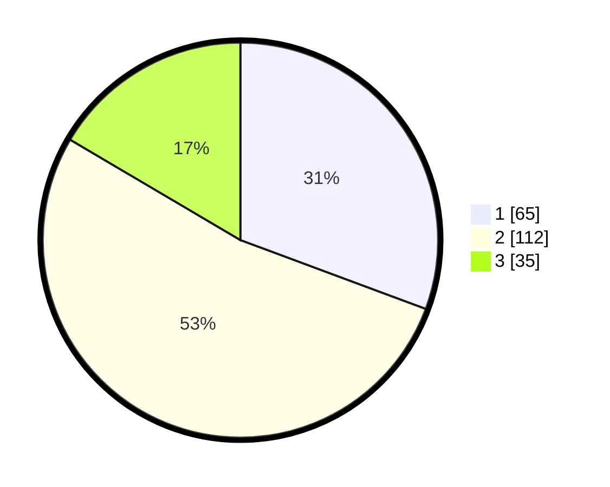

# Hasil

## Grafik

## Tabel

| No.    | Nama Paslon    | Suara | Suara (raw) | Persentase |
|:------ |:-------------- | -----:| -----------:| ----------:|
| 100025 | ANIES MUHAIMIN | 65    | [65][p-1]   | 30,66      |
| 100026 | PRABOWO GIBRAN | 112   | [112][p-2]  | 52,83      |
| 100027 | GANJAR MAHFUD  | 35    | [35][p-3]   | 16,51      |

[p-1]: https://github.com/gigit-pemilu/pemilu-2024/blob/main/pilpres/hitung-suara/sub/31-dki-jakarta/sub/74-jakarta-selatan/sub/05-kebayoran-lama/sub/1001-kebayoran-lama-utara/sub/114-tps/sub/paslon-1.txt
[p-2]: https://github.com/gigit-pemilu/pemilu-2024/blob/main/pilpres/hitung-suara/sub/31-dki-jakarta/sub/74-jakarta-selatan/sub/05-kebayoran-lama/sub/1001-kebayoran-lama-utara/sub/114-tps/sub/paslon-2.txt
[p-3]: https://github.com/gigit-pemilu/pemilu-2024/blob/main/pilpres/hitung-suara/sub/31-dki-jakarta/sub/74-jakarta-selatan/sub/05-kebayoran-lama/sub/1001-kebayoran-lama-utara/sub/114-tps/sub/paslon-3.txt

## Foto C Plano

https://sirekap-obj-formc.kpu.go.id/b285/pemilu/ppwp/31/74/05/10/01/3174051001114-20240215-014022--e731546a-465a-43a6-9b1a-a2b85538cf35.jpg

https://sirekap-obj-formc.kpu.go.id/b285/pemilu/ppwp/31/74/05/10/01/3174051001114-20240215-014234--813b49e9-3851-436a-892d-28647f6b5cbc.jpg

https://sirekap-obj-formc.kpu.go.id/b285/pemilu/ppwp/31/74/05/10/01/3174051001114-20240215-014331--abd440d0-5451-460b-8ab4-0a8397b69328.jpg

## Metadata

| Key        | Value               |
| ---------- | ------------------- |
| Time Stamp | 2024-02-24 22:31:28 |

