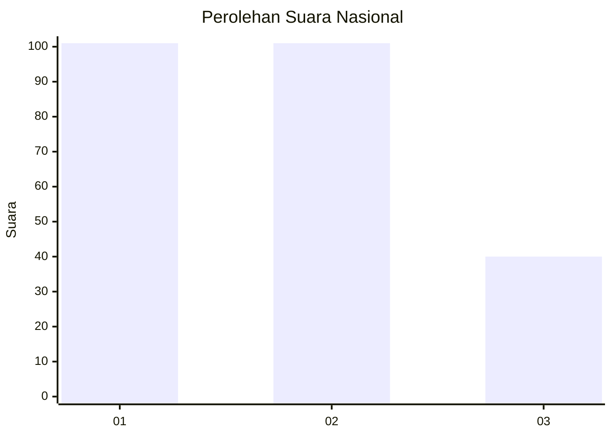
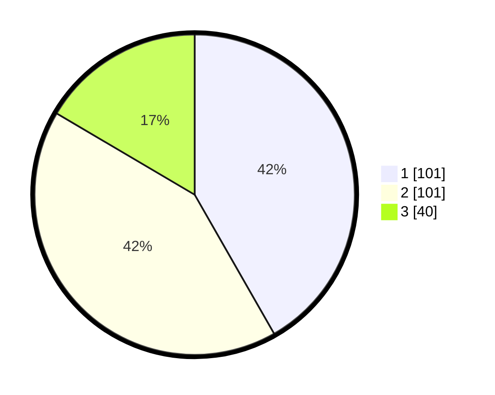

# Hasil

## Grafik

## Tabel

| No.    | Nama Paslon    | Suara | Suara (raw) | Persentase |
|:------ |:-------------- | -----:| -----------:| ----------:|
| 100025 | ANIES MUHAIMIN | 101   | [101][p-1]  | 41,74      |
| 100026 | PRABOWO GIBRAN | 101   | [101][p-2]  | 41,74      |
| 100027 | GANJAR MAHFUD  | 40    | [40][p-3]   | 16,53      |

[p-1]: https://github.com/gigit-pemilu/pemilu-2024/blob/main/pilpres/hitung-suara/sub/31-dki-jakarta/sub/74-jakarta-selatan/sub/05-kebayoran-lama/sub/1001-kebayoran-lama-utara/sub/122-tps/sub/paslon-1.txt
[p-2]: https://github.com/gigit-pemilu/pemilu-2024/blob/main/pilpres/hitung-suara/sub/31-dki-jakarta/sub/74-jakarta-selatan/sub/05-kebayoran-lama/sub/1001-kebayoran-lama-utara/sub/122-tps/sub/paslon-2.txt
[p-3]: https://github.com/gigit-pemilu/pemilu-2024/blob/main/pilpres/hitung-suara/sub/31-dki-jakarta/sub/74-jakarta-selatan/sub/05-kebayoran-lama/sub/1001-kebayoran-lama-utara/sub/122-tps/sub/paslon-3.txt

## Foto C Plano

https://sirekap-obj-formc.kpu.go.id/d05d/pemilu/ppwp/31/74/05/10/01/3174051001122-20240214-222708--5e1d0f50-8bd9-40e1-be7c-b0a0ffd73a8b.jpg

https://sirekap-obj-formc.kpu.go.id/d05d/pemilu/ppwp/31/74/05/10/01/3174051001122-20240214-222847--664fe2f4-2282-4cb4-ac8c-2f0e2ea22882.jpg

https://sirekap-obj-formc.kpu.go.id/d05d/pemilu/ppwp/31/74/05/10/01/3174051001122-20240214-222949--fb79b2ad-f70b-4a58-880a-609350bf38b1.jpg

## Metadata

| Key        | Value               |
| ---------- | ------------------- |
| Time Stamp | 2024-02-24 22:31:28 |

