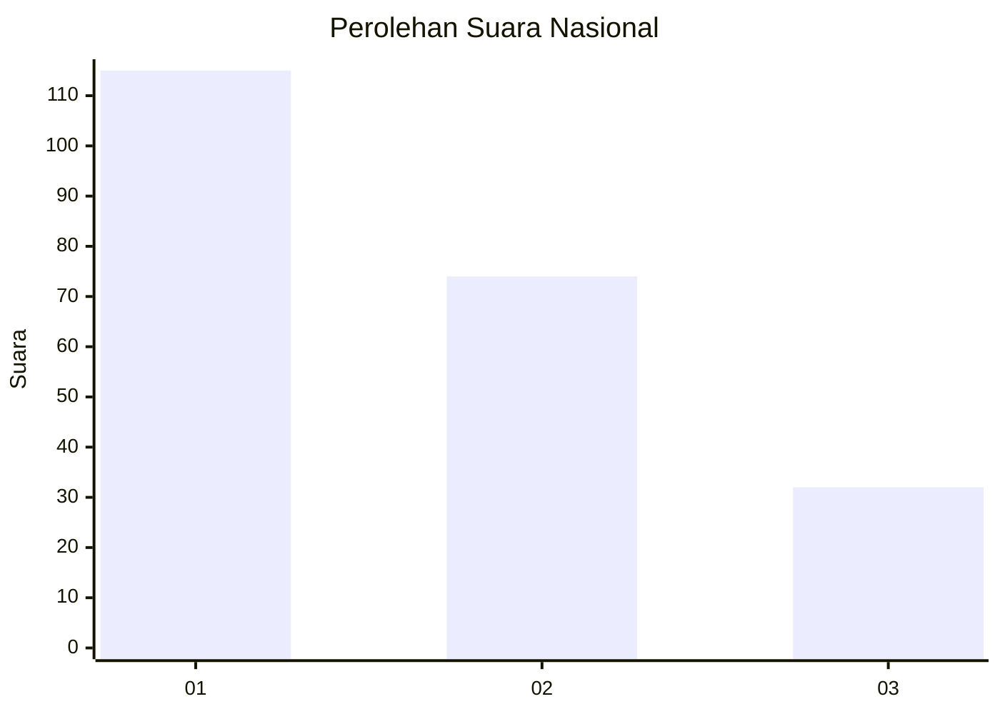
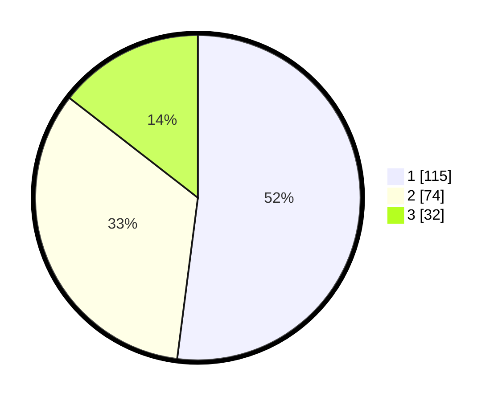

# Hasil

## Grafik

## Tabel

| No.    | Nama Paslon    | Suara | Suara (raw) | Persentase |
|:------ |:-------------- | -----:| -----------:| ----------:|
| 100025 | ANIES MUHAIMIN | 115   | [115][p-1]  | 52,04      |
| 100026 | PRABOWO GIBRAN | 74    | [74][p-2]   | 33,48      |
| 100027 | GANJAR MAHFUD  | 32    | [32][p-3]   | 14,48      |

[p-1]: https://github.com/gigit-pemilu/pemilu-2024/blob/main/pilpres/hitung-suara/sub/31-dki-jakarta/sub/74-jakarta-selatan/sub/05-kebayoran-lama/sub/1001-kebayoran-lama-utara/sub/127-tps/sub/paslon-1.txt
[p-2]: https://github.com/gigit-pemilu/pemilu-2024/blob/main/pilpres/hitung-suara/sub/31-dki-jakarta/sub/74-jakarta-selatan/sub/05-kebayoran-lama/sub/1001-kebayoran-lama-utara/sub/127-tps/sub/paslon-2.txt
[p-3]: https://github.com/gigit-pemilu/pemilu-2024/blob/main/pilpres/hitung-suara/sub/31-dki-jakarta/sub/74-jakarta-selatan/sub/05-kebayoran-lama/sub/1001-kebayoran-lama-utara/sub/127-tps/sub/paslon-3.txt

## Foto C Plano

https://sirekap-obj-formc.kpu.go.id/e9f5/pemilu/ppwp/31/74/05/10/01/3174051001127-20240215-013738--95efcd70-54b0-40a0-80ad-08419d5503df.jpg

https://sirekap-obj-formc.kpu.go.id/e9f5/pemilu/ppwp/31/74/05/10/01/3174051001127-20240215-013830--3d66c3d3-5ee4-416f-9355-0c963fda0b58.jpg

https://sirekap-obj-formc.kpu.go.id/e9f5/pemilu/ppwp/31/74/05/10/01/3174051001127-20240215-013948--4f9f34d4-c84f-451f-88dd-7884dbf80ba7.jpg

## Metadata

| Key        | Value               |
| ---------- | ------------------- |
| Time Stamp | 2024-02-25 14:00:00 |

