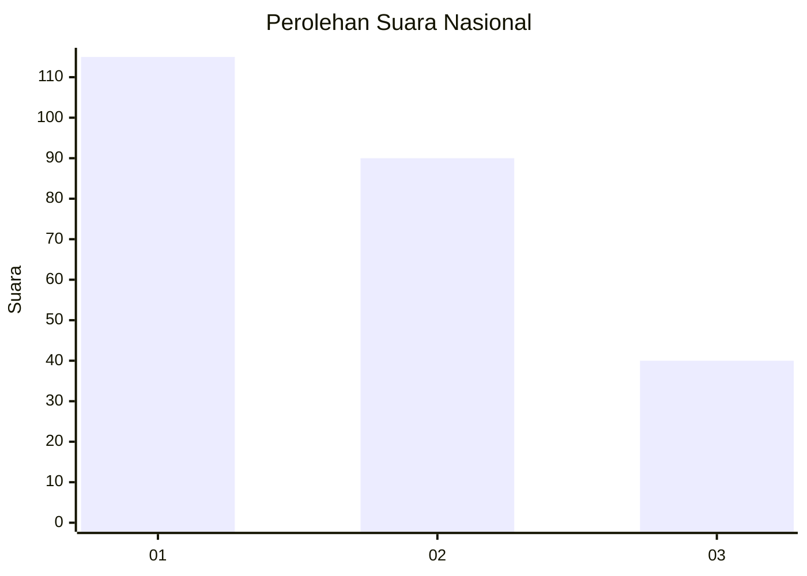
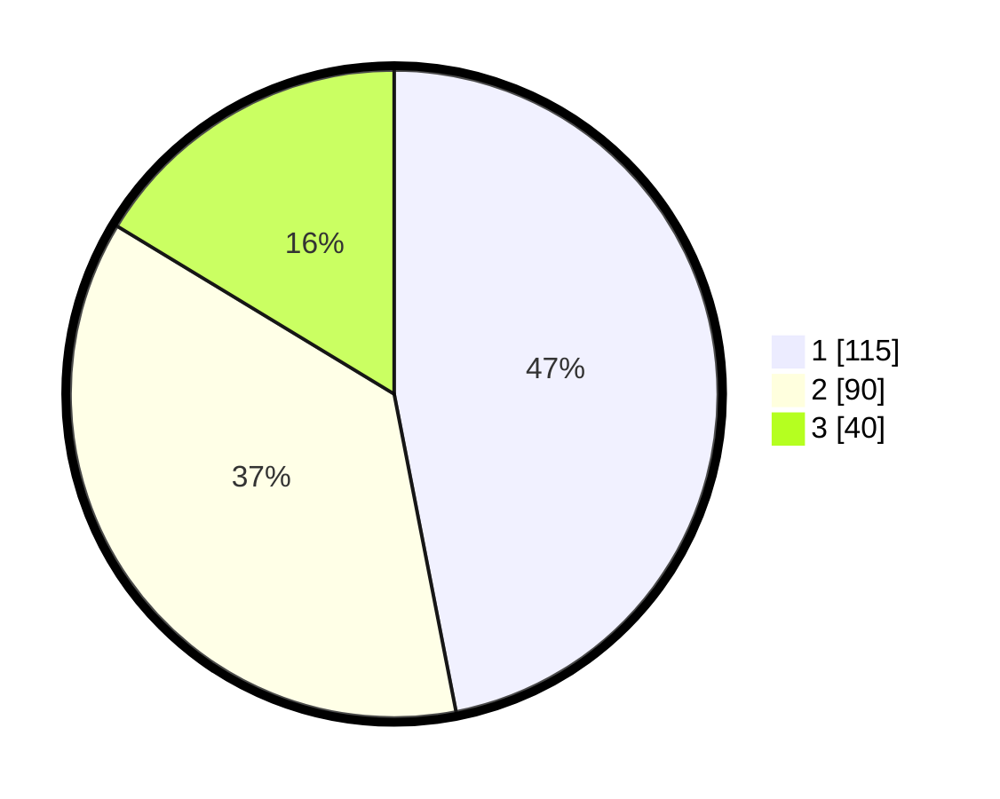

# Hasil

## Grafik

## Tabel

| No.    | Nama Paslon    | Suara | Suara (raw) | Persentase |
|:------ |:-------------- | -----:| -----------:| ----------:|
| 100025 | ANIES MUHAIMIN | 115   | [115][p-1]  | 46,94      |
| 100026 | PRABOWO GIBRAN | 90    | [90][p-2]   | 36,73      |
| 100027 | GANJAR MAHFUD  | 40    | [40][p-3]   | 16,33      |

[p-1]: https://github.com/gigit-pemilu/pemilu-2024/blob/main/pilpres/hitung-suara/sub/31-dki-jakarta/sub/74-jakarta-selatan/sub/05-kebayoran-lama/sub/1001-kebayoran-lama-utara/sub/133-tps/sub/paslon-1.txt
[p-2]: https://github.com/gigit-pemilu/pemilu-2024/blob/main/pilpres/hitung-suara/sub/31-dki-jakarta/sub/74-jakarta-selatan/sub/05-kebayoran-lama/sub/1001-kebayoran-lama-utara/sub/133-tps/sub/paslon-2.txt
[p-3]: https://github.com/gigit-pemilu/pemilu-2024/blob/main/pilpres/hitung-suara/sub/31-dki-jakarta/sub/74-jakarta-selatan/sub/05-kebayoran-lama/sub/1001-kebayoran-lama-utara/sub/133-tps/sub/paslon-3.txt

## Foto C Plano

https://sirekap-obj-formc.kpu.go.id/8e4f/pemilu/ppwp/31/74/05/10/01/3174051001133-20240215-014311--0c78d18a-4859-4e42-8a07-30d0820c76ad.jpg

https://sirekap-obj-formc.kpu.go.id/8e4f/pemilu/ppwp/31/74/05/10/01/3174051001133-20240215-014346--76e97283-5b40-4d11-8309-7822c2530d83.jpg

https://sirekap-obj-formc.kpu.go.id/8e4f/pemilu/ppwp/31/74/05/10/01/3174051001133-20240215-014219--7f7fe25d-6237-4ac2-b8ea-a8e5cb1d9ccd.jpg

## Metadata

| Key        | Value               |
| ---------- | ------------------- |
| Time Stamp | 2024-02-26 11:00:00 |

