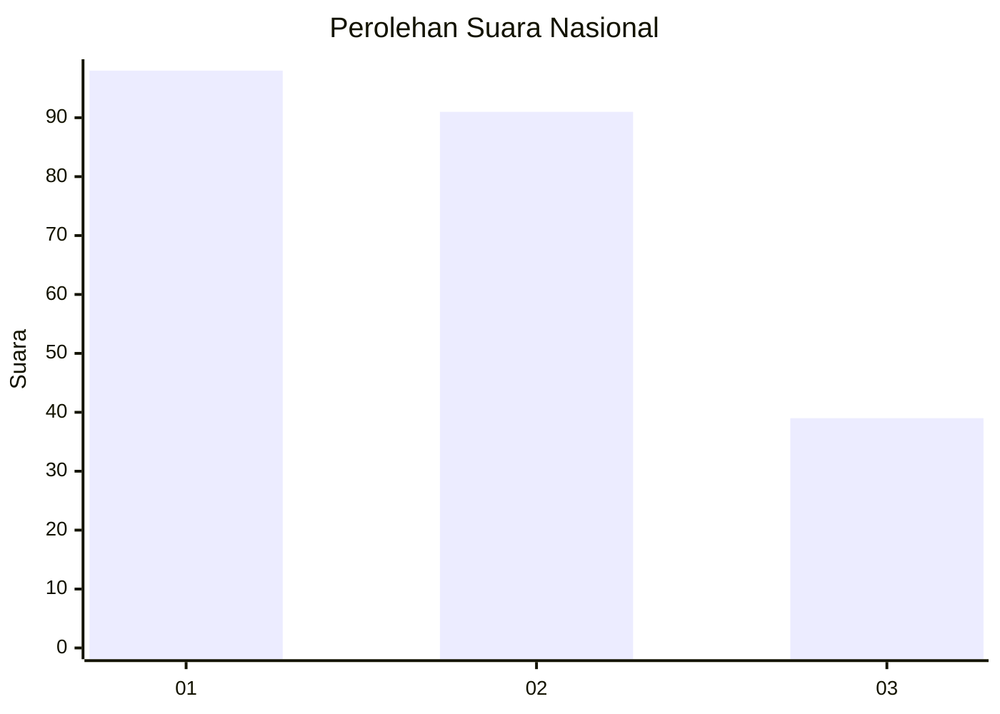
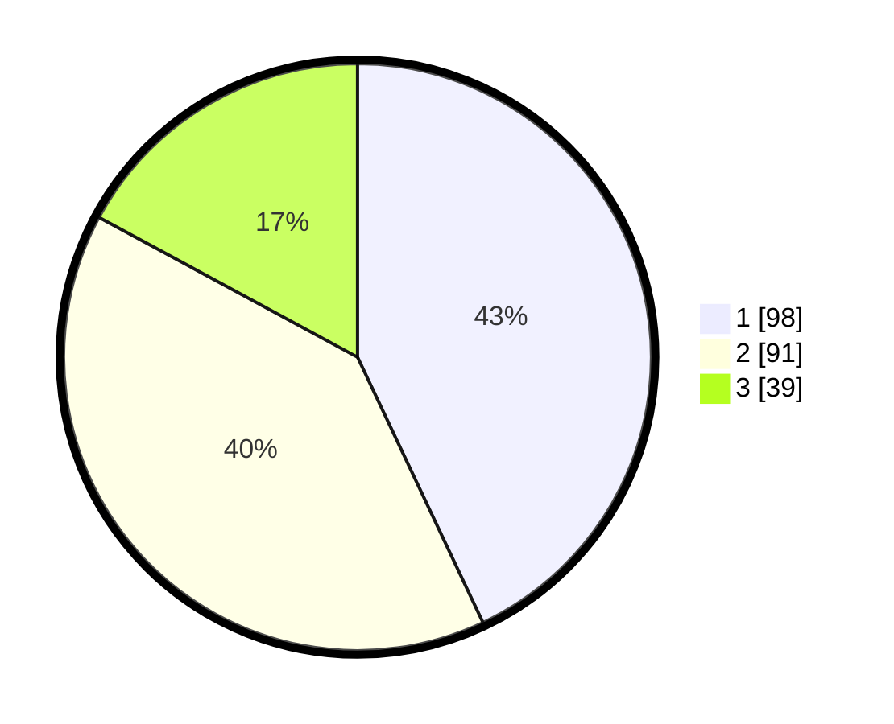

# Hasil

## Grafik

## Tabel

| No.    | Nama Paslon    | Suara | Suara (raw) | Persentase |
|:------ |:-------------- | -----:| -----------:| ----------:|
| 100025 | ANIES MUHAIMIN | 98    | [98][p-1]   | 42,98      |
| 100026 | PRABOWO GIBRAN | 91    | [91][p-2]   | 39,91      |
| 100027 | GANJAR MAHFUD  | 39    | [39][p-3]   | 17,11      |

[p-1]: https://github.com/gigit-pemilu/pemilu-2024/blob/main/pilpres/hitung-suara/sub/31-dki-jakarta/sub/74-jakarta-selatan/sub/05-kebayoran-lama/sub/1001-kebayoran-lama-utara/sub/135-tps/sub/paslon-1.txt
[p-2]: https://github.com/gigit-pemilu/pemilu-2024/blob/main/pilpres/hitung-suara/sub/31-dki-jakarta/sub/74-jakarta-selatan/sub/05-kebayoran-lama/sub/1001-kebayoran-lama-utara/sub/135-tps/sub/paslon-2.txt
[p-3]: https://github.com/gigit-pemilu/pemilu-2024/blob/main/pilpres/hitung-suara/sub/31-dki-jakarta/sub/74-jakarta-selatan/sub/05-kebayoran-lama/sub/1001-kebayoran-lama-utara/sub/135-tps/sub/paslon-3.txt

## Foto C Plano

https://sirekap-obj-formc.kpu.go.id/bdd3/pemilu/ppwp/31/74/05/10/01/3174051001135-20240214-224715--2efb00bf-2eda-4b35-be55-057f42a65c30.jpg

https://sirekap-obj-formc.kpu.go.id/bdd3/pemilu/ppwp/31/74/05/10/01/3174051001135-20240214-214855--08011f3d-3abf-4e7c-b7e7-cb09c216a604.jpg

https://sirekap-obj-formc.kpu.go.id/bdd3/pemilu/ppwp/31/74/05/10/01/3174051001135-20240214-210853--bbe6e376-56af-43bd-b65a-95e0b6301379.jpg

## Metadata

| Key        | Value               |
| ---------- | ------------------- |
| Time Stamp | 2024-02-15 22:40:13 |

