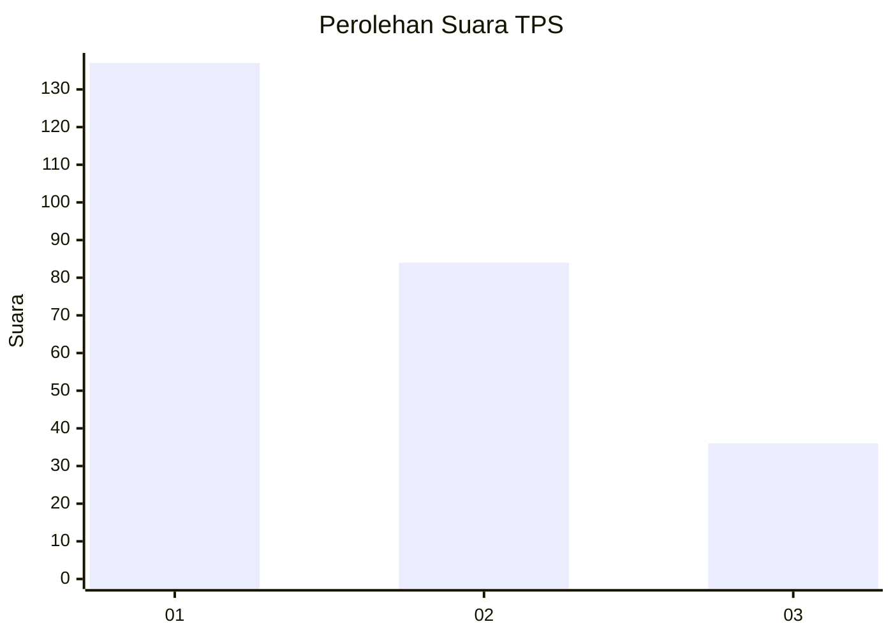
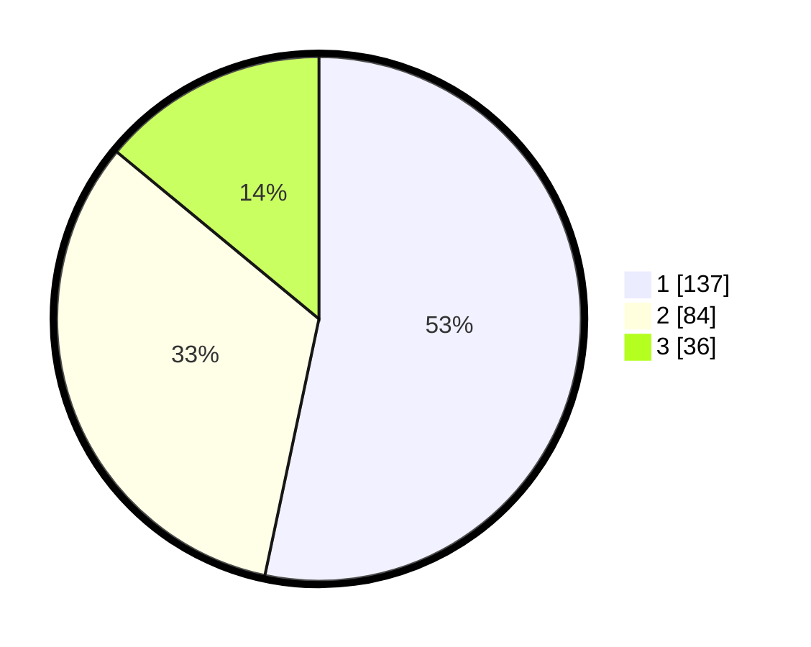

# Hasil

## Grafik

## Tabel

| No. | Nama Paslon    | Suara | Suara (raw) | Persentase |
|:--- |:-------------- | -----:| -----------:| ----------:|
| 1   | ANIES MUHAIMIN | 137   | [137][p-1]  | 53,31      |
| 2   | PRABOWO GIBRAN | 84    | [84][p-2]   | 32,68      |
| 3   | GANJAR MAHFUD  | 36    | [36][p-3]   | 14,01      |

[p-1]: https://github.com/gigit-pemilu/pemilu-2024-31-dki-jakarta/blob/main/pilpres/hitung-suara/sub/31-dki-jakarta/sub/74-jakarta-selatan/sub/05-kebayoran-lama/sub/1002-pondok-pinang/sub/002-tps/sub/paslon-1.txt
[p-2]: https://github.com/gigit-pemilu/pemilu-2024-31-dki-jakarta/blob/main/pilpres/hitung-suara/sub/31-dki-jakarta/sub/74-jakarta-selatan/sub/05-kebayoran-lama/sub/1002-pondok-pinang/sub/002-tps/sub/paslon-2.txt
[p-3]: https://github.com/gigit-pemilu/pemilu-2024-31-dki-jakarta/blob/main/pilpres/hitung-suara/sub/31-dki-jakarta/sub/74-jakarta-selatan/sub/05-kebayoran-lama/sub/1002-pondok-pinang/sub/002-tps/sub/paslon-3.txt

## Foto C Plano

https://sirekap-obj-formc.kpu.go.id/213b/pemilu/ppwp/31/74/05/10/02/3174051002002-20240217-143318--db764822-1410-46e1-bce2-5c9f1ad82bc7.jpg

https://sirekap-obj-formc.kpu.go.id/213b/pemilu/ppwp/31/74/05/10/02/3174051002002-20240217-143449--bb6f88e0-dbb4-49aa-975f-a90f3fa47f95.jpg

https://sirekap-obj-formc.kpu.go.id/213b/pemilu/ppwp/31/74/05/10/02/3174051002002-20240217-143621--f96d4af4-03db-4c06-9f77-5121cd3e0b27.jpg

## Metadata

| Key        | Value               |
| ---------- | ------------------- |
| Time Stamp | 2024-02-20 11:00:00 |

## DATA PEMILIH TETAP

Jumlah pemilih dalam DPT: **0**.
 * L: **0**.
 * P: **0**.

## DATA PENGGUNA HAK PILIH

Jumlah pengguna hak pilih dalam DPT: **828**.
 * L: **503**.
 * P: **775**.

Jumlah pengguna hak pilih dalam DPTb: **888**.
 * L: **808**.
 * P: **850**.

Jumlah pengguna hak pilih dalam DPK: **253**.
 * L: **137**.
 * P: **229**.

Jumlah pengguna hak pilih: **0**.
 * L: **0**.
 * P: **0**.

## JUMLAH SUARA SAH DAN TIDAK SAH

JUMLAH SELURUH SUARA SAH: **257**.

JUMLAH SUARA TIDAK SAH: **1**.

JUMLAH SELURUH SUARA SAH DAN SUARA TIDAK SAH: **258**.

