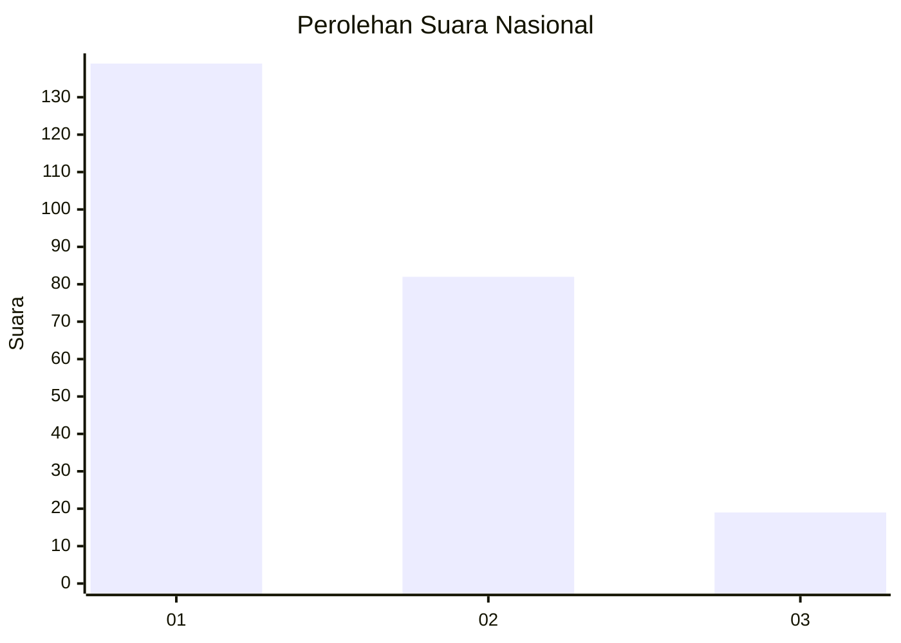
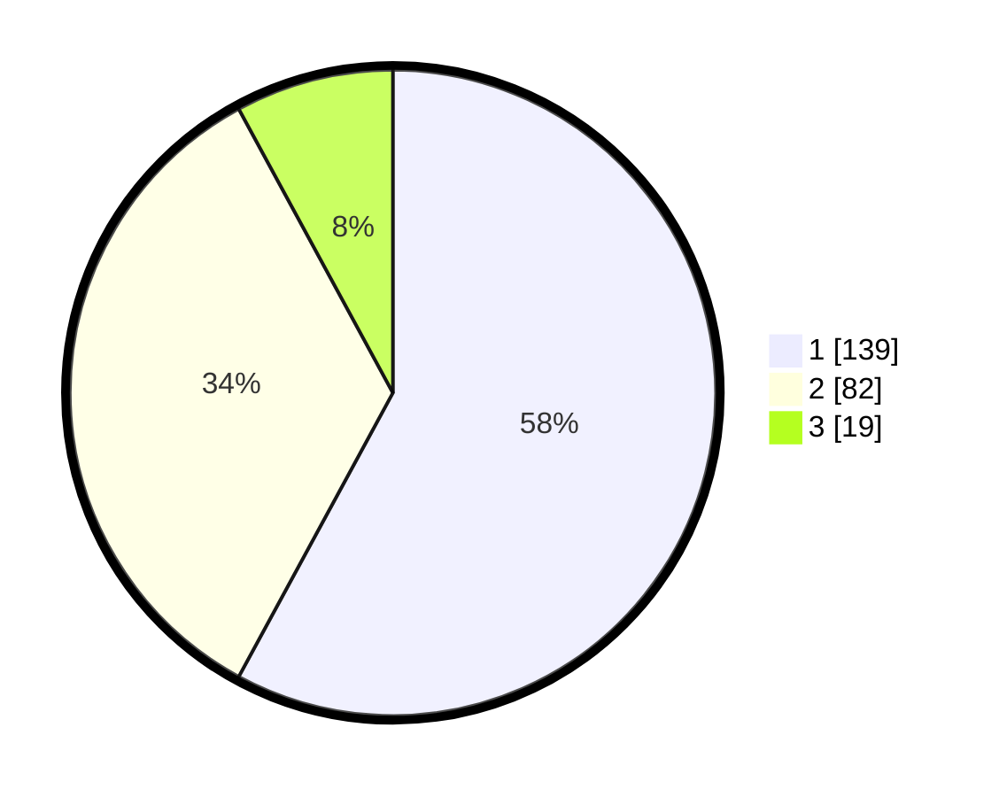

# Hasil

## Grafik

## Tabel

| No.    | Nama Paslon    | Suara | Suara (raw) | Persentase |
|:------ |:-------------- | -----:| -----------:| ----------:|
| 100025 | ANIES MUHAIMIN | 139   | [139][p-1]  | 57,92      |
| 100026 | PRABOWO GIBRAN | 82    | [82][p-2]   | 34,17      |
| 100027 | GANJAR MAHFUD  | 19    | [19][p-3]   | 7,92       |

[p-1]: https://github.com/gigit-pemilu/pemilu-2024/blob/main/pilpres/hitung-suara/sub/31-dki-jakarta/sub/74-jakarta-selatan/sub/05-kebayoran-lama/sub/1002-pondok-pinang/sub/003-tps/sub/paslon-1.txt
[p-2]: https://github.com/gigit-pemilu/pemilu-2024/blob/main/pilpres/hitung-suara/sub/31-dki-jakarta/sub/74-jakarta-selatan/sub/05-kebayoran-lama/sub/1002-pondok-pinang/sub/003-tps/sub/paslon-2.txt
[p-3]: https://github.com/gigit-pemilu/pemilu-2024/blob/main/pilpres/hitung-suara/sub/31-dki-jakarta/sub/74-jakarta-selatan/sub/05-kebayoran-lama/sub/1002-pondok-pinang/sub/003-tps/sub/paslon-3.txt

## Foto C Plano

https://sirekap-obj-formc.kpu.go.id/dd9c/pemilu/ppwp/31/74/05/10/02/3174051002003-20240214-194912--8b7c0666-bf3d-4b73-a89f-7edb0c8c9eb3.jpg

https://sirekap-obj-formc.kpu.go.id/dd9c/pemilu/ppwp/31/74/05/10/02/3174051002003-20240214-193642--b7b9babe-136d-42dc-94e6-5bc5911e498e.jpg

https://sirekap-obj-formc.kpu.go.id/dd9c/pemilu/ppwp/31/74/05/10/02/3174051002003-20240214-200254--d95c0daf-30da-4330-87b1-379b36e574e9.jpg

## Metadata

| Key        | Value               |
| ---------- | ------------------- |
| Time Stamp | 2024-02-24 22:31:28 |

