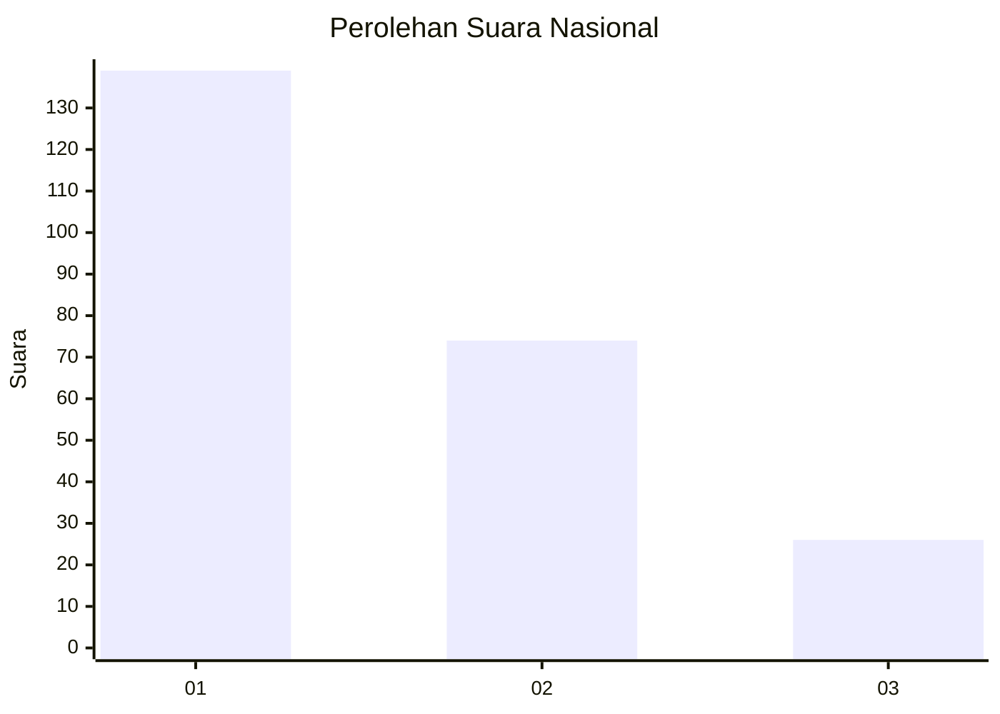
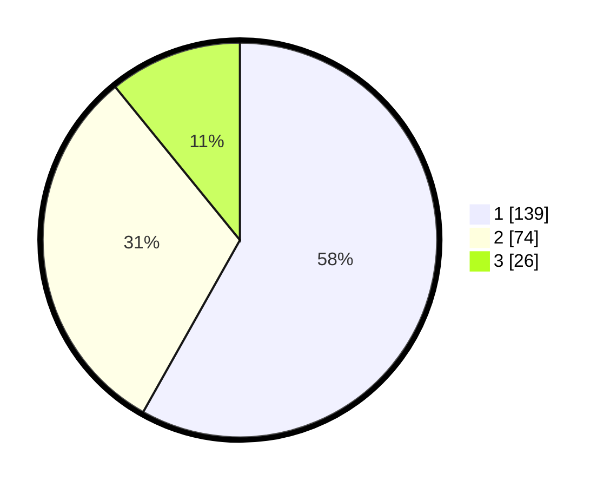

# Hasil

## Grafik

## Tabel

| No.    | Nama Paslon    | Suara | Suara (raw) | Persentase |
|:------ |:-------------- | -----:| -----------:| ----------:|
| 100025 | ANIES MUHAIMIN | 139   | [139][p-1]  | 58,16      |
| 100026 | PRABOWO GIBRAN | 74    | [74][p-2]   | 30,96      |
| 100027 | GANJAR MAHFUD  | 26    | [26][p-3]   | 10,88      |

[p-1]: https://github.com/gigit-pemilu/pemilu-2024/blob/main/pilpres/hitung-suara/sub/31-dki-jakarta/sub/74-jakarta-selatan/sub/05-kebayoran-lama/sub/1002-pondok-pinang/sub/004-tps/sub/paslon-1.txt
[p-2]: https://github.com/gigit-pemilu/pemilu-2024/blob/main/pilpres/hitung-suara/sub/31-dki-jakarta/sub/74-jakarta-selatan/sub/05-kebayoran-lama/sub/1002-pondok-pinang/sub/004-tps/sub/paslon-2.txt
[p-3]: https://github.com/gigit-pemilu/pemilu-2024/blob/main/pilpres/hitung-suara/sub/31-dki-jakarta/sub/74-jakarta-selatan/sub/05-kebayoran-lama/sub/1002-pondok-pinang/sub/004-tps/sub/paslon-3.txt

## Foto C Plano

https://sirekap-obj-formc.kpu.go.id/55cd/pemilu/ppwp/31/74/05/10/02/3174051002004-20240217-161407--e4135c45-9cf5-49d9-babc-1930e85b93b2.jpg

https://sirekap-obj-formc.kpu.go.id/55cd/pemilu/ppwp/31/74/05/10/02/3174051002004-20240217-161456--faec898a-45fd-4cb9-9152-0ef265d5949b.jpg

https://sirekap-obj-formc.kpu.go.id/55cd/pemilu/ppwp/31/74/05/10/02/3174051002004-20240217-161957--f6437420-57f9-4711-84b3-afc66dbf3901.jpg

## Metadata

| Key        | Value               |
| ---------- | ------------------- |
| Time Stamp | 2024-02-19 12:00:00 |

## DATA PEMILIH TETAP

Jumlah pemilih dalam DPT: **282**.
 * L: **149**.
 * P: **133**.

## DATA PENGGUNA HAK PILIH

Jumlah pengguna hak pilih dalam DPT: **234**.
 * L: **125**.
 * P: **109**.

Jumlah pengguna hak pilih dalam DPTb: **885**.
 * L: **84**.
 * P: **482**.

Jumlah pengguna hak pilih dalam DPK: **1**.
 * L: **8**.
 * P: **0**.

Jumlah pengguna hak pilih: **240**.
 * L: **229**.
 * P: **612**.

## JUMLAH SUARA SAH DAN TIDAK SAH

JUMLAH SELURUH SUARA SAH: **239**.

JUMLAH SUARA TIDAK SAH: **1**.

JUMLAH SELURUH SUARA SAH DAN SUARA TIDAK SAH: **240**.

