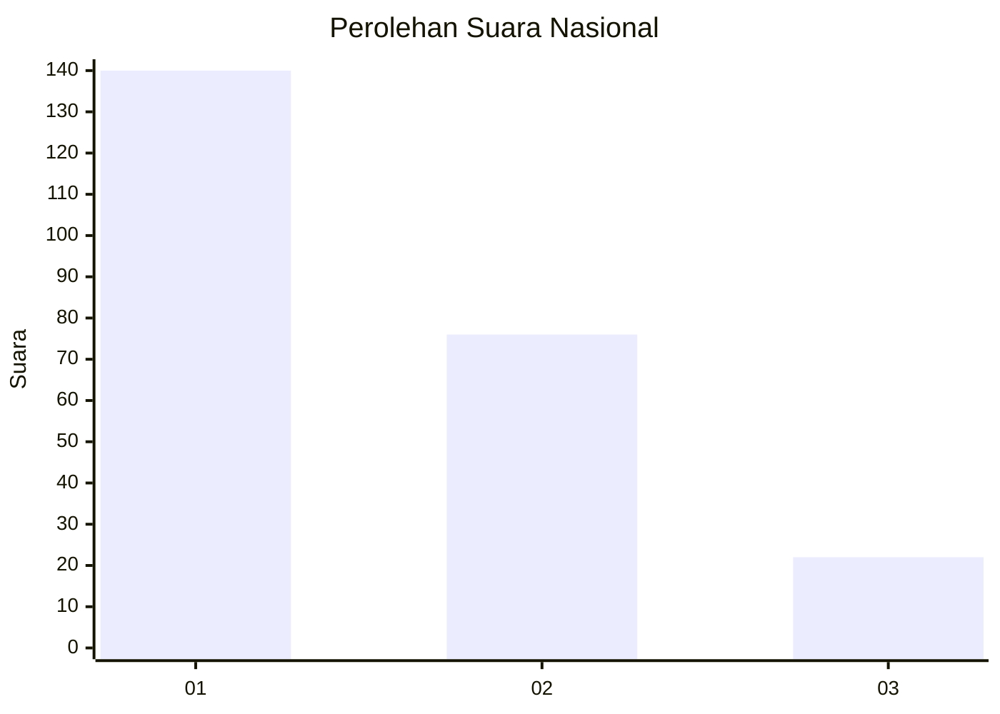
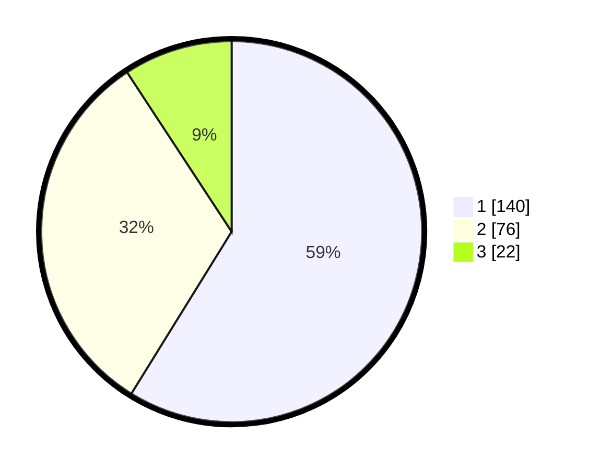

# Hasil

## Grafik

## Tabel

| No.    | Nama Paslon    | Suara | Suara (raw) | Persentase |
|:------ |:-------------- | -----:| -----------:| ----------:|
| 100025 | ANIES MUHAIMIN | 140   | [140][p-1]  | 58,82      |
| 100026 | PRABOWO GIBRAN | 76    | [76][p-2]   | 31,93      |
| 100027 | GANJAR MAHFUD  | 22    | [22][p-3]   | 9,24       |

[p-1]: https://github.com/gigit-pemilu/pemilu-2024/blob/main/pilpres/hitung-suara/sub/31-dki-jakarta/sub/74-jakarta-selatan/sub/05-kebayoran-lama/sub/1002-pondok-pinang/sub/016-tps/sub/paslon-1.txt
[p-2]: https://github.com/gigit-pemilu/pemilu-2024/blob/main/pilpres/hitung-suara/sub/31-dki-jakarta/sub/74-jakarta-selatan/sub/05-kebayoran-lama/sub/1002-pondok-pinang/sub/016-tps/sub/paslon-2.txt
[p-3]: https://github.com/gigit-pemilu/pemilu-2024/blob/main/pilpres/hitung-suara/sub/31-dki-jakarta/sub/74-jakarta-selatan/sub/05-kebayoran-lama/sub/1002-pondok-pinang/sub/016-tps/sub/paslon-3.txt

## Foto C Plano

https://sirekap-obj-formc.kpu.go.id/e8c5/pemilu/ppwp/31/74/05/10/02/3174051002016-20240214-204254--33d4e420-5753-48c5-b3a8-f8b48874d775.jpg

https://sirekap-obj-formc.kpu.go.id/e8c5/pemilu/ppwp/31/74/05/10/02/3174051002016-20240214-204311--76405836-65e4-4a6b-b91d-72675bc31401.jpg

https://sirekap-obj-formc.kpu.go.id/e8c5/pemilu/ppwp/31/74/05/10/02/3174051002016-20240214-204329--f404a9b7-a77f-4179-918a-a8911f61b553.jpg

## Metadata

| Key        | Value               |
| ---------- | ------------------- |
| Time Stamp | 2024-02-24 22:31:28 |

