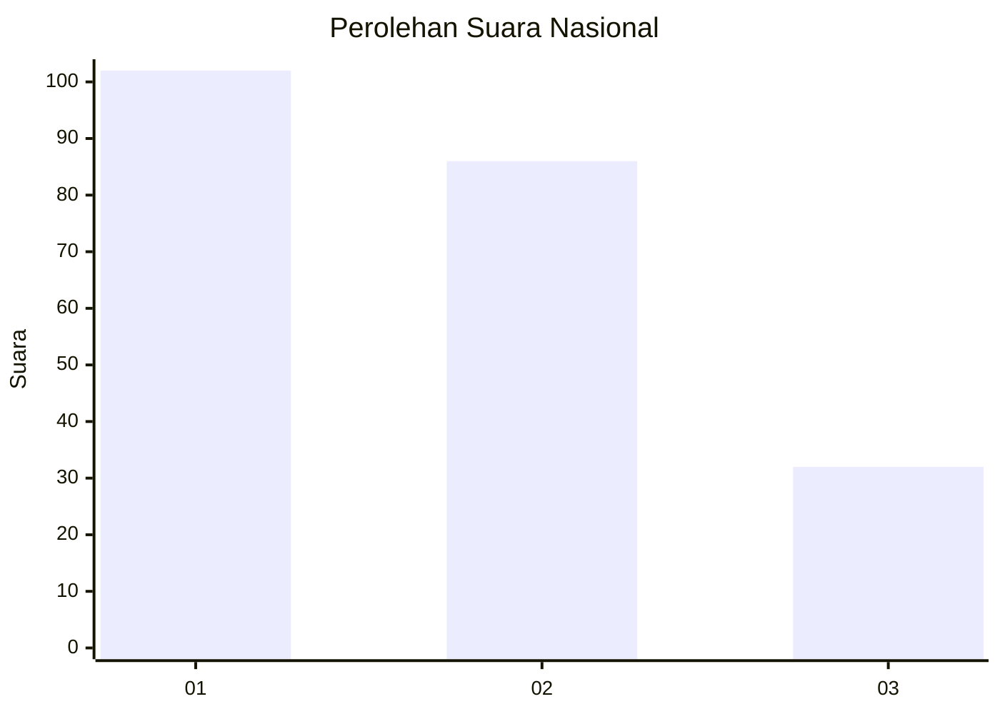
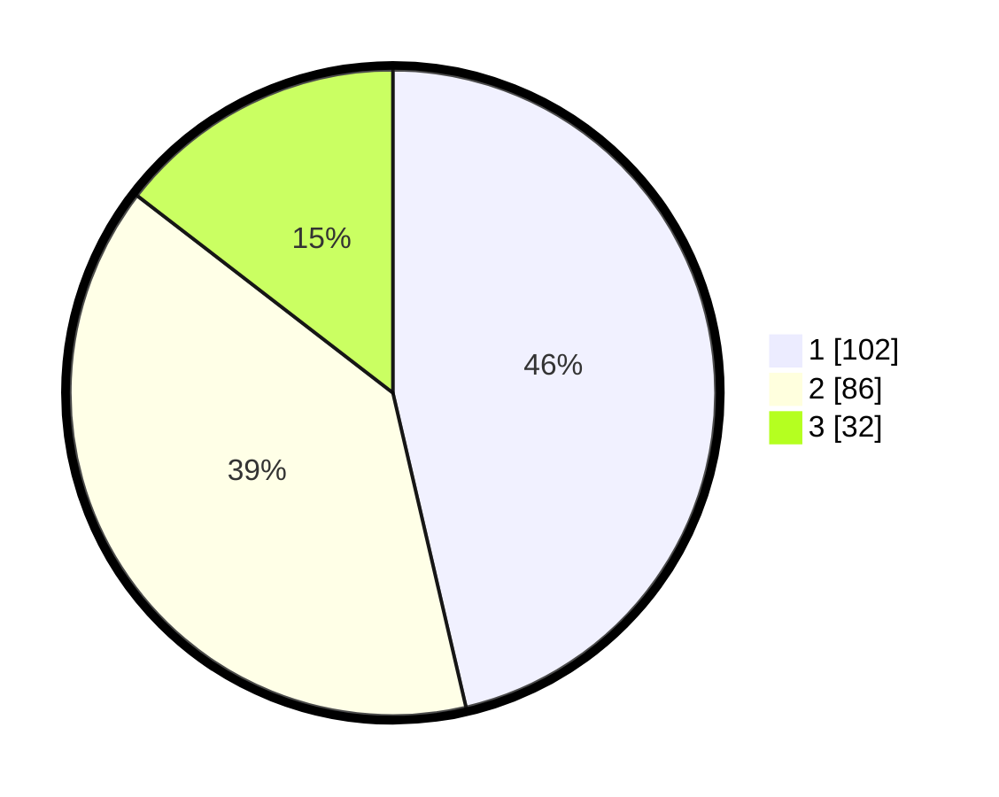

# Hasil

## Grafik

## Tabel

| No.    | Nama Paslon    | Suara | Suara (raw) | Persentase |
|:------ |:-------------- | -----:| -----------:| ----------:|
| 100025 | ANIES MUHAIMIN | 102   | [102][p-1]  | 46,36      |
| 100026 | PRABOWO GIBRAN | 86    | [86][p-2]   | 39,09      |
| 100027 | GANJAR MAHFUD  | 32    | [32][p-3]   | 14,55      |

[p-1]: https://github.com/gigit-pemilu/pemilu-2024/blob/main/pilpres/hitung-suara/sub/31-dki-jakarta/sub/74-jakarta-selatan/sub/05-kebayoran-lama/sub/1002-pondok-pinang/sub/017-tps/sub/paslon-1.txt
[p-2]: https://github.com/gigit-pemilu/pemilu-2024/blob/main/pilpres/hitung-suara/sub/31-dki-jakarta/sub/74-jakarta-selatan/sub/05-kebayoran-lama/sub/1002-pondok-pinang/sub/017-tps/sub/paslon-2.txt
[p-3]: https://github.com/gigit-pemilu/pemilu-2024/blob/main/pilpres/hitung-suara/sub/31-dki-jakarta/sub/74-jakarta-selatan/sub/05-kebayoran-lama/sub/1002-pondok-pinang/sub/017-tps/sub/paslon-3.txt

## Foto C Plano

https://sirekap-obj-formc.kpu.go.id/5141/pemilu/ppwp/31/74/05/10/02/3174051002017-20240217-203241--e589dc58-0edb-4706-82d6-8a78a905e74d.jpg

https://sirekap-obj-formc.kpu.go.id/5141/pemilu/ppwp/31/74/05/10/02/3174051002017-20240217-203321--3e17efa7-02e3-47e0-91b7-d234faa4ba1e.jpg

https://sirekap-obj-formc.kpu.go.id/5141/pemilu/ppwp/31/74/05/10/02/3174051002017-20240217-203401--c0ab0dbc-afe3-44da-a284-2e84e34f1e73.jpg

## Metadata

| Key        | Value               |
| ---------- | ------------------- |
| Time Stamp | 2024-02-19 06:16:00 |

## DATA PEMILIH TETAP

Jumlah pemilih dalam DPT: **729**.
 * L: **212**.
 * P: **575**.

## DATA PENGGUNA HAK PILIH

Jumlah pengguna hak pilih dalam DPT: **213**.
 * L: **92**.
 * P: **171**.

Jumlah pengguna hak pilih dalam DPTb: **870**.
 * L: **555**.
 * P: **807**.

Jumlah pengguna hak pilih dalam DPK: **3**.
 * L: **1**.
 * P: **404**.

Jumlah pengguna hak pilih: **225**.
 * L: **55**.
 * P: **335**.

## JUMLAH SUARA SAH DAN TIDAK SAH

JUMLAH SELURUH SUARA SAH: **22**.

JUMLAH SUARA TIDAK SAH: **5**.

JUMLAH SELURUH SUARA SAH DAN SUARA TIDAK SAH: **25**.

