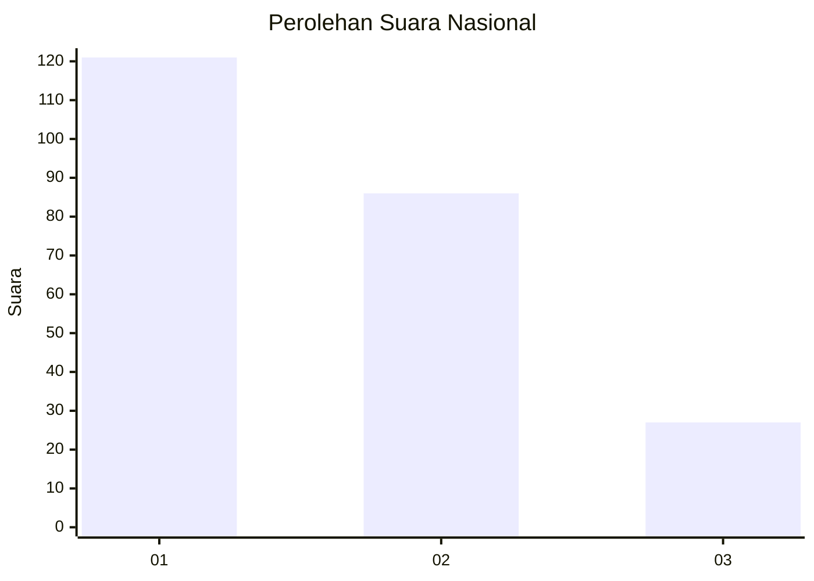
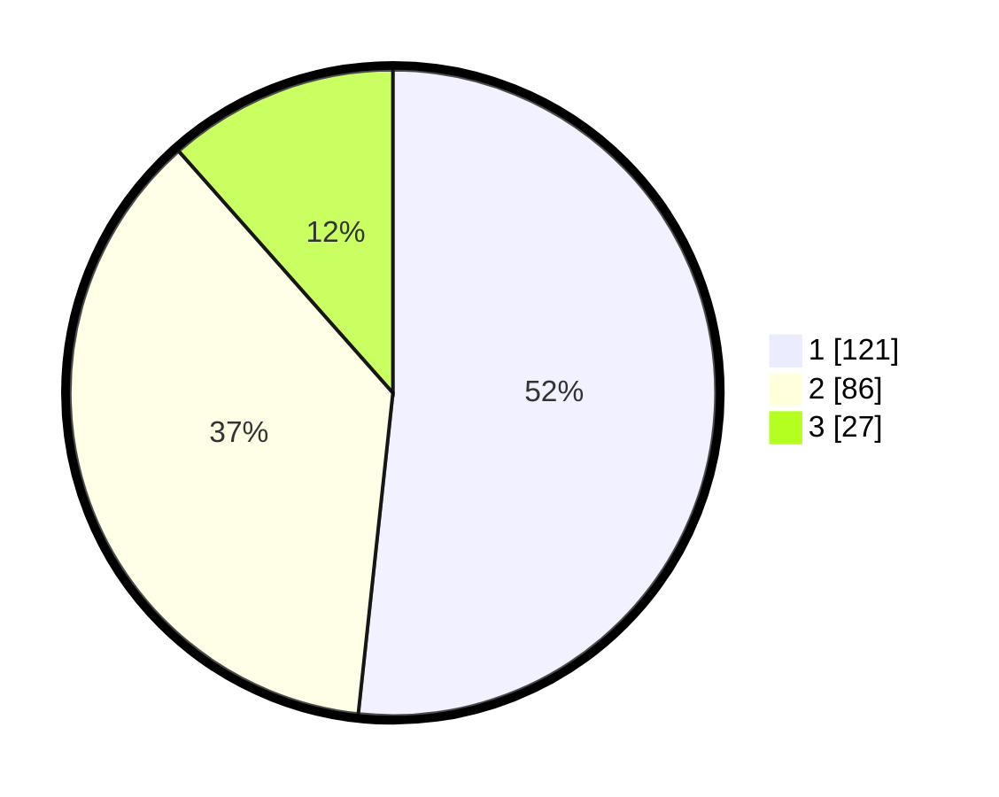

# Hasil

## Grafik

## Tabel

| No.    | Nama Paslon    | Suara | Suara (raw) | Persentase |
|:------ |:-------------- | -----:| -----------:| ----------:|
| 100025 | ANIES MUHAIMIN | 121   | [121][p-1]  | 51,71      |
| 100026 | PRABOWO GIBRAN | 86    | [86][p-2]   | 36,75      |
| 100027 | GANJAR MAHFUD  | 27    | [27][p-3]   | 11,54      |

[p-1]: https://github.com/gigit-pemilu/pemilu-2024/blob/main/pilpres/hitung-suara/sub/31-dki-jakarta/sub/74-jakarta-selatan/sub/05-kebayoran-lama/sub/1002-pondok-pinang/sub/033-tps/sub/paslon-1.txt
[p-2]: https://github.com/gigit-pemilu/pemilu-2024/blob/main/pilpres/hitung-suara/sub/31-dki-jakarta/sub/74-jakarta-selatan/sub/05-kebayoran-lama/sub/1002-pondok-pinang/sub/033-tps/sub/paslon-2.txt
[p-3]: https://github.com/gigit-pemilu/pemilu-2024/blob/main/pilpres/hitung-suara/sub/31-dki-jakarta/sub/74-jakarta-selatan/sub/05-kebayoran-lama/sub/1002-pondok-pinang/sub/033-tps/sub/paslon-3.txt

## Foto C Plano

https://sirekap-obj-formc.kpu.go.id/b135/pemilu/ppwp/31/74/05/10/02/3174051002033-20240214-214344--4f0d2cb4-98cf-444b-b850-10194245992f.jpg

https://sirekap-obj-formc.kpu.go.id/b135/pemilu/ppwp/31/74/05/10/02/3174051002033-20240214-214638--31b095fe-c5e1-42a2-9c7f-5c42e1e23d0f.jpg

https://sirekap-obj-formc.kpu.go.id/b135/pemilu/ppwp/31/74/05/10/02/3174051002033-20240214-230744--29f81bb0-23e2-43b5-b949-9294d49ef397.jpg

## Metadata

| Key        | Value               |
| ---------- | ------------------- |
| Time Stamp | 2024-02-24 22:31:28 |

