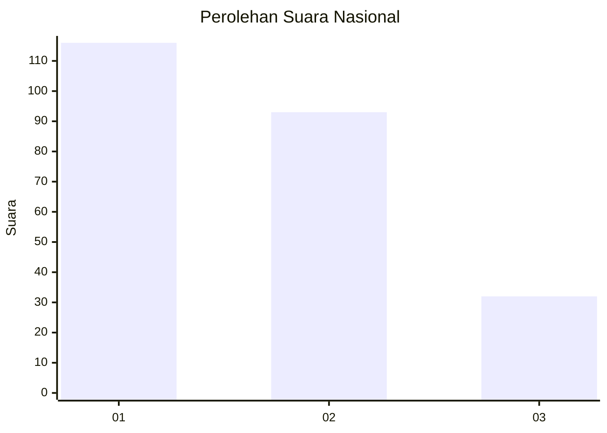
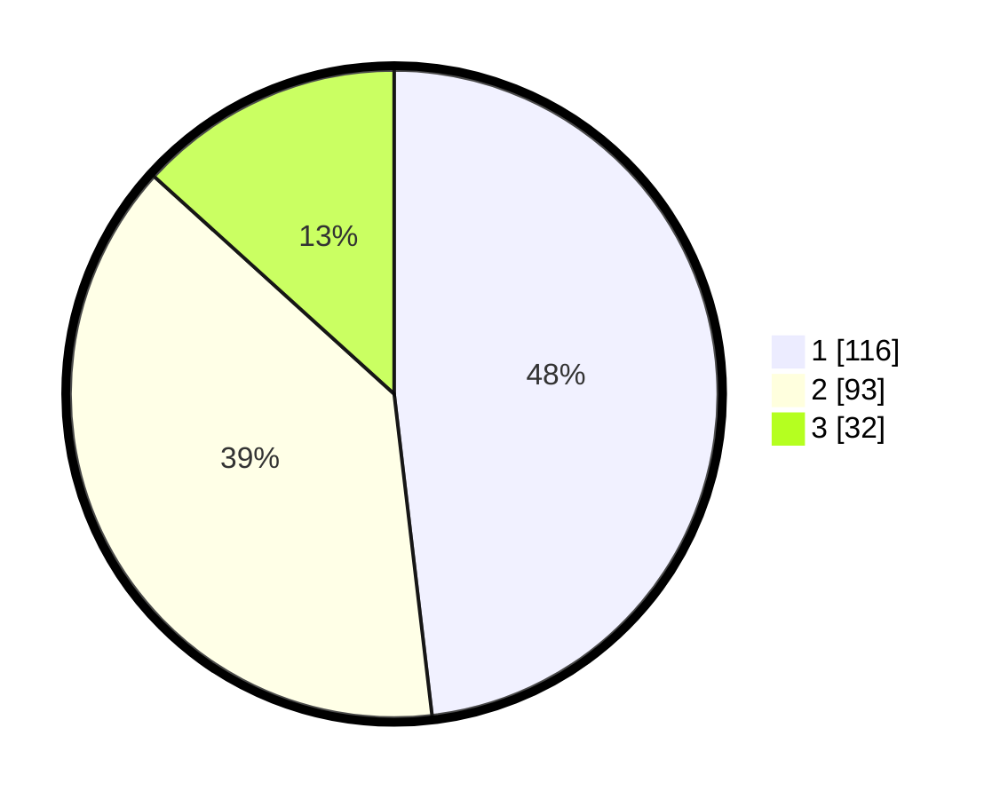

# Hasil

## Grafik

## Tabel

| No.    | Nama Paslon    | Suara | Suara (raw) | Persentase |
|:------ |:-------------- | -----:| -----------:| ----------:|
| 100025 | ANIES MUHAIMIN | 116   | [116][p-1]  | 48,13      |
| 100026 | PRABOWO GIBRAN | 93    | [93][p-2]   | 38,59      |
| 100027 | GANJAR MAHFUD  | 32    | [32][p-3]   | 13,28      |

[p-1]: https://github.com/gigit-pemilu/pemilu-2024/blob/main/pilpres/hitung-suara/sub/31-dki-jakarta/sub/74-jakarta-selatan/sub/05-kebayoran-lama/sub/1002-pondok-pinang/sub/036-tps/sub/paslon-1.txt
[p-2]: https://github.com/gigit-pemilu/pemilu-2024/blob/main/pilpres/hitung-suara/sub/31-dki-jakarta/sub/74-jakarta-selatan/sub/05-kebayoran-lama/sub/1002-pondok-pinang/sub/036-tps/sub/paslon-2.txt
[p-3]: https://github.com/gigit-pemilu/pemilu-2024/blob/main/pilpres/hitung-suara/sub/31-dki-jakarta/sub/74-jakarta-selatan/sub/05-kebayoran-lama/sub/1002-pondok-pinang/sub/036-tps/sub/paslon-3.txt

## Foto C Plano

https://sirekap-obj-formc.kpu.go.id/84fb/pemilu/ppwp/31/74/05/10/02/3174051002036-20240217-222853--31ff1549-e169-4748-8a2c-1a3db0c86233.jpg

https://sirekap-obj-formc.kpu.go.id/84fb/pemilu/ppwp/31/74/05/10/02/3174051002036-20240214-233550--e8bc8c76-35bc-4cf6-86e1-a83206ddcfcd.jpg

https://sirekap-obj-formc.kpu.go.id/84fb/pemilu/ppwp/31/74/05/10/02/3174051002036-20240214-233643--4df7c660-a19f-4bf8-b4f5-d6cd243cde3d.jpg

## Metadata

| Key        | Value               |
| ---------- | ------------------- |
| Time Stamp | 2024-02-19 06:16:00 |

