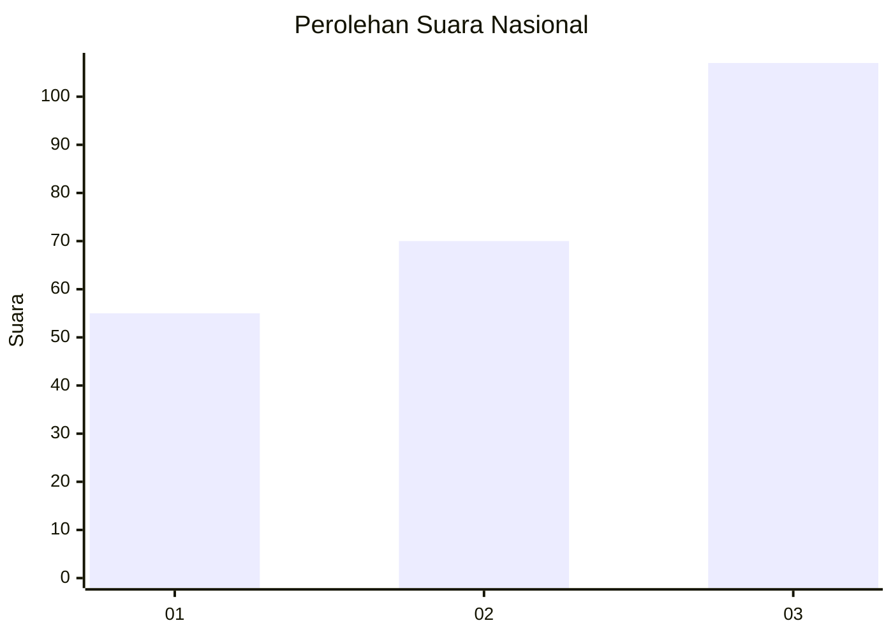
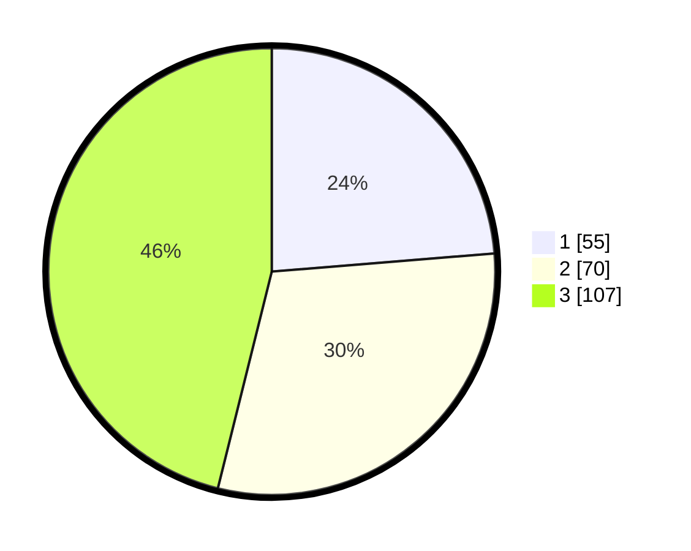

# Hasil

## Grafik

## Tabel

| No.    | Nama Paslon    | Suara | Suara (raw) | Persentase |
|:------ |:-------------- | -----:| -----------:| ----------:|
| 100025 | ANIES MUHAIMIN | 55    | [55][p-1]   | 23,71      |
| 100026 | PRABOWO GIBRAN | 70    | [70][p-2]   | 30,17      |
| 100027 | GANJAR MAHFUD  | 107   | [107][p-3]  | 46,12      |

[p-1]: https://github.com/gigit-pemilu/pemilu-2024/blob/main/pilpres/hitung-suara/sub/31-dki-jakarta/sub/74-jakarta-selatan/sub/05-kebayoran-lama/sub/1002-pondok-pinang/sub/053-tps/sub/paslon-1.txt
[p-2]: https://github.com/gigit-pemilu/pemilu-2024/blob/main/pilpres/hitung-suara/sub/31-dki-jakarta/sub/74-jakarta-selatan/sub/05-kebayoran-lama/sub/1002-pondok-pinang/sub/053-tps/sub/paslon-2.txt
[p-3]: https://github.com/gigit-pemilu/pemilu-2024/blob/main/pilpres/hitung-suara/sub/31-dki-jakarta/sub/74-jakarta-selatan/sub/05-kebayoran-lama/sub/1002-pondok-pinang/sub/053-tps/sub/paslon-3.txt

## Foto C Plano

https://sirekap-obj-formc.kpu.go.id/2310/pemilu/ppwp/31/74/05/10/02/3174051002053-20240214-215248--c2be9074-ac72-428a-ac74-745158c3882f.jpg

https://sirekap-obj-formc.kpu.go.id/2310/pemilu/ppwp/31/74/05/10/02/3174051002053-20240214-215344--ac18c055-247c-406e-a519-9b328989d29e.jpg

https://sirekap-obj-formc.kpu.go.id/2310/pemilu/ppwp/31/74/05/10/02/3174051002053-20240214-215450--43cab5e7-aaa5-40a6-a100-9886366f5d0a.jpg

## Metadata

| Key        | Value               |
| ---------- | ------------------- |
| Time Stamp | 2024-02-25 11:00:00 |

