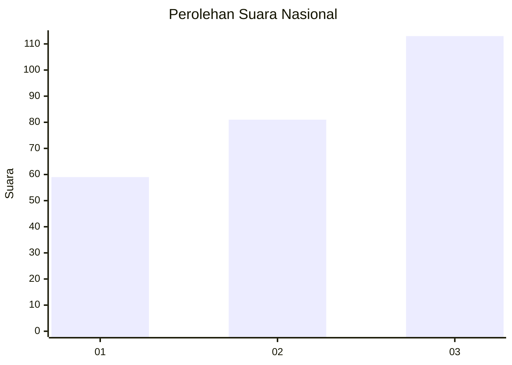
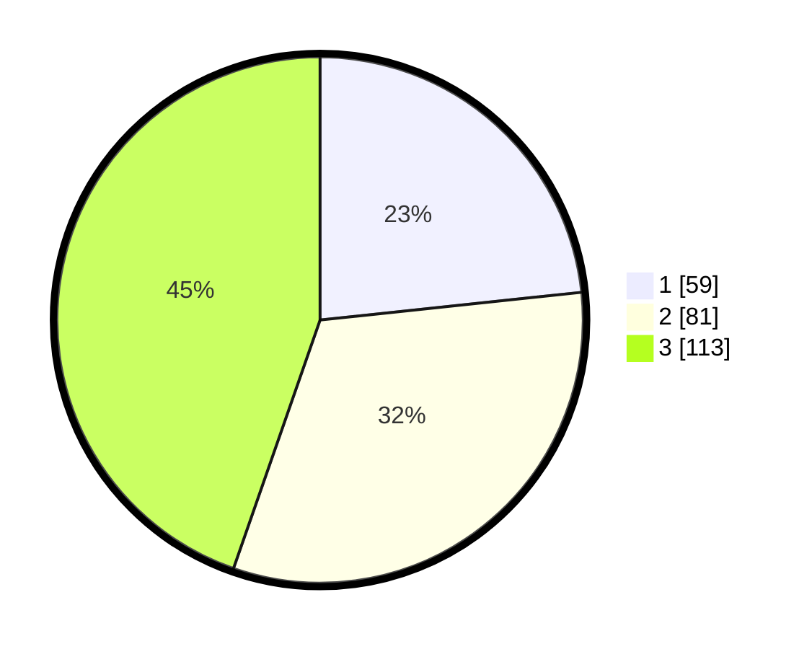

# Hasil

## Grafik

## Tabel

| No. | Nama Paslon    | Suara | Suara (raw) | Persentase |
|:--- |:-------------- | -----:| -----------:| ----------:|
| 1   | ANIES MUHAIMIN | 59    | [59][p-1]   | 23,32      |
| 2   | PRABOWO GIBRAN | 81    | [81][p-2]   | 32,02      |
| 3   | GANJAR MAHFUD  | 113   | [113][p-3]  | 44,66      |

[p-1]: https://github.com/gigit-pemilu/pemilu-2024/blob/main/pilpres/hitung-suara/sub/31-dki-jakarta/sub/74-jakarta-selatan/sub/05-kebayoran-lama/sub/1002-pondok-pinang/sub/054-tps/sub/paslon-1.txt
[p-2]: https://github.com/gigit-pemilu/pemilu-2024/blob/main/pilpres/hitung-suara/sub/31-dki-jakarta/sub/74-jakarta-selatan/sub/05-kebayoran-lama/sub/1002-pondok-pinang/sub/054-tps/sub/paslon-2.txt
[p-3]: https://github.com/gigit-pemilu/pemilu-2024/blob/main/pilpres/hitung-suara/sub/31-dki-jakarta/sub/74-jakarta-selatan/sub/05-kebayoran-lama/sub/1002-pondok-pinang/sub/054-tps/sub/paslon-3.txt

## Foto C Plano

https://sirekap-obj-formc.kpu.go.id/832f/pemilu/ppwp/31/74/05/10/02/3174051002054-20240215-213650--d85e05fa-ee6b-4c5a-955c-3c82085e9a32.jpg

https://sirekap-obj-formc.kpu.go.id/832f/pemilu/ppwp/31/74/05/10/02/3174051002054-20240215-212723--57c5b124-082f-47c3-89ec-cff4c1861946.jpg

https://sirekap-obj-formc.kpu.go.id/832f/pemilu/ppwp/31/74/05/10/02/3174051002054-20240215-213601--afe1a1e1-dfc4-4bcb-a414-2aee2c0f5555.jpg

## Metadata

| Key        | Value               |
| ---------- | ------------------- |
| Time Stamp | 2024-02-26 11:00:00 |

