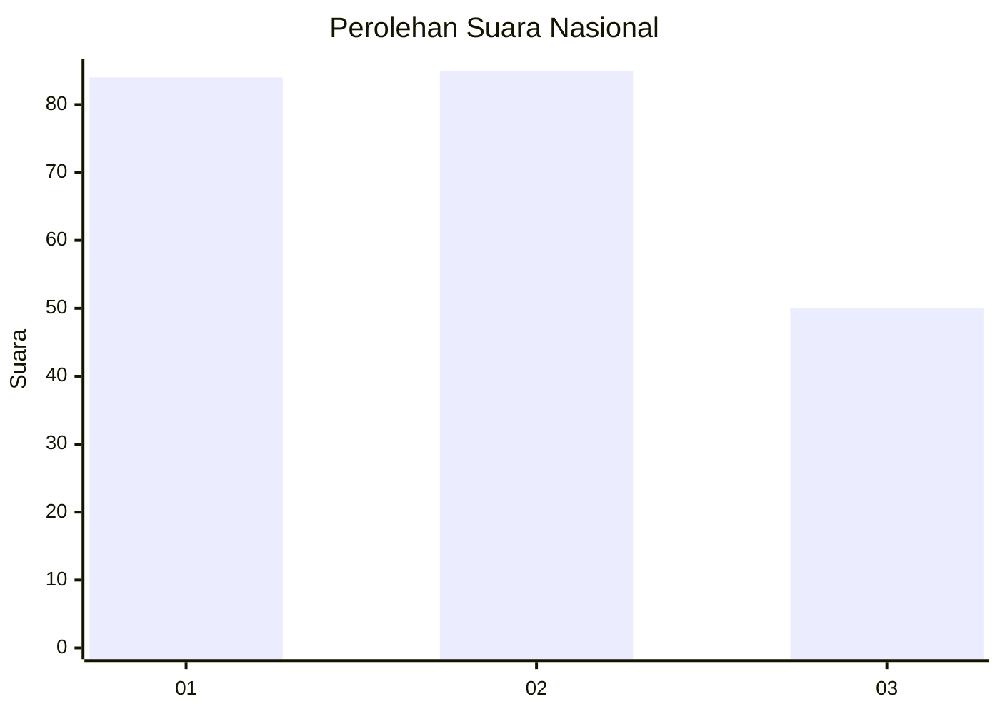
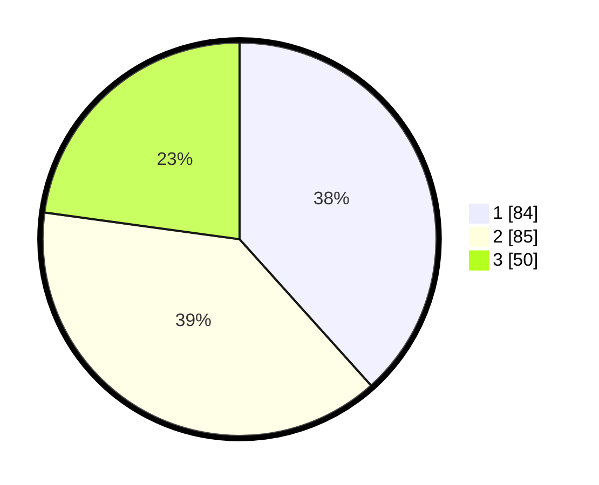

# Hasil

## Grafik

## Tabel

| No.    | Nama Paslon    | Suara | Suara (raw) | Persentase |
|:------ |:-------------- | -----:| -----------:| ----------:|
| 100025 | ANIES MUHAIMIN | 84    | [84][p-1]   | 38,36      |
| 100026 | PRABOWO GIBRAN | 85    | [85][p-2]   | 38,81      |
| 100027 | GANJAR MAHFUD  | 50    | [50][p-3]   | 22,83      |

[p-1]: https://github.com/gigit-pemilu/pemilu-2024/blob/main/pilpres/hitung-suara/sub/31-dki-jakarta/sub/74-jakarta-selatan/sub/05-kebayoran-lama/sub/1002-pondok-pinang/sub/065-tps/sub/paslon-1.txt
[p-2]: https://github.com/gigit-pemilu/pemilu-2024/blob/main/pilpres/hitung-suara/sub/31-dki-jakarta/sub/74-jakarta-selatan/sub/05-kebayoran-lama/sub/1002-pondok-pinang/sub/065-tps/sub/paslon-2.txt
[p-3]: https://github.com/gigit-pemilu/pemilu-2024/blob/main/pilpres/hitung-suara/sub/31-dki-jakarta/sub/74-jakarta-selatan/sub/05-kebayoran-lama/sub/1002-pondok-pinang/sub/065-tps/sub/paslon-3.txt

## Foto C Plano

https://sirekap-obj-formc.kpu.go.id/9fa2/pemilu/ppwp/31/74/05/10/02/3174051002065-20240218-193820--535d78db-752e-484e-bc6e-4097a0bbde01.jpg

https://sirekap-obj-formc.kpu.go.id/9fa2/pemilu/ppwp/31/74/05/10/02/3174051002065-20240218-193853--7125a24d-af07-454b-885b-f67842b3e162.jpg

https://sirekap-obj-formc.kpu.go.id/9fa2/pemilu/ppwp/31/74/05/10/02/3174051002065-20240218-193904--7c622748-61a2-4741-9140-09fb718d9c79.jpg

## Metadata

| Key        | Value               |
| ---------- | ------------------- |
| Time Stamp | 2024-02-24 22:31:28 |

