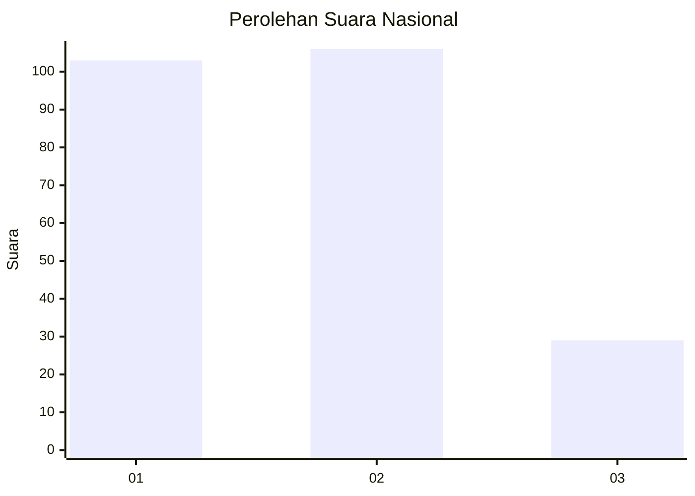
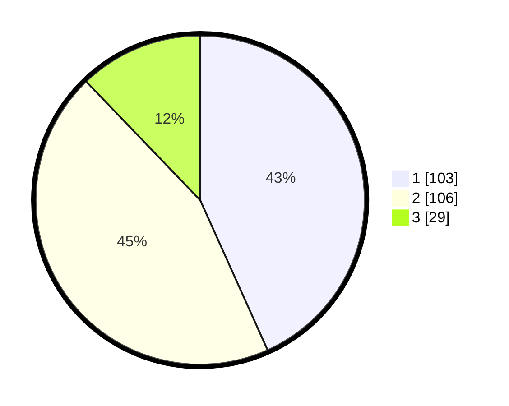

# Hasil

## Grafik

## Tabel

| No.    | Nama Paslon    | Suara | Suara (raw) | Persentase |
|:------ |:-------------- | -----:| -----------:| ----------:|
| 100025 | ANIES MUHAIMIN | 103   | [103][p-1]  | 43,28      |
| 100026 | PRABOWO GIBRAN | 106   | [106][p-2]  | 44,54      |
| 100027 | GANJAR MAHFUD  | 29    | [29][p-3]   | 12,18      |

[p-1]: https://github.com/gigit-pemilu/pemilu-2024/blob/main/pilpres/hitung-suara/sub/31-dki-jakarta/sub/74-jakarta-selatan/sub/05-kebayoran-lama/sub/1002-pondok-pinang/sub/074-tps/sub/paslon-1.txt
[p-2]: https://github.com/gigit-pemilu/pemilu-2024/blob/main/pilpres/hitung-suara/sub/31-dki-jakarta/sub/74-jakarta-selatan/sub/05-kebayoran-lama/sub/1002-pondok-pinang/sub/074-tps/sub/paslon-2.txt
[p-3]: https://github.com/gigit-pemilu/pemilu-2024/blob/main/pilpres/hitung-suara/sub/31-dki-jakarta/sub/74-jakarta-selatan/sub/05-kebayoran-lama/sub/1002-pondok-pinang/sub/074-tps/sub/paslon-3.txt

## Foto C Plano

https://sirekap-obj-formc.kpu.go.id/6296/pemilu/ppwp/31/74/05/10/02/3174051002074-20240214-230054--a9b6b290-ec1f-48ba-b0a5-cd3036389bee.jpg

https://sirekap-obj-formc.kpu.go.id/6296/pemilu/ppwp/31/74/05/10/02/3174051002074-20240214-195136--693d106b-1da6-4424-b631-be265c4cee7a.jpg

https://sirekap-obj-formc.kpu.go.id/6296/pemilu/ppwp/31/74/05/10/02/3174051002074-20240214-195248--a73ba520-6ac8-48c3-8a10-102044fa062a.jpg

## Metadata

| Key        | Value               |
| ---------- | ------------------- |
| Time Stamp | 2024-02-15 18:00:26 |

