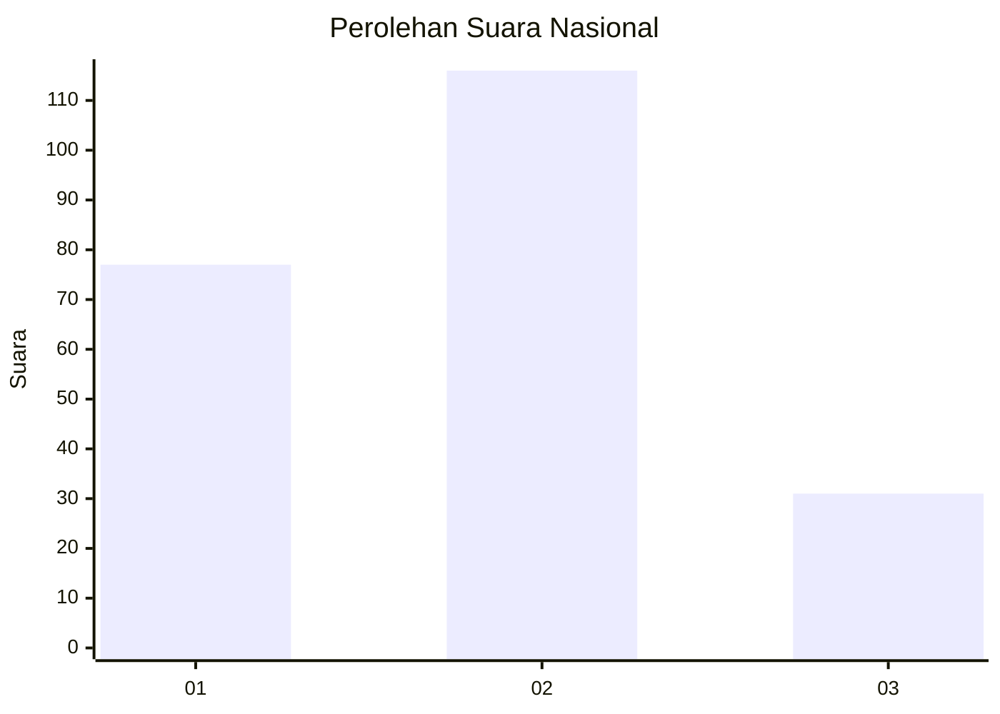
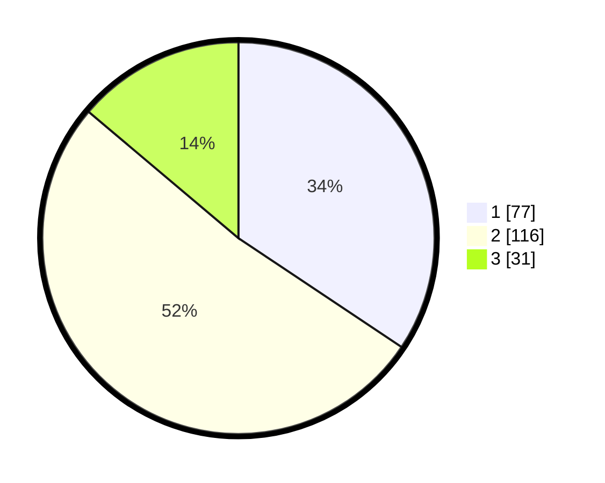

# Hasil

## Grafik

## Tabel

| No.    | Nama Paslon    | Suara | Suara (raw) | Persentase |
|:------ |:-------------- | -----:| -----------:| ----------:|
| 100025 | ANIES MUHAIMIN | 77    | [77][p-1]   | 34,38      |
| 100026 | PRABOWO GIBRAN | 116   | [116][p-2]  | 51,79      |
| 100027 | GANJAR MAHFUD  | 31    | [31][p-3]   | 13,84      |

[p-1]: https://github.com/gigit-pemilu/pemilu-2024/blob/main/pilpres/hitung-suara/sub/31-dki-jakarta/sub/74-jakarta-selatan/sub/05-kebayoran-lama/sub/1002-pondok-pinang/sub/101-tps/sub/paslon-1.txt
[p-2]: https://github.com/gigit-pemilu/pemilu-2024/blob/main/pilpres/hitung-suara/sub/31-dki-jakarta/sub/74-jakarta-selatan/sub/05-kebayoran-lama/sub/1002-pondok-pinang/sub/101-tps/sub/paslon-2.txt
[p-3]: https://github.com/gigit-pemilu/pemilu-2024/blob/main/pilpres/hitung-suara/sub/31-dki-jakarta/sub/74-jakarta-selatan/sub/05-kebayoran-lama/sub/1002-pondok-pinang/sub/101-tps/sub/paslon-3.txt

## Foto C Plano

https://sirekap-obj-formc.kpu.go.id/4380/pemilu/ppwp/31/74/05/10/02/3174051002101-20240214-222237--0001e64b-1401-497a-a7ca-2ea68c863125.jpg

https://sirekap-obj-formc.kpu.go.id/4380/pemilu/ppwp/31/74/05/10/02/3174051002101-20240214-222858--df640dd9-9147-49ac-90f7-eff9d074cbdc.jpg

https://sirekap-obj-formc.kpu.go.id/4380/pemilu/ppwp/31/74/05/10/02/3174051002101-20240214-222838--2229648d-01fe-492c-bdfb-246bcd784856.jpg

## Metadata

| Key        | Value               |
| ---------- | ------------------- |
| Time Stamp | 2024-02-24 22:31:28 |

