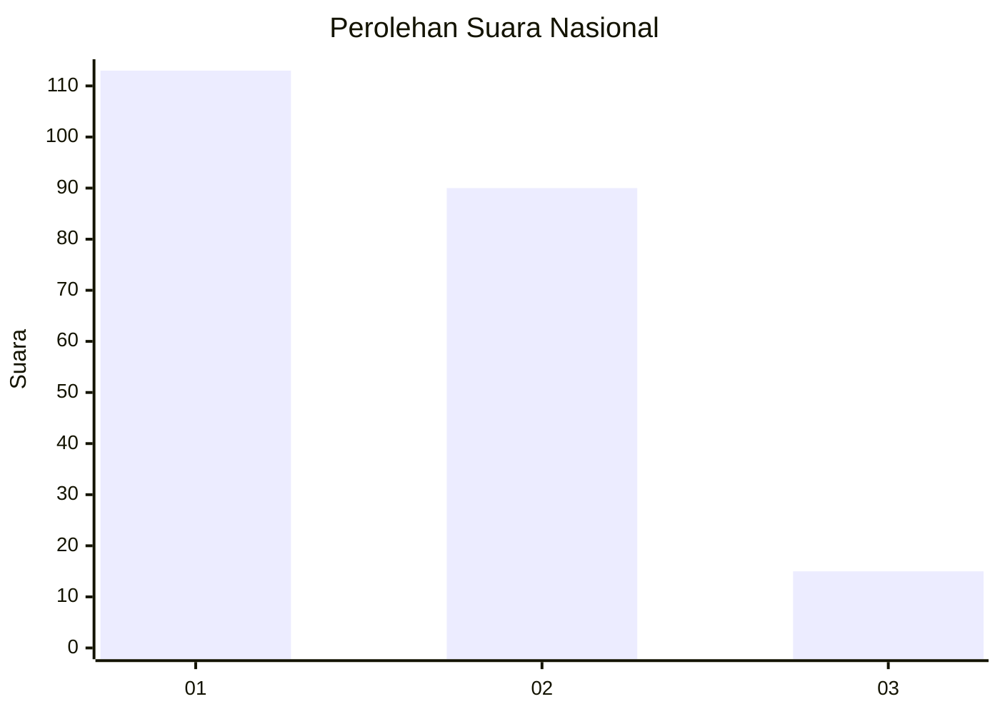
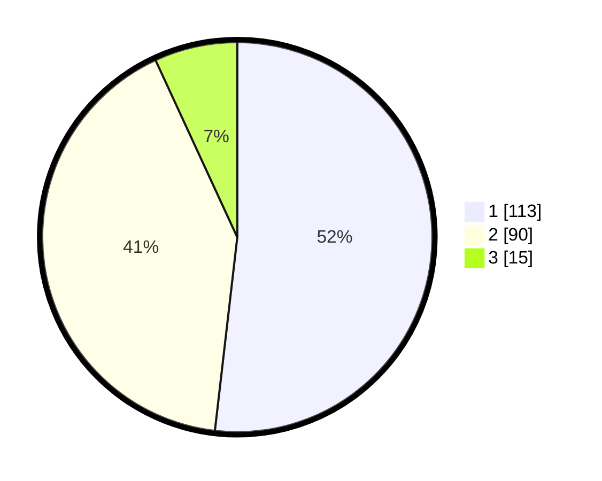

# Hasil

## Grafik

## Tabel

| No.    | Nama Paslon    | Suara | Suara (raw) | Persentase |
|:------ |:-------------- | -----:| -----------:| ----------:|
| 100025 | ANIES MUHAIMIN | 113   | [113][p-1]  | 51,83      |
| 100026 | PRABOWO GIBRAN | 90    | [90][p-2]   | 41,28      |
| 100027 | GANJAR MAHFUD  | 15    | [15][p-3]   | 6,88       |

[p-1]: https://github.com/gigit-pemilu/pemilu-2024/blob/main/pilpres/hitung-suara/sub/31-dki-jakarta/sub/74-jakarta-selatan/sub/05-kebayoran-lama/sub/1002-pondok-pinang/sub/110-tps/sub/paslon-1.txt
[p-2]: https://github.com/gigit-pemilu/pemilu-2024/blob/main/pilpres/hitung-suara/sub/31-dki-jakarta/sub/74-jakarta-selatan/sub/05-kebayoran-lama/sub/1002-pondok-pinang/sub/110-tps/sub/paslon-2.txt
[p-3]: https://github.com/gigit-pemilu/pemilu-2024/blob/main/pilpres/hitung-suara/sub/31-dki-jakarta/sub/74-jakarta-selatan/sub/05-kebayoran-lama/sub/1002-pondok-pinang/sub/110-tps/sub/paslon-3.txt

## Foto C Plano

https://sirekap-obj-formc.kpu.go.id/d5bb/pemilu/ppwp/31/74/05/10/02/3174051002110-20240214-221610--d33d4d42-eb8d-498c-8e68-2841696d7ff4.jpg

https://sirekap-obj-formc.kpu.go.id/d5bb/pemilu/ppwp/31/74/05/10/02/3174051002110-20240214-222316--6da709fd-f694-4acd-88a2-3eb15ab0a881.jpg

https://sirekap-obj-formc.kpu.go.id/d5bb/pemilu/ppwp/31/74/05/10/02/3174051002110-20240214-222417--e72c98e7-54f1-4e91-897b-bb3268389bb8.jpg

## Metadata

| Key        | Value               |
| ---------- | ------------------- |
| Time Stamp | 2024-02-24 22:31:28 |

