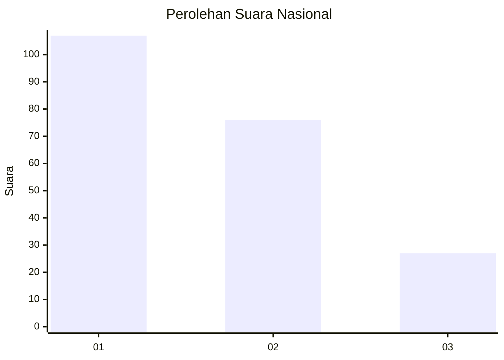
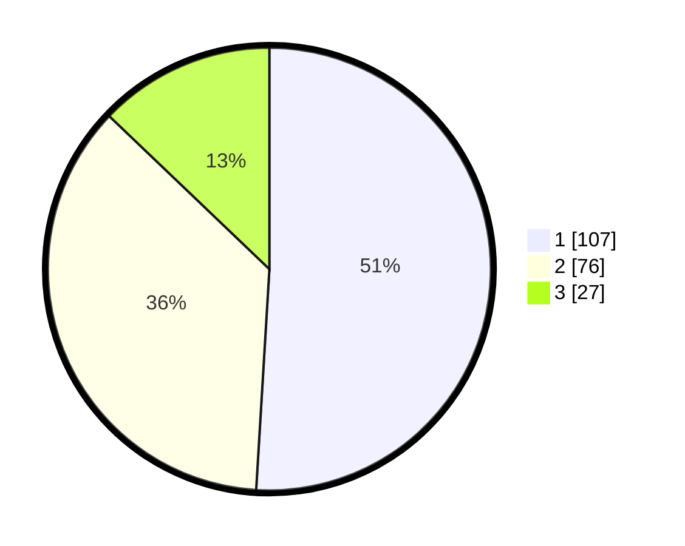

# Hasil

## Grafik

## Tabel

| No.    | Nama Paslon    | Suara | Suara (raw) | Persentase |
|:------ |:-------------- | -----:| -----------:| ----------:|
| 100025 | ANIES MUHAIMIN | 107   | [107][p-1]  | 50,95      |
| 100026 | PRABOWO GIBRAN | 76    | [76][p-2]   | 36,19      |
| 100027 | GANJAR MAHFUD  | 27    | [27][p-3]   | 12,86      |

[p-1]: https://github.com/gigit-pemilu/pemilu-2024/blob/main/pilpres/hitung-suara/sub/31-dki-jakarta/sub/74-jakarta-selatan/sub/05-kebayoran-lama/sub/1002-pondok-pinang/sub/111-tps/sub/paslon-1.txt
[p-2]: https://github.com/gigit-pemilu/pemilu-2024/blob/main/pilpres/hitung-suara/sub/31-dki-jakarta/sub/74-jakarta-selatan/sub/05-kebayoran-lama/sub/1002-pondok-pinang/sub/111-tps/sub/paslon-2.txt
[p-3]: https://github.com/gigit-pemilu/pemilu-2024/blob/main/pilpres/hitung-suara/sub/31-dki-jakarta/sub/74-jakarta-selatan/sub/05-kebayoran-lama/sub/1002-pondok-pinang/sub/111-tps/sub/paslon-3.txt

## Foto C Plano

https://sirekap-obj-formc.kpu.go.id/9b9c/pemilu/ppwp/31/74/05/10/02/3174051002111-20240214-202724--e41bb15d-1724-4114-9fec-595d134c45da.jpg

https://sirekap-obj-formc.kpu.go.id/9b9c/pemilu/ppwp/31/74/05/10/02/3174051002111-20240214-202934--e7680e99-2656-41e9-b964-5fd9a71e051a.jpg

https://sirekap-obj-formc.kpu.go.id/9b9c/pemilu/ppwp/31/74/05/10/02/3174051002111-20240214-203122--c182e76b-4e8a-4557-8e6f-640f09a1244b.jpg

## Metadata

| Key        | Value               |
| ---------- | ------------------- |
| Time Stamp | 2024-02-25 20:00:00 |

