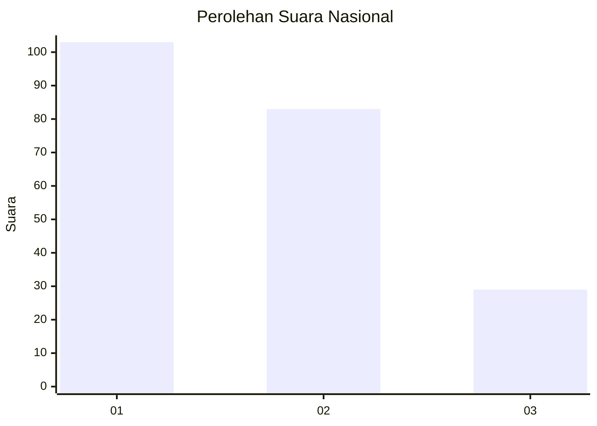
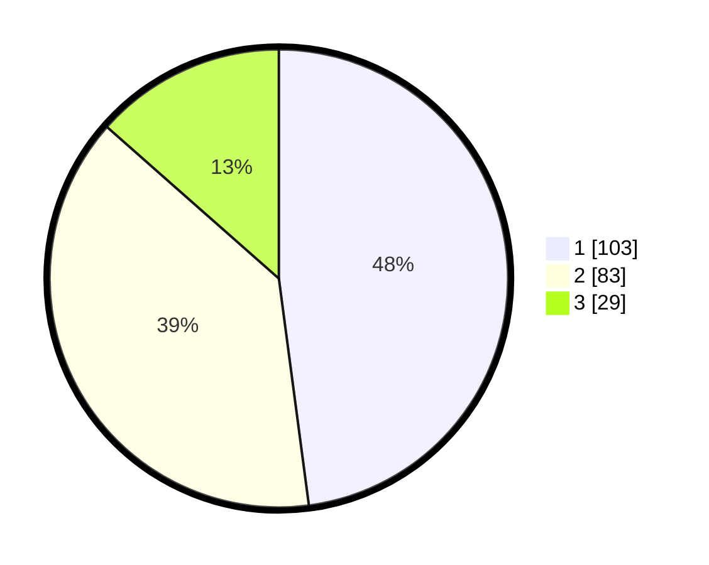

# Hasil

## Grafik

## Tabel

| No.    | Nama Paslon    | Suara | Suara (raw) | Persentase |
|:------ |:-------------- | -----:| -----------:| ----------:|
| 100025 | ANIES MUHAIMIN | 103   | [103][p-1]  | 47,91      |
| 100026 | PRABOWO GIBRAN | 83    | [83][p-2]   | 38,60      |
| 100027 | GANJAR MAHFUD  | 29    | [29][p-3]   | 13,49      |

[p-1]: https://github.com/gigit-pemilu/pemilu-2024/blob/main/pilpres/hitung-suara/sub/31-dki-jakarta/sub/74-jakarta-selatan/sub/05-kebayoran-lama/sub/1002-pondok-pinang/sub/113-tps/sub/paslon-1.txt
[p-2]: https://github.com/gigit-pemilu/pemilu-2024/blob/main/pilpres/hitung-suara/sub/31-dki-jakarta/sub/74-jakarta-selatan/sub/05-kebayoran-lama/sub/1002-pondok-pinang/sub/113-tps/sub/paslon-2.txt
[p-3]: https://github.com/gigit-pemilu/pemilu-2024/blob/main/pilpres/hitung-suara/sub/31-dki-jakarta/sub/74-jakarta-selatan/sub/05-kebayoran-lama/sub/1002-pondok-pinang/sub/113-tps/sub/paslon-3.txt

## Foto C Plano

https://sirekap-obj-formc.kpu.go.id/8ce5/pemilu/ppwp/31/74/05/10/02/3174051002113-20240214-193504--e5cc2f01-e6eb-4fd1-b52c-584d95b4fcbb.jpg

https://sirekap-obj-formc.kpu.go.id/8ce5/pemilu/ppwp/31/74/05/10/02/3174051002113-20240214-193607--37d8e591-1c37-4213-bb7e-a64854950ca1.jpg

https://sirekap-obj-formc.kpu.go.id/8ce5/pemilu/ppwp/31/74/05/10/02/3174051002113-20240214-193701--91827bb6-b595-4934-9bd1-860e30eb1713.jpg

## Metadata

| Key        | Value               |
| ---------- | ------------------- |
| Time Stamp | 2024-02-24 22:31:28 |

