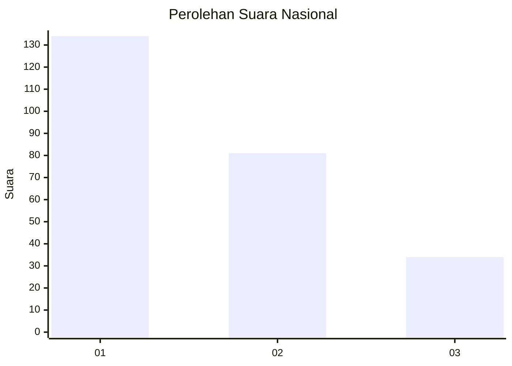
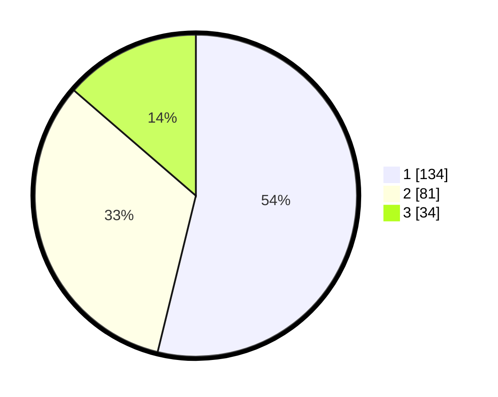

# Hasil

## Grafik

## Tabel

| No.    | Nama Paslon    | Suara | Suara (raw) | Persentase |
|:------ |:-------------- | -----:| -----------:| ----------:|
| 100025 | ANIES MUHAIMIN | 134   | [134][p-1]  | 53,82      |
| 100026 | PRABOWO GIBRAN | 81    | [81][p-2]   | 32,53      |
| 100027 | GANJAR MAHFUD  | 34    | [34][p-3]   | 13,65      |

[p-1]: https://github.com/gigit-pemilu/pemilu-2024/blob/main/pilpres/hitung-suara/sub/31-dki-jakarta/sub/74-jakarta-selatan/sub/05-kebayoran-lama/sub/1002-pondok-pinang/sub/142-tps/sub/paslon-1.txt
[p-2]: https://github.com/gigit-pemilu/pemilu-2024/blob/main/pilpres/hitung-suara/sub/31-dki-jakarta/sub/74-jakarta-selatan/sub/05-kebayoran-lama/sub/1002-pondok-pinang/sub/142-tps/sub/paslon-2.txt
[p-3]: https://github.com/gigit-pemilu/pemilu-2024/blob/main/pilpres/hitung-suara/sub/31-dki-jakarta/sub/74-jakarta-selatan/sub/05-kebayoran-lama/sub/1002-pondok-pinang/sub/142-tps/sub/paslon-3.txt

## Foto C Plano

https://sirekap-obj-formc.kpu.go.id/80c0/pemilu/ppwp/31/74/05/10/02/3174051002142-20240215-040545--de1953b2-260b-47ba-b5b0-e387d912c27a.jpg

https://sirekap-obj-formc.kpu.go.id/80c0/pemilu/ppwp/31/74/05/10/02/3174051002142-20240215-034455--a28fca28-7e78-456a-9d91-9b34aef5d579.jpg

https://sirekap-obj-formc.kpu.go.id/80c0/pemilu/ppwp/31/74/05/10/02/3174051002142-20240215-040752--3ff44229-aae2-40bd-8176-63050b6940eb.jpg

## Metadata

| Key        | Value               |
| ---------- | ------------------- |
| Time Stamp | 2024-02-24 22:31:28 |

