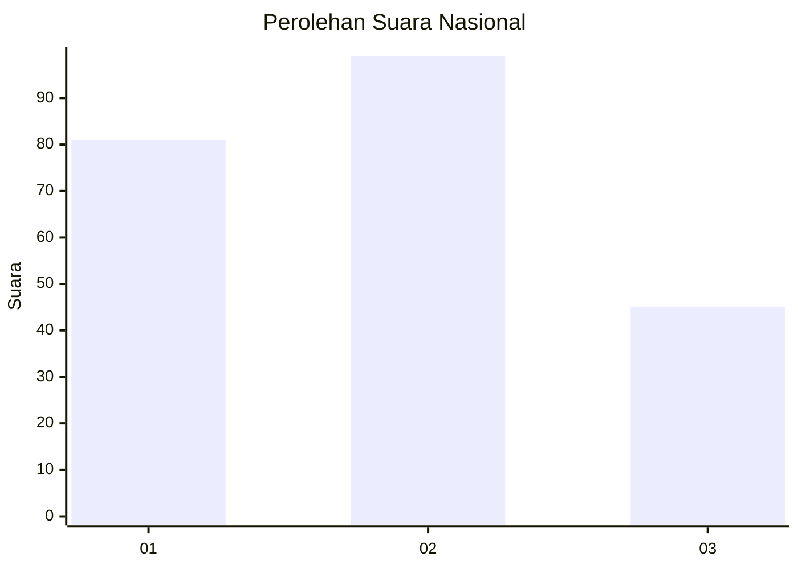
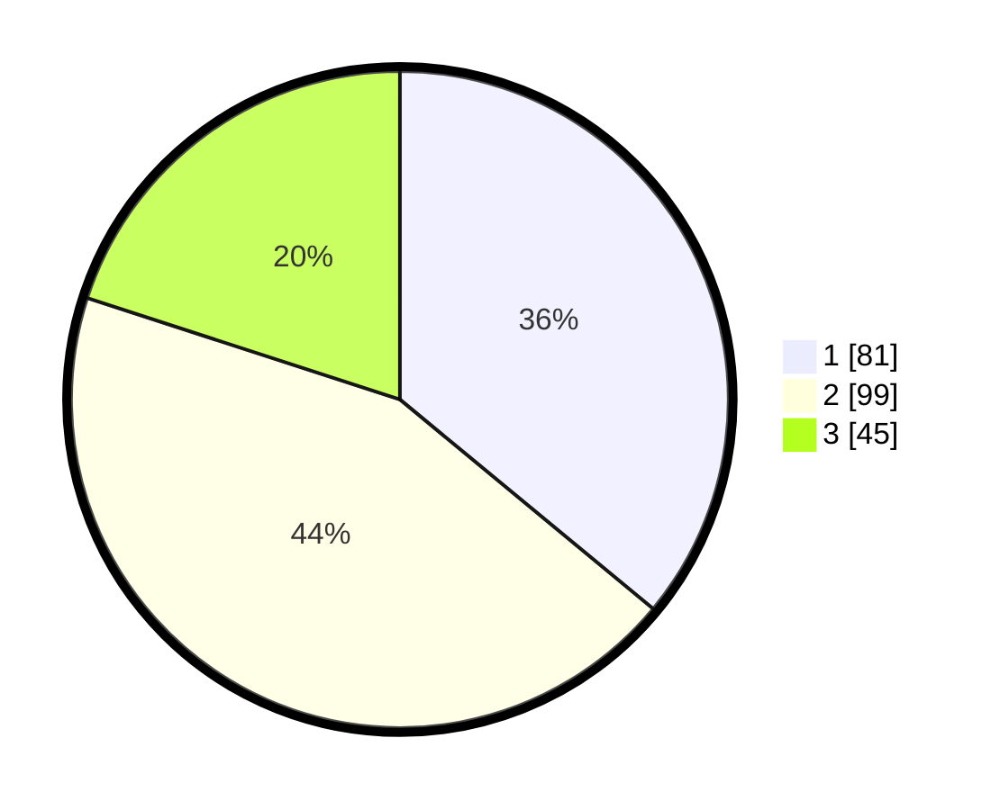

# Hasil

## Grafik

## Tabel

| No.    | Nama Paslon    | Suara | Suara (raw) | Persentase |
|:------ |:-------------- | -----:| -----------:| ----------:|
| 100025 | ANIES MUHAIMIN | 81    | [81][p-1]   | 36,00      |
| 100026 | PRABOWO GIBRAN | 99    | [99][p-2]   | 44,00      |
| 100027 | GANJAR MAHFUD  | 45    | [45][p-3]   | 20,00      |

[p-1]: https://github.com/gigit-pemilu/pemilu-2024/blob/main/pilpres/hitung-suara/sub/31-dki-jakarta/sub/74-jakarta-selatan/sub/05-kebayoran-lama/sub/1002-pondok-pinang/sub/149-tps/sub/paslon-1.txt
[p-2]: https://github.com/gigit-pemilu/pemilu-2024/blob/main/pilpres/hitung-suara/sub/31-dki-jakarta/sub/74-jakarta-selatan/sub/05-kebayoran-lama/sub/1002-pondok-pinang/sub/149-tps/sub/paslon-2.txt
[p-3]: https://github.com/gigit-pemilu/pemilu-2024/blob/main/pilpres/hitung-suara/sub/31-dki-jakarta/sub/74-jakarta-selatan/sub/05-kebayoran-lama/sub/1002-pondok-pinang/sub/149-tps/sub/paslon-3.txt

## Foto C Plano

https://sirekap-obj-formc.kpu.go.id/ee7b/pemilu/ppwp/31/74/05/10/02/3174051002149-20240214-225640--75fb0cc3-9bf4-47fc-beac-bfb0f5797f6f.jpg

https://sirekap-obj-formc.kpu.go.id/ee7b/pemilu/ppwp/31/74/05/10/02/3174051002149-20240214-225745--70ffd902-f6d5-4ec7-9c69-dff602450ecd.jpg

https://sirekap-obj-formc.kpu.go.id/ee7b/pemilu/ppwp/31/74/05/10/02/3174051002149-20240214-225918--42aa882e-3282-4709-bf49-42623fcc3e83.jpg

## Metadata

| Key        | Value               |
| ---------- | ------------------- |
| Time Stamp | 2024-02-24 22:31:28 |

