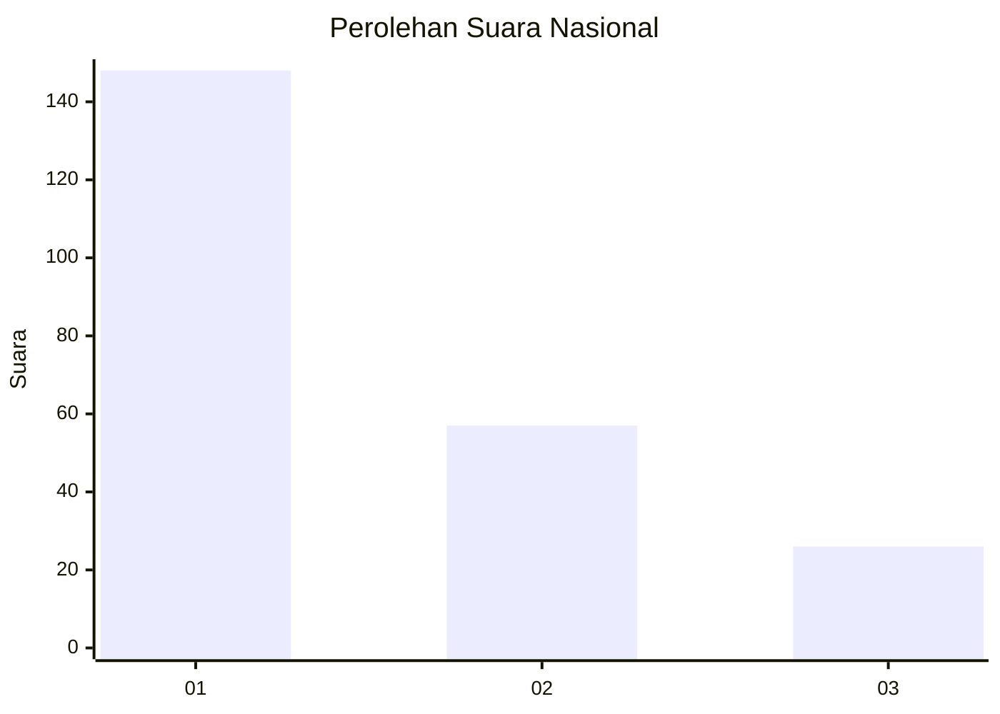
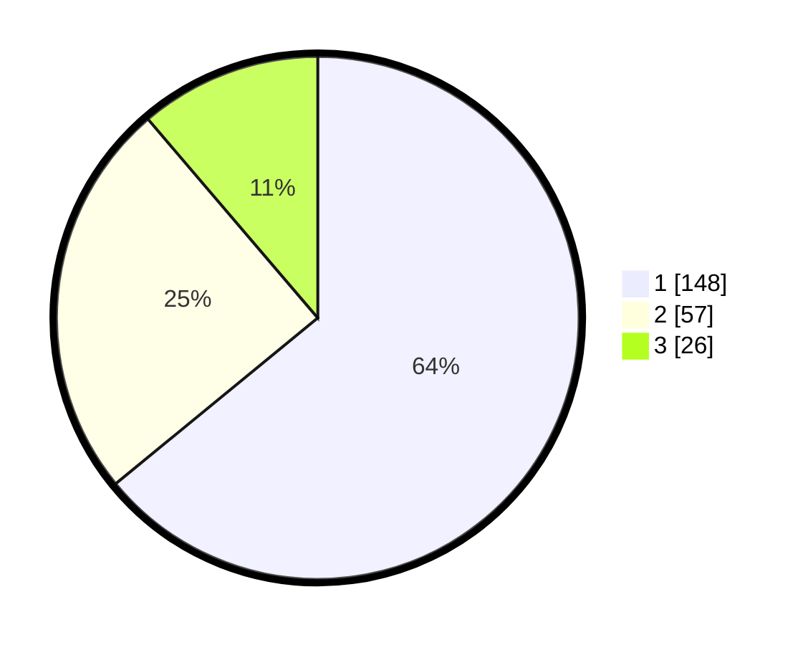

# Hasil

## Grafik

## Tabel

| No.    | Nama Paslon    | Suara | Suara (raw) | Persentase |
|:------ |:-------------- | -----:| -----------:| ----------:|
| 100025 | ANIES MUHAIMIN | 148   | [148][p-1]  | 64,07      |
| 100026 | PRABOWO GIBRAN | 57    | [57][p-2]   | 24,68      |
| 100027 | GANJAR MAHFUD  | 26    | [26][p-3]   | 11,26      |

[p-1]: https://github.com/gigit-pemilu/pemilu-2024/blob/main/pilpres/hitung-suara/sub/31-dki-jakarta/sub/74-jakarta-selatan/sub/05-kebayoran-lama/sub/1002-pondok-pinang/sub/152-tps/sub/paslon-1.txt
[p-2]: https://github.com/gigit-pemilu/pemilu-2024/blob/main/pilpres/hitung-suara/sub/31-dki-jakarta/sub/74-jakarta-selatan/sub/05-kebayoran-lama/sub/1002-pondok-pinang/sub/152-tps/sub/paslon-2.txt
[p-3]: https://github.com/gigit-pemilu/pemilu-2024/blob/main/pilpres/hitung-suara/sub/31-dki-jakarta/sub/74-jakarta-selatan/sub/05-kebayoran-lama/sub/1002-pondok-pinang/sub/152-tps/sub/paslon-3.txt

## Foto C Plano

https://sirekap-obj-formc.kpu.go.id/2b08/pemilu/ppwp/31/74/05/10/02/3174051002152-20240215-004924--f1913cbc-aefa-489d-bae6-1b46c4722d8e.jpg

https://sirekap-obj-formc.kpu.go.id/2b08/pemilu/ppwp/31/74/05/10/02/3174051002152-20240215-011232--065c7762-86c8-4823-bacb-6dc3a1d3612f.jpg

https://sirekap-obj-formc.kpu.go.id/2b08/pemilu/ppwp/31/74/05/10/02/3174051002152-20240215-005231--b90c5fc6-9f0c-4cee-8105-d180903dc1de.jpg

## Metadata

| Key        | Value               |
| ---------- | ------------------- |
| Time Stamp | 2024-02-17 19:30:00 |

