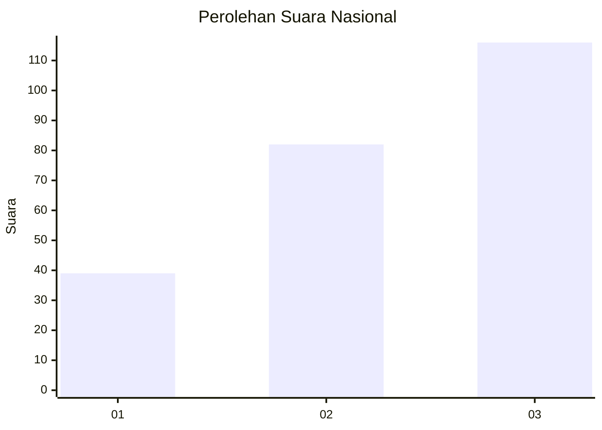
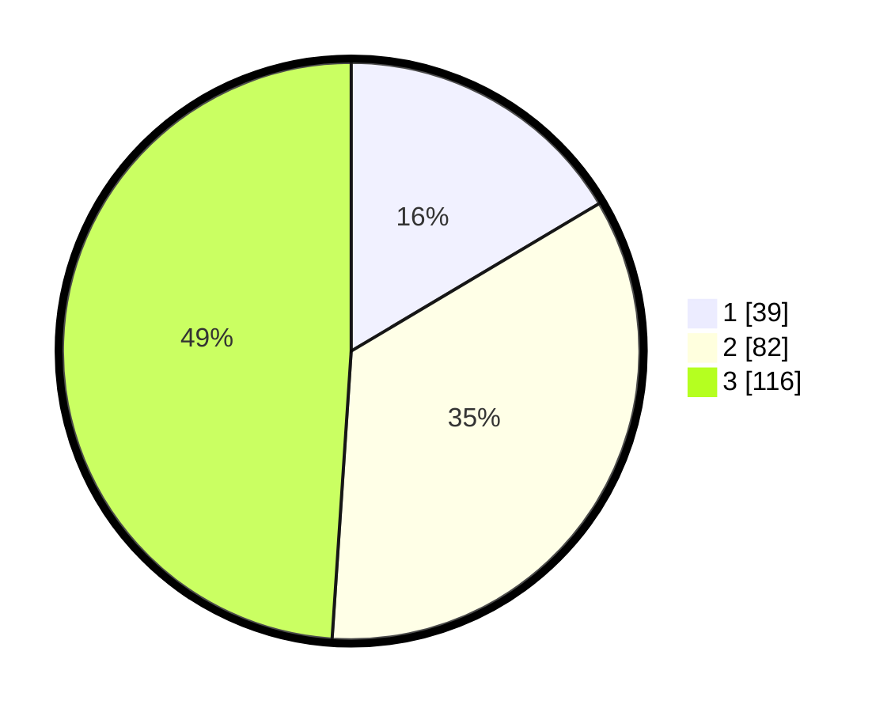

# Hasil

## Grafik

## Tabel

| No.    | Nama Paslon    | Suara | Suara (raw) | Persentase |
|:------ |:-------------- | -----:| -----------:| ----------:|
| 100025 | ANIES MUHAIMIN | 39    | [39][p-1]   | 16,46      |
| 100026 | PRABOWO GIBRAN | 82    | [82][p-2]   | 34,60      |
| 100027 | GANJAR MAHFUD  | 116   | [116][p-3]  | 48,95      |

[p-1]: https://github.com/gigit-pemilu/pemilu-2024/blob/main/pilpres/hitung-suara/sub/31-dki-jakarta/sub/74-jakarta-selatan/sub/05-kebayoran-lama/sub/1002-pondok-pinang/sub/170-tps/sub/paslon-1.txt
[p-2]: https://github.com/gigit-pemilu/pemilu-2024/blob/main/pilpres/hitung-suara/sub/31-dki-jakarta/sub/74-jakarta-selatan/sub/05-kebayoran-lama/sub/1002-pondok-pinang/sub/170-tps/sub/paslon-2.txt
[p-3]: https://github.com/gigit-pemilu/pemilu-2024/blob/main/pilpres/hitung-suara/sub/31-dki-jakarta/sub/74-jakarta-selatan/sub/05-kebayoran-lama/sub/1002-pondok-pinang/sub/170-tps/sub/paslon-3.txt

## Foto C Plano

https://sirekap-obj-formc.kpu.go.id/240f/pemilu/ppwp/31/74/05/10/02/3174051002170-20240216-003003--e10ec9ad-e1da-40f1-b3d6-7fc88bcb3d91.jpg

https://sirekap-obj-formc.kpu.go.id/240f/pemilu/ppwp/31/74/05/10/02/3174051002170-20240216-002935--5a99e01e-e146-4a49-ae04-e8cc14685054.jpg

https://sirekap-obj-formc.kpu.go.id/240f/pemilu/ppwp/31/74/05/10/02/3174051002170-20240214-214751--df4d5836-19a1-47d3-85fe-920e97039e08.jpg

## Metadata

| Key        | Value               |
| ---------- | ------------------- |
| Time Stamp | 2024-02-24 22:31:28 |

