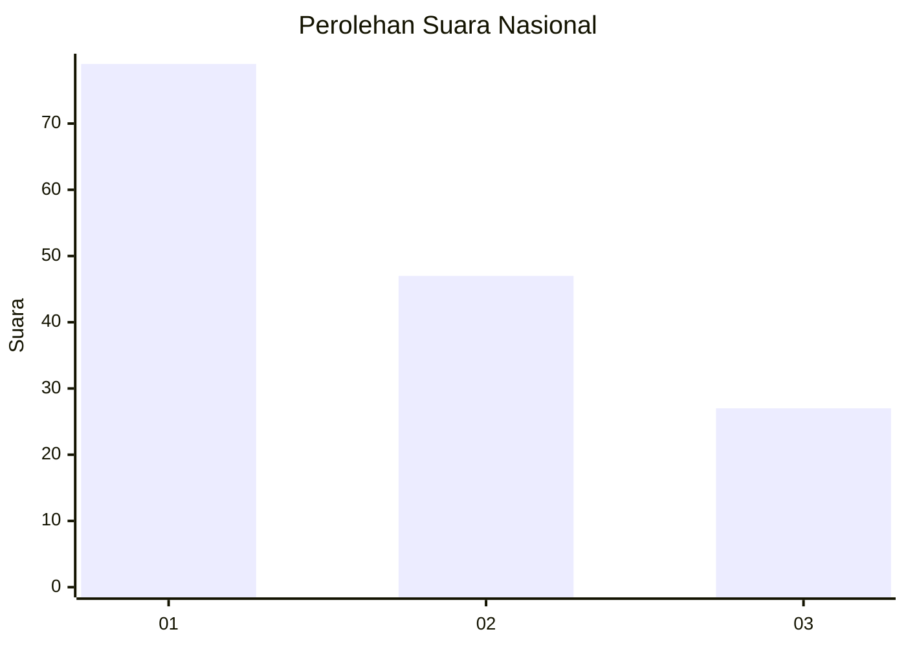
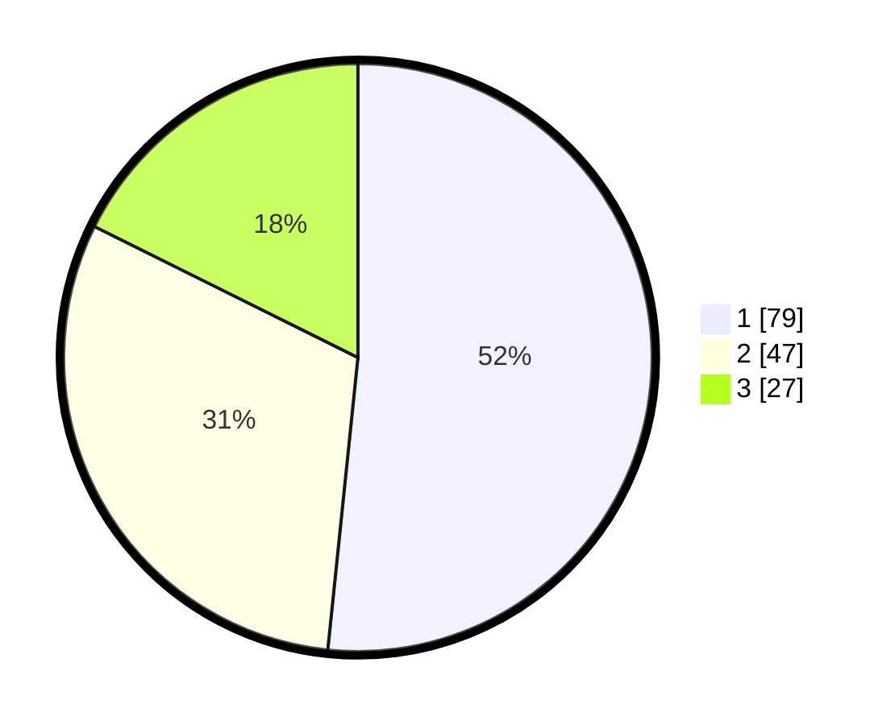

# Hasil

## Grafik

## Tabel

| No.    | Nama Paslon    | Suara | Suara (raw) | Persentase |
|:------ |:-------------- | -----:| -----------:| ----------:|
| 100025 | ANIES MUHAIMIN | 79    | [79][p-1]   | 51,63      |
| 100026 | PRABOWO GIBRAN | 47    | [47][p-2]   | 30,72      |
| 100027 | GANJAR MAHFUD  | 27    | [27][p-3]   | 17,65      |

[p-1]: https://github.com/gigit-pemilu/pemilu-2024/blob/main/pilpres/hitung-suara/sub/31-dki-jakarta/sub/74-jakarta-selatan/sub/05-kebayoran-lama/sub/1003-cipulir/sub/027-tps/sub/paslon-1.txt
[p-2]: https://github.com/gigit-pemilu/pemilu-2024/blob/main/pilpres/hitung-suara/sub/31-dki-jakarta/sub/74-jakarta-selatan/sub/05-kebayoran-lama/sub/1003-cipulir/sub/027-tps/sub/paslon-2.txt
[p-3]: https://github.com/gigit-pemilu/pemilu-2024/blob/main/pilpres/hitung-suara/sub/31-dki-jakarta/sub/74-jakarta-selatan/sub/05-kebayoran-lama/sub/1003-cipulir/sub/027-tps/sub/paslon-3.txt

## Foto C Plano

https://sirekap-obj-formc.kpu.go.id/c7b0/pemilu/ppwp/31/74/05/10/03/3174051003027-20240214-220123--050e2875-dacc-4411-a53e-a484fc8ec174.jpg

https://sirekap-obj-formc.kpu.go.id/c7b0/pemilu/ppwp/31/74/05/10/03/3174051003027-20240214-220129--d788e3a7-73b8-428e-b111-fc1c62ac4877.jpg

https://sirekap-obj-formc.kpu.go.id/c7b0/pemilu/ppwp/31/74/05/10/03/3174051003027-20240214-220136--a863f8eb-299d-4265-93f1-b62056ff5d50.jpg

## Metadata

| Key        | Value               |
| ---------- | ------------------- |
| Time Stamp | 2024-02-25 14:00:00 |

