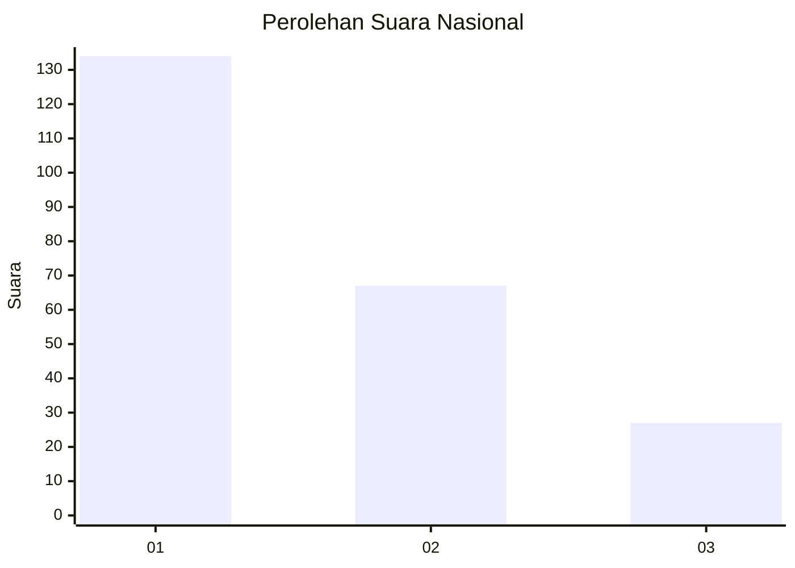
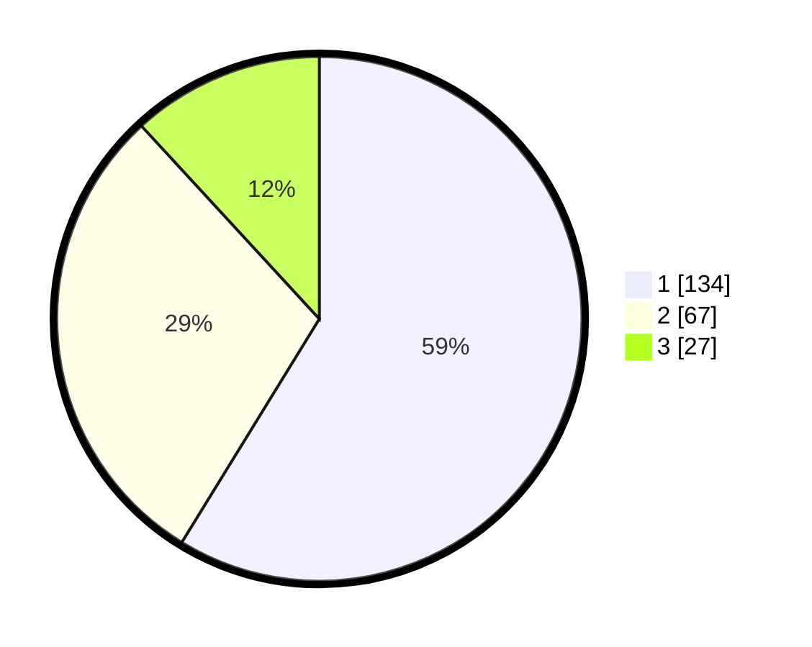

# Hasil

## Grafik

## Tabel

| No. | Nama Paslon    | Suara | Suara (raw) | Persentase |
|:--- |:-------------- | -----:| -----------:| ----------:|
| 1   | ANIES MUHAIMIN | 134   | [134][p-1]  | 58,77      |
| 2   | PRABOWO GIBRAN | 67    | [67][p-2]   | 29,39      |
| 3   | GANJAR MAHFUD  | 27    | [27][p-3]   | 11,84      |

[p-1]: https://github.com/gigit-pemilu/pemilu-2024/blob/main/pilpres/hitung-suara/sub/31-dki-jakarta/sub/74-jakarta-selatan/sub/05-kebayoran-lama/sub/1003-cipulir/sub/041-tps/sub/paslon-1.txt
[p-2]: https://github.com/gigit-pemilu/pemilu-2024/blob/main/pilpres/hitung-suara/sub/31-dki-jakarta/sub/74-jakarta-selatan/sub/05-kebayoran-lama/sub/1003-cipulir/sub/041-tps/sub/paslon-2.txt
[p-3]: https://github.com/gigit-pemilu/pemilu-2024/blob/main/pilpres/hitung-suara/sub/31-dki-jakarta/sub/74-jakarta-selatan/sub/05-kebayoran-lama/sub/1003-cipulir/sub/041-tps/sub/paslon-3.txt

## Foto C Plano

https://sirekap-obj-formc.kpu.go.id/928c/pemilu/ppwp/31/74/05/10/03/3174051003041-20240221-164035--c4edff22-e8c7-42d8-ba38-369668fc23ed.jpg

https://sirekap-obj-formc.kpu.go.id/928c/pemilu/ppwp/31/74/05/10/03/3174051003041-20240221-163814--4a24267a-2460-4410-9ac3-89b8d1b56160.jpg

https://sirekap-obj-formc.kpu.go.id/928c/pemilu/ppwp/31/74/05/10/03/3174051003041-20240221-164131--b9a96585-298e-4e94-8d33-f9138b4cf917.jpg

## Metadata

| Key        | Value               |
| ---------- | ------------------- |
| Time Stamp | 2024-02-21 18:00:00 |

## DATA PEMILIH TETAP

Jumlah pemilih dalam DPT: **425**.
 * L: **205**.
 * P: **570**.

## DATA PENGGUNA HAK PILIH

Jumlah pengguna hak pilih dalam DPT: **707**.
 * L: **202**.
 * P: **25**.

Jumlah pengguna hak pilih dalam DPTb: **250**.
 * L: **445**.
 * P: **603**.

Jumlah pengguna hak pilih dalam DPK: **22**.
 * L: **372**.
 * P: **24**.

Jumlah pengguna hak pilih: **0**.
 * L: **0**.
 * P: **0**.

## JUMLAH SUARA SAH DAN TIDAK SAH

JUMLAH SELURUH SUARA SAH: **710**.

JUMLAH SUARA TIDAK SAH: **41**.

JUMLAH SELURUH SUARA SAH DAN SUARA TIDAK SAH: **110**.

