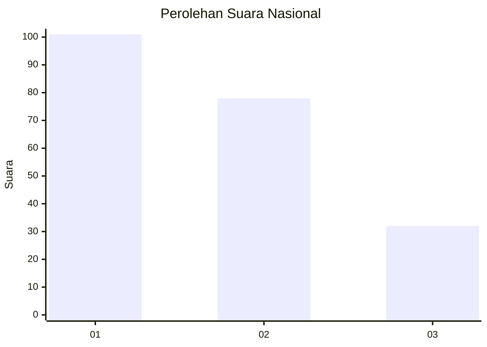
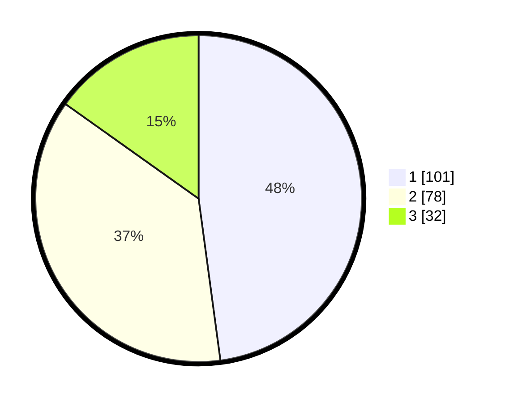

# Hasil

## Grafik

## Tabel

| No.    | Nama Paslon    | Suara | Suara (raw) | Persentase |
|:------ |:-------------- | -----:| -----------:| ----------:|
| 100025 | ANIES MUHAIMIN | 101   | [101][p-1]  | 47,87      |
| 100026 | PRABOWO GIBRAN | 78    | [78][p-2]   | 36,97      |
| 100027 | GANJAR MAHFUD  | 32    | [32][p-3]   | 15,17      |

[p-1]: https://github.com/gigit-pemilu/pemilu-2024/blob/main/pilpres/hitung-suara/sub/31-dki-jakarta/sub/74-jakarta-selatan/sub/05-kebayoran-lama/sub/1003-cipulir/sub/106-tps/sub/paslon-1.txt
[p-2]: https://github.com/gigit-pemilu/pemilu-2024/blob/main/pilpres/hitung-suara/sub/31-dki-jakarta/sub/74-jakarta-selatan/sub/05-kebayoran-lama/sub/1003-cipulir/sub/106-tps/sub/paslon-2.txt
[p-3]: https://github.com/gigit-pemilu/pemilu-2024/blob/main/pilpres/hitung-suara/sub/31-dki-jakarta/sub/74-jakarta-selatan/sub/05-kebayoran-lama/sub/1003-cipulir/sub/106-tps/sub/paslon-3.txt

## Foto C Plano

https://sirekap-obj-formc.kpu.go.id/e0d4/pemilu/ppwp/31/74/05/10/03/3174051003106-20240214-212849--e8137766-f890-45e4-b1bd-e06ac3ea4b77.jpg

https://sirekap-obj-formc.kpu.go.id/e0d4/pemilu/ppwp/31/74/05/10/03/3174051003106-20240214-213128--c44988f4-36a9-4124-9d92-abf1f9ef7951.jpg

https://sirekap-obj-formc.kpu.go.id/e0d4/pemilu/ppwp/31/74/05/10/03/3174051003106-20240214-213323--6fb0bda0-bfdd-4f57-b98a-9f7409fe6d81.jpg

## Metadata

| Key        | Value               |
| ---------- | ------------------- |
| Time Stamp | 2024-02-25 17:00:00 |

