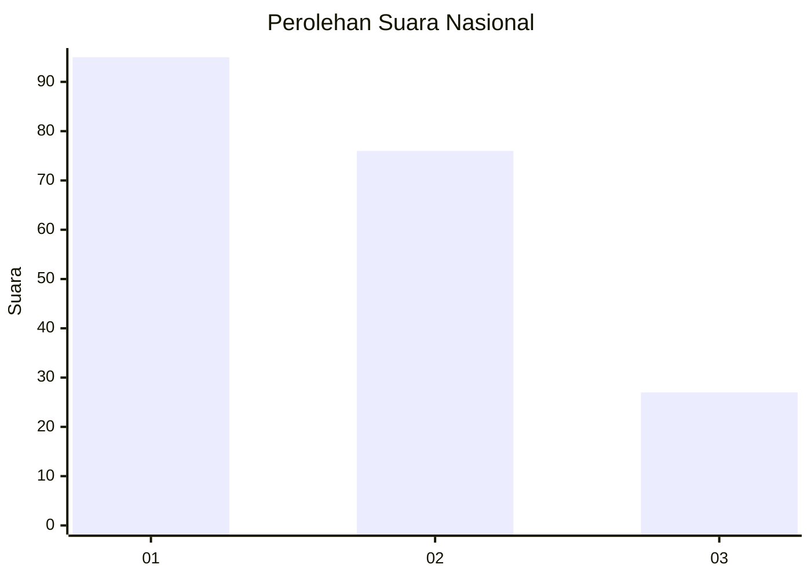
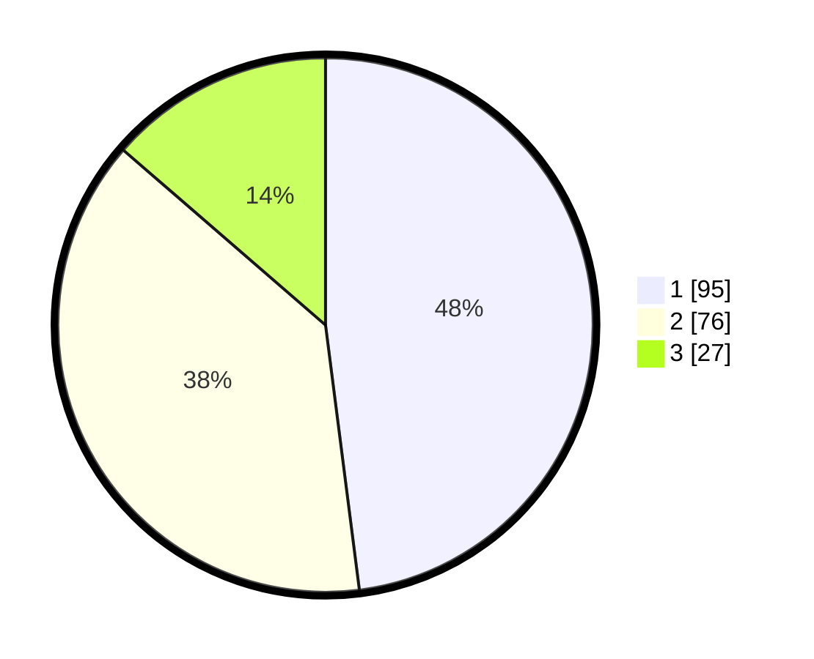

# Hasil

## Grafik

## Tabel

| No.    | Nama Paslon    | Suara | Suara (raw) | Persentase |
|:------ |:-------------- | -----:| -----------:| ----------:|
| 100025 | ANIES MUHAIMIN | 95    | [95][p-1]   | 47,98      |
| 100026 | PRABOWO GIBRAN | 76    | [76][p-2]   | 38,38      |
| 100027 | GANJAR MAHFUD  | 27    | [27][p-3]   | 13,64      |

[p-1]: https://github.com/gigit-pemilu/pemilu-2024/blob/main/pilpres/hitung-suara/sub/31-dki-jakarta/sub/74-jakarta-selatan/sub/05-kebayoran-lama/sub/1003-cipulir/sub/116-tps/sub/paslon-1.txt
[p-2]: https://github.com/gigit-pemilu/pemilu-2024/blob/main/pilpres/hitung-suara/sub/31-dki-jakarta/sub/74-jakarta-selatan/sub/05-kebayoran-lama/sub/1003-cipulir/sub/116-tps/sub/paslon-2.txt
[p-3]: https://github.com/gigit-pemilu/pemilu-2024/blob/main/pilpres/hitung-suara/sub/31-dki-jakarta/sub/74-jakarta-selatan/sub/05-kebayoran-lama/sub/1003-cipulir/sub/116-tps/sub/paslon-3.txt

## Foto C Plano

https://sirekap-obj-formc.kpu.go.id/ab97/pemilu/ppwp/31/74/05/10/03/3174051003116-20240214-195837--7890a4bd-5e11-40f9-bdc4-1abf896a0be7.jpg

https://sirekap-obj-formc.kpu.go.id/ab97/pemilu/ppwp/31/74/05/10/03/3174051003116-20240214-195611--7eecbf0a-f51a-4a54-94cd-d9f2f8f6b490.jpg

https://sirekap-obj-formc.kpu.go.id/ab97/pemilu/ppwp/31/74/05/10/03/3174051003116-20240214-195728--720e96e3-a9db-46cb-ad98-94f4808ea080.jpg

## Metadata

| Key        | Value               |
| ---------- | ------------------- |
| Time Stamp | 2024-02-24 22:31:28 |

