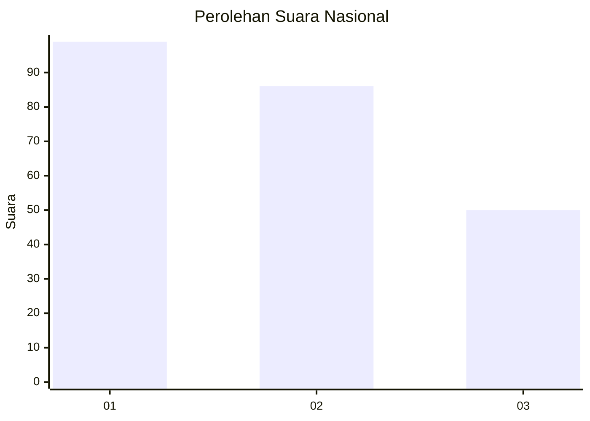
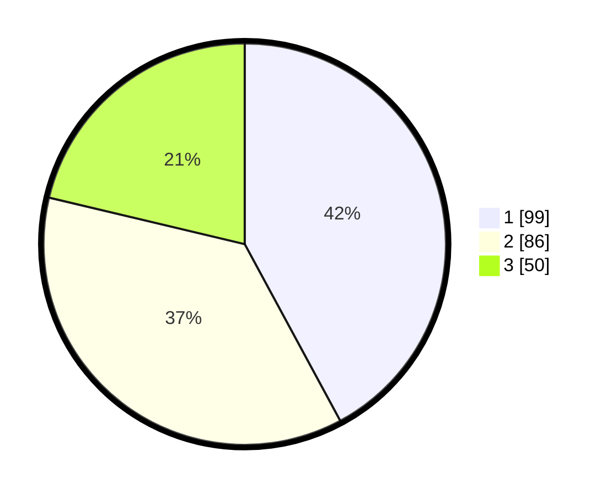

# Hasil

## Grafik

## Tabel

| No.    | Nama Paslon    | Suara | Suara (raw) | Persentase |
|:------ |:-------------- | -----:| -----------:| ----------:|
| 100025 | ANIES MUHAIMIN | 99    | [99][p-1]   | 42,13      |
| 100026 | PRABOWO GIBRAN | 86    | [86][p-2]   | 36,60      |
| 100027 | GANJAR MAHFUD  | 50    | [50][p-3]   | 21,28      |

[p-1]: https://github.com/gigit-pemilu/pemilu-2024/blob/main/pilpres/hitung-suara/sub/31-dki-jakarta/sub/74-jakarta-selatan/sub/05-kebayoran-lama/sub/1003-cipulir/sub/137-tps/sub/paslon-1.txt
[p-2]: https://github.com/gigit-pemilu/pemilu-2024/blob/main/pilpres/hitung-suara/sub/31-dki-jakarta/sub/74-jakarta-selatan/sub/05-kebayoran-lama/sub/1003-cipulir/sub/137-tps/sub/paslon-2.txt
[p-3]: https://github.com/gigit-pemilu/pemilu-2024/blob/main/pilpres/hitung-suara/sub/31-dki-jakarta/sub/74-jakarta-selatan/sub/05-kebayoran-lama/sub/1003-cipulir/sub/137-tps/sub/paslon-3.txt

## Foto C Plano

https://sirekap-obj-formc.kpu.go.id/c8fc/pemilu/ppwp/31/74/05/10/03/3174051003137-20240219-143227--35047379-8b08-4244-a544-69c6ec9dafce.jpg

https://sirekap-obj-formc.kpu.go.id/c8fc/pemilu/ppwp/31/74/05/10/03/3174051003137-20240214-215334--f6cb3f95-32dc-4e05-9400-463670f36674.jpg

https://sirekap-obj-formc.kpu.go.id/c8fc/pemilu/ppwp/31/74/05/10/03/3174051003137-20240219-201211--b7751d64-3beb-42d6-9b90-b4307a5c2db8.jpg

## Metadata

| Key        | Value               |
| ---------- | ------------------- |
| Time Stamp | 2024-02-24 22:31:28 |

