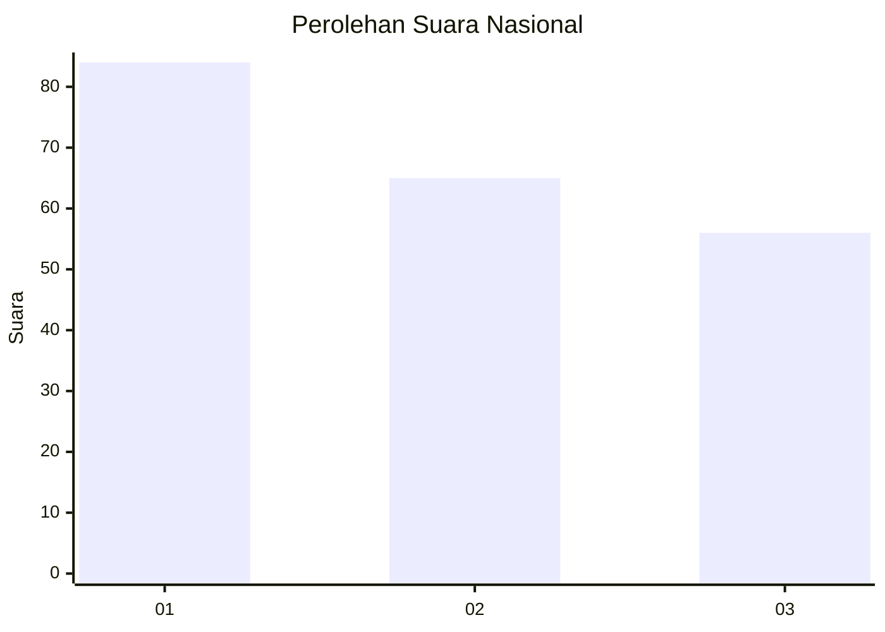
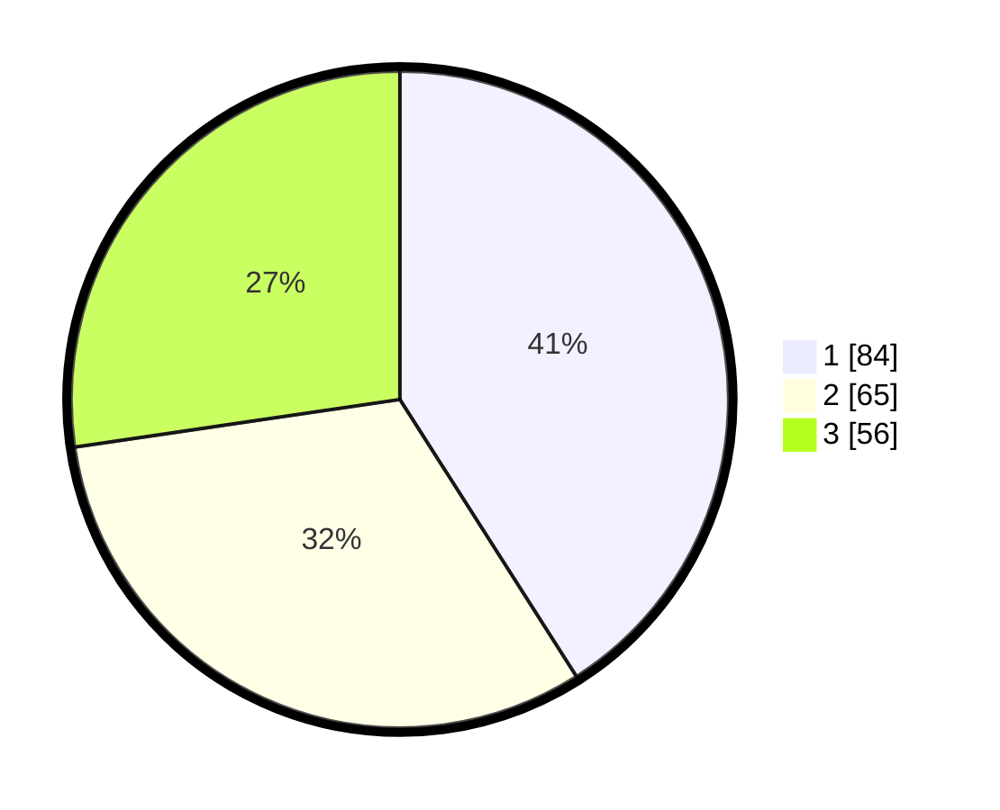

# Hasil

## Grafik

## Tabel

| No.    | Nama Paslon    | Suara | Suara (raw) | Persentase |
|:------ |:-------------- | -----:| -----------:| ----------:|
| 100025 | ANIES MUHAIMIN | 84    | [84][p-1]   | 40,98      |
| 100026 | PRABOWO GIBRAN | 65    | [65][p-2]   | 31,71      |
| 100027 | GANJAR MAHFUD  | 56    | [56][p-3]   | 27,32      |

[p-1]: https://github.com/gigit-pemilu/pemilu-2024/blob/main/pilpres/hitung-suara/sub/31-dki-jakarta/sub/74-jakarta-selatan/sub/05-kebayoran-lama/sub/1004-grogol-utara/sub/023-tps/sub/paslon-1.txt
[p-2]: https://github.com/gigit-pemilu/pemilu-2024/blob/main/pilpres/hitung-suara/sub/31-dki-jakarta/sub/74-jakarta-selatan/sub/05-kebayoran-lama/sub/1004-grogol-utara/sub/023-tps/sub/paslon-2.txt
[p-3]: https://github.com/gigit-pemilu/pemilu-2024/blob/main/pilpres/hitung-suara/sub/31-dki-jakarta/sub/74-jakarta-selatan/sub/05-kebayoran-lama/sub/1004-grogol-utara/sub/023-tps/sub/paslon-3.txt

## Foto C Plano

https://sirekap-obj-formc.kpu.go.id/17a1/pemilu/ppwp/31/74/05/10/04/3174051004023-20240214-192750--792807c6-8443-4da0-9780-6ca8e602cfe7.jpg

https://sirekap-obj-formc.kpu.go.id/17a1/pemilu/ppwp/31/74/05/10/04/3174051004023-20240214-191545--6f6d51f2-93b3-4dd9-81be-1c27c994996f.jpg

https://sirekap-obj-formc.kpu.go.id/17a1/pemilu/ppwp/31/74/05/10/04/3174051004023-20240214-193026--311848cb-1406-4e45-8edf-5ea9f0ff5982.jpg

## Metadata

| Key        | Value               |
| ---------- | ------------------- |
| Time Stamp | 2024-02-14 21:46:01 |

