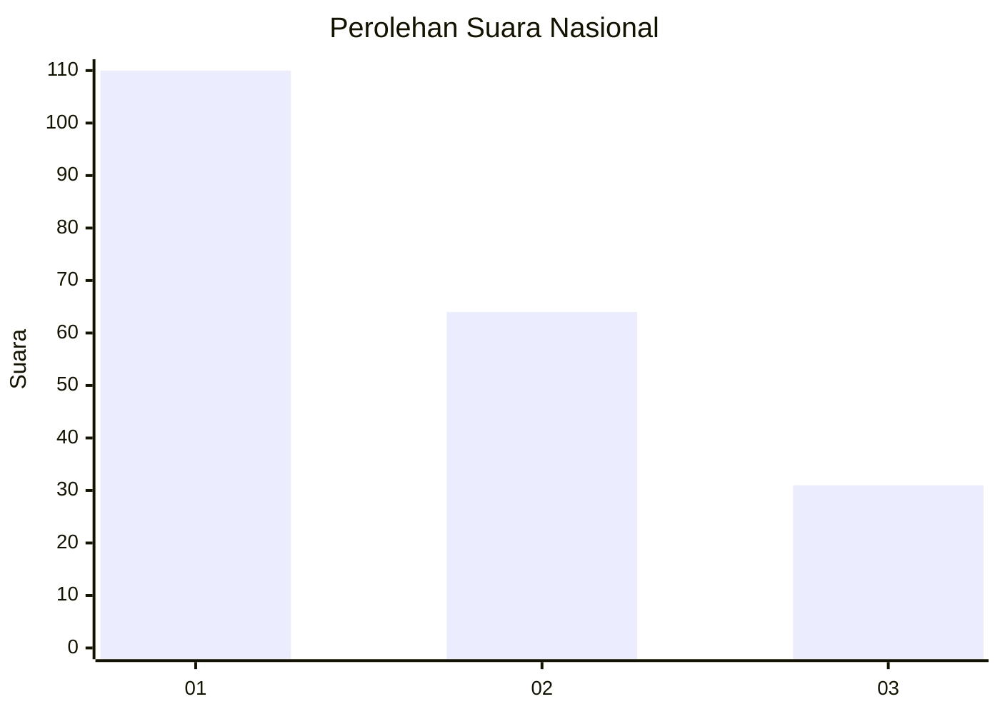
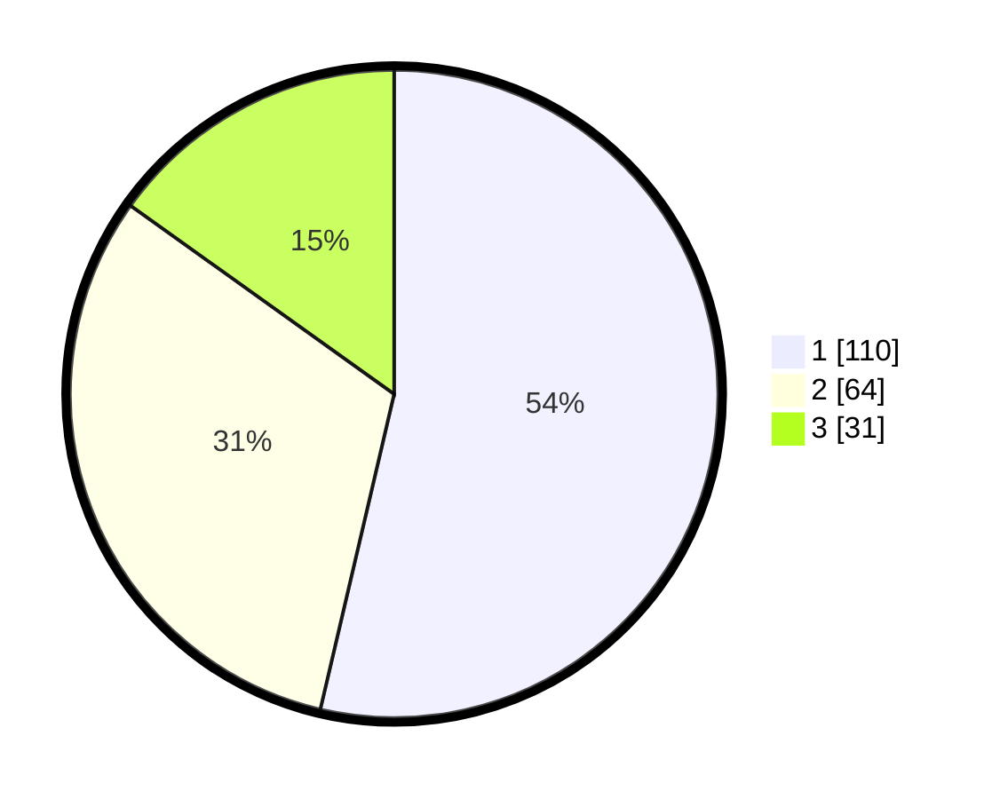

# Hasil

## Grafik

## Tabel

| No.    | Nama Paslon    | Suara | Suara (raw) | Persentase |
|:------ |:-------------- | -----:| -----------:| ----------:|
| 100025 | ANIES MUHAIMIN | 110   | [110][p-1]  | 53,66      |
| 100026 | PRABOWO GIBRAN | 64    | [64][p-2]   | 31,22      |
| 100027 | GANJAR MAHFUD  | 31    | [31][p-3]   | 15,12      |

[p-1]: https://github.com/gigit-pemilu/pemilu-2024/blob/main/pilpres/hitung-suara/sub/31-dki-jakarta/sub/74-jakarta-selatan/sub/05-kebayoran-lama/sub/1004-grogol-utara/sub/053-tps/sub/paslon-1.txt
[p-2]: https://github.com/gigit-pemilu/pemilu-2024/blob/main/pilpres/hitung-suara/sub/31-dki-jakarta/sub/74-jakarta-selatan/sub/05-kebayoran-lama/sub/1004-grogol-utara/sub/053-tps/sub/paslon-2.txt
[p-3]: https://github.com/gigit-pemilu/pemilu-2024/blob/main/pilpres/hitung-suara/sub/31-dki-jakarta/sub/74-jakarta-selatan/sub/05-kebayoran-lama/sub/1004-grogol-utara/sub/053-tps/sub/paslon-3.txt

## Foto C Plano

https://sirekap-obj-formc.kpu.go.id/5847/pemilu/ppwp/31/74/05/10/04/3174051004053-20240214-232729--51f3b65f-cf3a-4126-9212-5f7f7bf1f960.jpg

https://sirekap-obj-formc.kpu.go.id/5847/pemilu/ppwp/31/74/05/10/04/3174051004053-20240214-232900--16c90fa4-3b8e-4dfc-954c-a213e0c50331.jpg

https://sirekap-obj-formc.kpu.go.id/5847/pemilu/ppwp/31/74/05/10/04/3174051004053-20240214-233047--599f4c07-0509-4a87-ac48-85273b5beeae.jpg

## Metadata

| Key        | Value               |
| ---------- | ------------------- |
| Time Stamp | 2024-02-24 22:31:28 |

