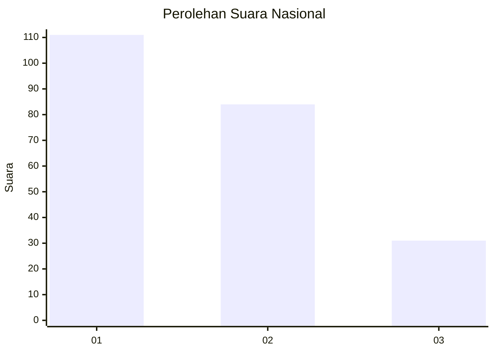
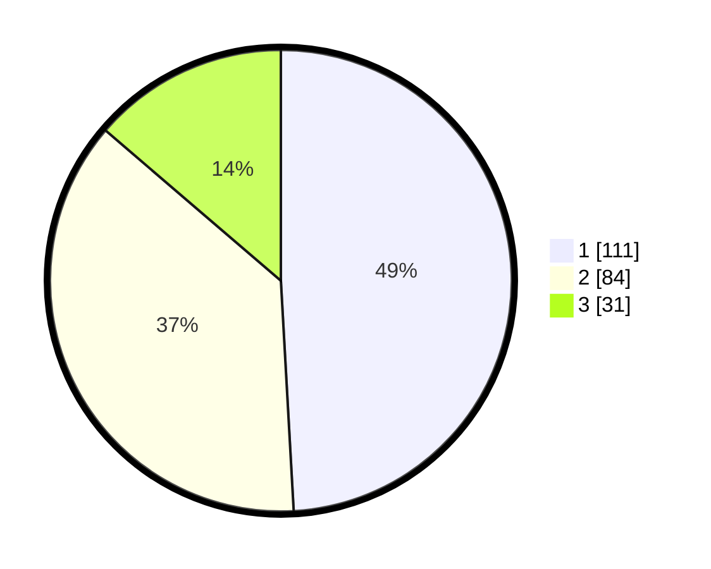

# Hasil

## Grafik

## Tabel

| No.    | Nama Paslon    | Suara | Suara (raw) | Persentase |
|:------ |:-------------- | -----:| -----------:| ----------:|
| 100025 | ANIES MUHAIMIN | 111   | [111][p-1]  | 49,12      |
| 100026 | PRABOWO GIBRAN | 84    | [84][p-2]   | 37,17      |
| 100027 | GANJAR MAHFUD  | 31    | [31][p-3]   | 13,72      |

[p-1]: https://github.com/gigit-pemilu/pemilu-2024/blob/main/pilpres/hitung-suara/sub/31-dki-jakarta/sub/74-jakarta-selatan/sub/05-kebayoran-lama/sub/1004-grogol-utara/sub/057-tps/sub/paslon-1.txt
[p-2]: https://github.com/gigit-pemilu/pemilu-2024/blob/main/pilpres/hitung-suara/sub/31-dki-jakarta/sub/74-jakarta-selatan/sub/05-kebayoran-lama/sub/1004-grogol-utara/sub/057-tps/sub/paslon-2.txt
[p-3]: https://github.com/gigit-pemilu/pemilu-2024/blob/main/pilpres/hitung-suara/sub/31-dki-jakarta/sub/74-jakarta-selatan/sub/05-kebayoran-lama/sub/1004-grogol-utara/sub/057-tps/sub/paslon-3.txt

## Foto C Plano

https://sirekap-obj-formc.kpu.go.id/48f6/pemilu/ppwp/31/74/05/10/04/3174051004057-20240214-155741--fb7f9221-493e-42bd-b784-c13ffc0ae283.jpg

https://sirekap-obj-formc.kpu.go.id/48f6/pemilu/ppwp/31/74/05/10/04/3174051004057-20240214-155312--09b25f04-5701-4dfb-9c66-da53495abe57.jpg

https://sirekap-obj-formc.kpu.go.id/48f6/pemilu/ppwp/31/74/05/10/04/3174051004057-20240214-155433--9864e917-05d7-4e69-9df1-29eb01e32275.jpg

## Metadata

| Key        | Value               |
| ---------- | ------------------- |
| Time Stamp | 2024-02-24 22:31:28 |

