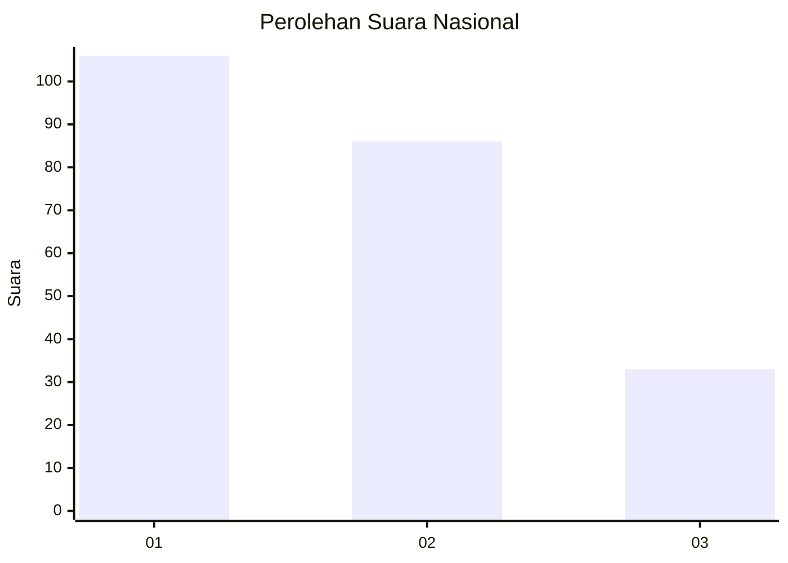
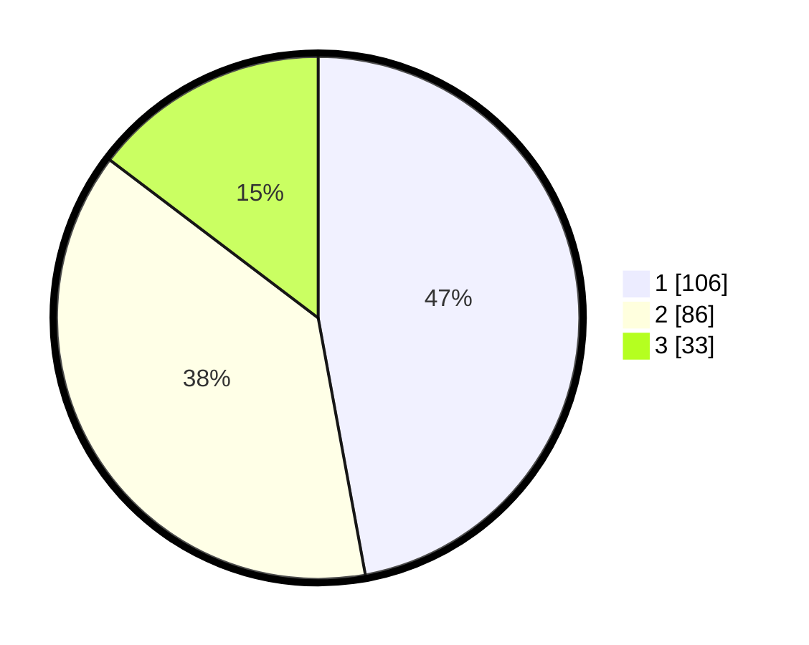

# Hasil

## Grafik

## Tabel

| No.    | Nama Paslon    | Suara | Suara (raw) | Persentase |
|:------ |:-------------- | -----:| -----------:| ----------:|
| 100025 | ANIES MUHAIMIN | 106   | [106][p-1]  | 47,11      |
| 100026 | PRABOWO GIBRAN | 86    | [86][p-2]   | 38,22      |
| 100027 | GANJAR MAHFUD  | 33    | [33][p-3]   | 14,67      |

[p-1]: https://github.com/gigit-pemilu/pemilu-2024/blob/main/pilpres/hitung-suara/sub/31-dki-jakarta/sub/74-jakarta-selatan/sub/05-kebayoran-lama/sub/1004-grogol-utara/sub/076-tps/sub/paslon-1.txt
[p-2]: https://github.com/gigit-pemilu/pemilu-2024/blob/main/pilpres/hitung-suara/sub/31-dki-jakarta/sub/74-jakarta-selatan/sub/05-kebayoran-lama/sub/1004-grogol-utara/sub/076-tps/sub/paslon-2.txt
[p-3]: https://github.com/gigit-pemilu/pemilu-2024/blob/main/pilpres/hitung-suara/sub/31-dki-jakarta/sub/74-jakarta-selatan/sub/05-kebayoran-lama/sub/1004-grogol-utara/sub/076-tps/sub/paslon-3.txt

## Foto C Plano

https://sirekap-obj-formc.kpu.go.id/cd33/pemilu/ppwp/31/74/05/10/04/3174051004076-20240214-230032--bc2ba094-50e9-4b3b-ae81-ec0064aff436.jpg

https://sirekap-obj-formc.kpu.go.id/cd33/pemilu/ppwp/31/74/05/10/04/3174051004076-20240214-225814--926663fb-7dc2-4689-9b4f-9a45bf29198c.jpg

https://sirekap-obj-formc.kpu.go.id/cd33/pemilu/ppwp/31/74/05/10/04/3174051004076-20240214-225954--64d43dc4-32a7-4692-9a06-e5b3555fc4bf.jpg

## Metadata

| Key        | Value               |
| ---------- | ------------------- |
| Time Stamp | 2024-02-15 20:00:44 |

