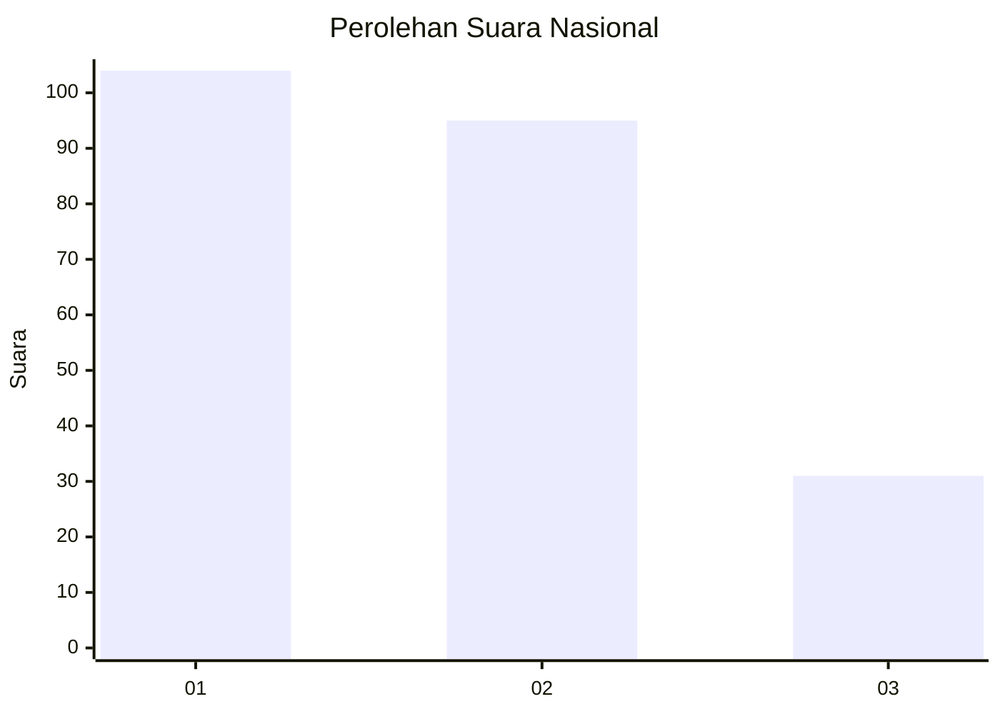
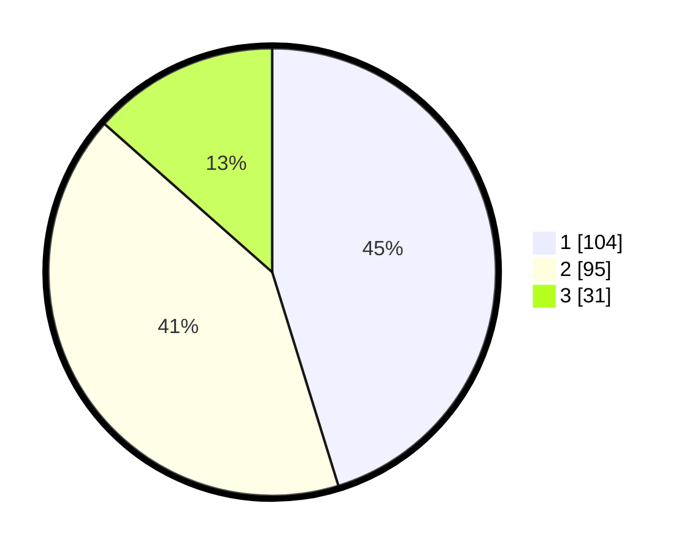

# Hasil

## Grafik

## Tabel

| No.    | Nama Paslon    | Suara | Suara (raw) | Persentase |
|:------ |:-------------- | -----:| -----------:| ----------:|
| 100025 | ANIES MUHAIMIN | 104   | [104][p-1]  | 45,22      |
| 100026 | PRABOWO GIBRAN | 95    | [95][p-2]   | 41,30      |
| 100027 | GANJAR MAHFUD  | 31    | [31][p-3]   | 13,48      |

[p-1]: https://github.com/gigit-pemilu/pemilu-2024/blob/main/pilpres/hitung-suara/sub/31-dki-jakarta/sub/74-jakarta-selatan/sub/05-kebayoran-lama/sub/1004-grogol-utara/sub/095-tps/sub/paslon-1.txt
[p-2]: https://github.com/gigit-pemilu/pemilu-2024/blob/main/pilpres/hitung-suara/sub/31-dki-jakarta/sub/74-jakarta-selatan/sub/05-kebayoran-lama/sub/1004-grogol-utara/sub/095-tps/sub/paslon-2.txt
[p-3]: https://github.com/gigit-pemilu/pemilu-2024/blob/main/pilpres/hitung-suara/sub/31-dki-jakarta/sub/74-jakarta-selatan/sub/05-kebayoran-lama/sub/1004-grogol-utara/sub/095-tps/sub/paslon-3.txt

## Foto C Plano

https://sirekap-obj-formc.kpu.go.id/7bce/pemilu/ppwp/31/74/05/10/04/3174051004095-20240214-212322--9c83bfbb-1286-430f-9b66-7c309cebb673.jpg

https://sirekap-obj-formc.kpu.go.id/7bce/pemilu/ppwp/31/74/05/10/04/3174051004095-20240214-212747--6bdfa515-2846-46a3-bc46-d37e3e33b029.jpg

https://sirekap-obj-formc.kpu.go.id/7bce/pemilu/ppwp/31/74/05/10/04/3174051004095-20240214-212922--922b020a-e1b8-48e9-8e24-0a81dc21d5f3.jpg

## Metadata

| Key        | Value               |
| ---------- | ------------------- |
| Time Stamp | 2024-02-25 14:00:00 |

