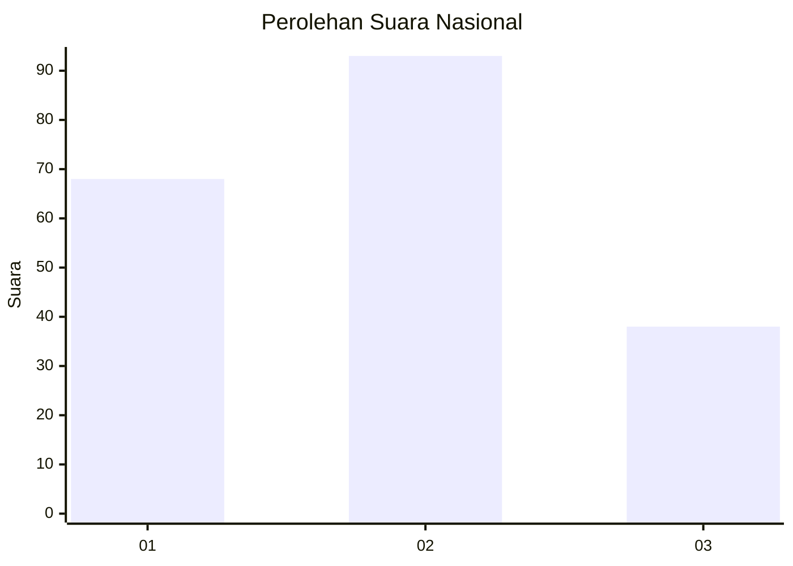
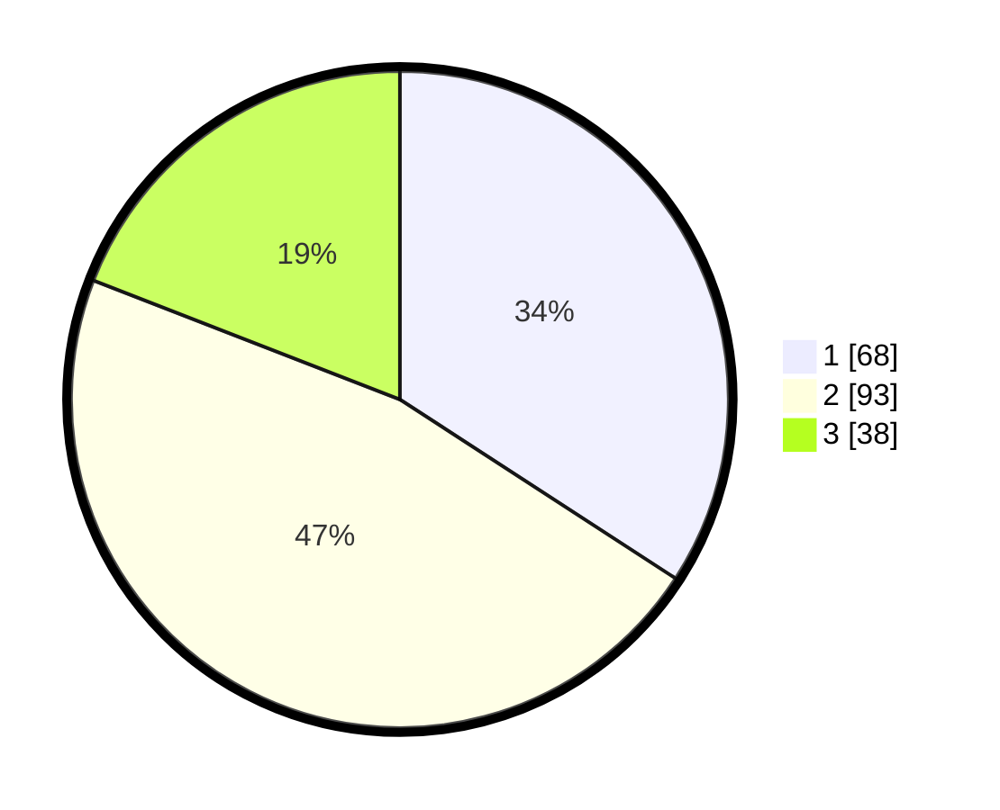

# Hasil

## Grafik

## Tabel

| No.    | Nama Paslon    | Suara | Suara (raw) | Persentase |
|:------ |:-------------- | -----:| -----------:| ----------:|
| 100025 | ANIES MUHAIMIN | 68    | [68][p-1]   | 34,17      |
| 100026 | PRABOWO GIBRAN | 93    | [93][p-2]   | 46,73      |
| 100027 | GANJAR MAHFUD  | 38    | [38][p-3]   | 19,10      |

[p-1]: https://github.com/gigit-pemilu/pemilu-2024/blob/main/pilpres/hitung-suara/sub/31-dki-jakarta/sub/74-jakarta-selatan/sub/05-kebayoran-lama/sub/1004-grogol-utara/sub/100-tps/sub/paslon-1.txt
[p-2]: https://github.com/gigit-pemilu/pemilu-2024/blob/main/pilpres/hitung-suara/sub/31-dki-jakarta/sub/74-jakarta-selatan/sub/05-kebayoran-lama/sub/1004-grogol-utara/sub/100-tps/sub/paslon-2.txt
[p-3]: https://github.com/gigit-pemilu/pemilu-2024/blob/main/pilpres/hitung-suara/sub/31-dki-jakarta/sub/74-jakarta-selatan/sub/05-kebayoran-lama/sub/1004-grogol-utara/sub/100-tps/sub/paslon-3.txt

## Foto C Plano

https://sirekap-obj-formc.kpu.go.id/374e/pemilu/ppwp/31/74/05/10/04/3174051004100-20240214-230621--9a988744-bf5e-49d2-8ae5-6f4696346835.jpg

https://sirekap-obj-formc.kpu.go.id/374e/pemilu/ppwp/31/74/05/10/04/3174051004100-20240214-225330--d5519878-77f4-4f8b-b534-ec9c30b5ef45.jpg

https://sirekap-obj-formc.kpu.go.id/374e/pemilu/ppwp/31/74/05/10/04/3174051004100-20240214-230746--a34bf7a5-e0dd-4c33-b4e2-16c69b33646e.jpg

## Metadata

| Key        | Value               |
| ---------- | ------------------- |
| Time Stamp | 2024-02-24 22:31:28 |

