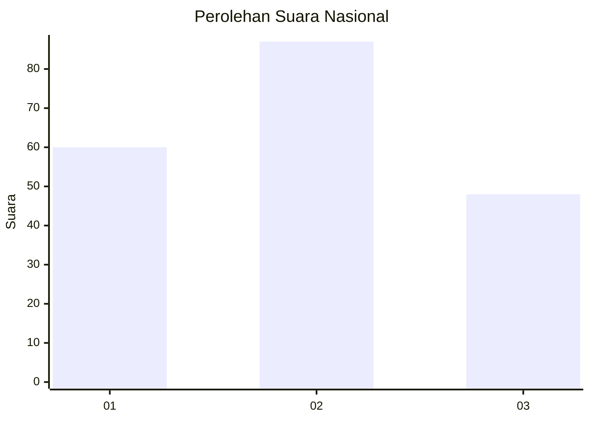
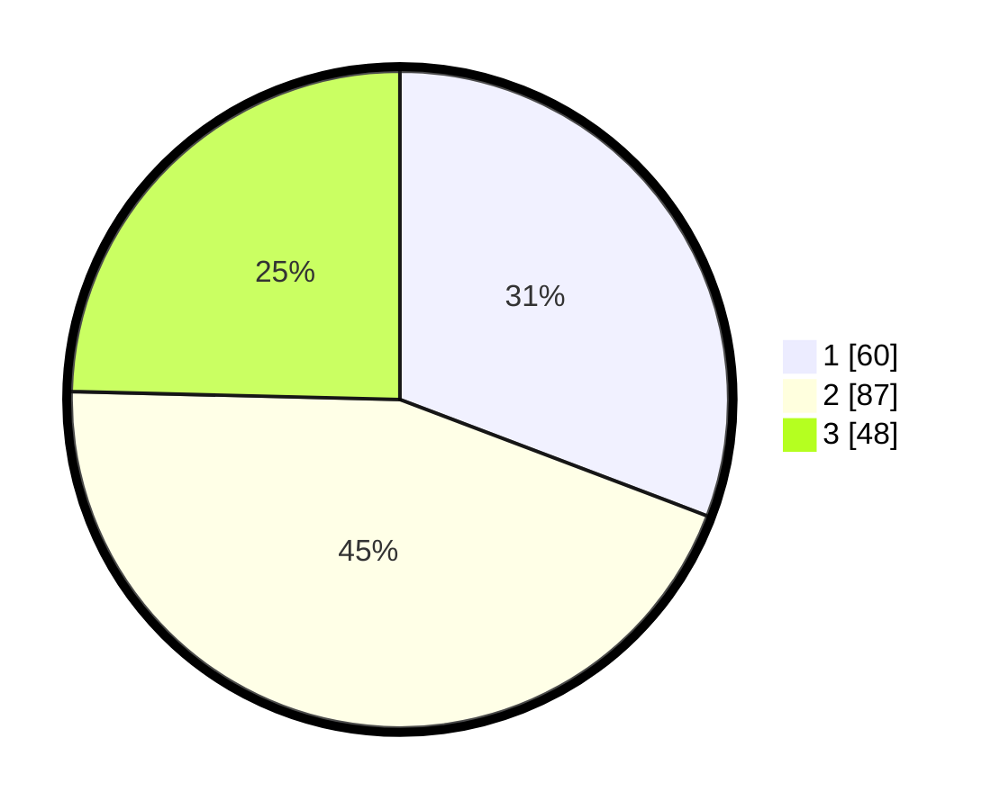

# Hasil

## Grafik

## Tabel

| No.    | Nama Paslon    | Suara | Suara (raw) | Persentase |
|:------ |:-------------- | -----:| -----------:| ----------:|
| 100025 | ANIES MUHAIMIN | 60    | [60][p-1]   | 30,77      |
| 100026 | PRABOWO GIBRAN | 87    | [87][p-2]   | 44,62      |
| 100027 | GANJAR MAHFUD  | 48    | [48][p-3]   | 24,62      |

[p-1]: https://github.com/gigit-pemilu/pemilu-2024/blob/main/pilpres/hitung-suara/sub/31-dki-jakarta/sub/74-jakarta-selatan/sub/05-kebayoran-lama/sub/1004-grogol-utara/sub/108-tps/sub/paslon-1.txt
[p-2]: https://github.com/gigit-pemilu/pemilu-2024/blob/main/pilpres/hitung-suara/sub/31-dki-jakarta/sub/74-jakarta-selatan/sub/05-kebayoran-lama/sub/1004-grogol-utara/sub/108-tps/sub/paslon-2.txt
[p-3]: https://github.com/gigit-pemilu/pemilu-2024/blob/main/pilpres/hitung-suara/sub/31-dki-jakarta/sub/74-jakarta-selatan/sub/05-kebayoran-lama/sub/1004-grogol-utara/sub/108-tps/sub/paslon-3.txt

## Foto C Plano

https://sirekap-obj-formc.kpu.go.id/af2c/pemilu/ppwp/31/74/05/10/04/3174051004108-20240214-230001--f60a1eb4-08ca-46bd-8f18-715a4434d687.jpg

https://sirekap-obj-formc.kpu.go.id/af2c/pemilu/ppwp/31/74/05/10/04/3174051004108-20240214-230118--89e11ec1-b0bd-4c0d-b085-61be3b7f7064.jpg

https://sirekap-obj-formc.kpu.go.id/af2c/pemilu/ppwp/31/74/05/10/04/3174051004108-20240214-230249--46536825-8a06-4b48-ace5-b9c7209905ee.jpg

## Metadata

| Key        | Value               |
| ---------- | ------------------- |
| Time Stamp | 2024-02-24 22:31:28 |

