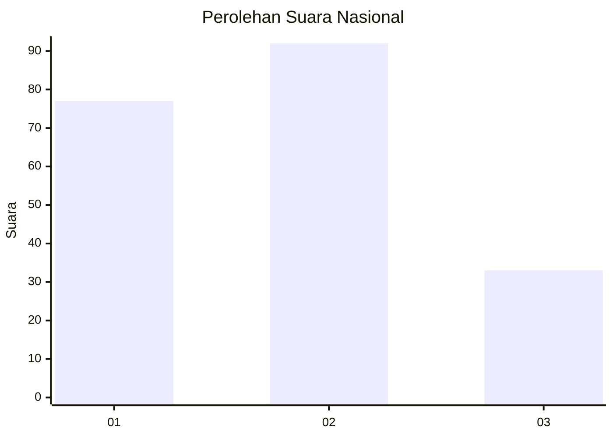
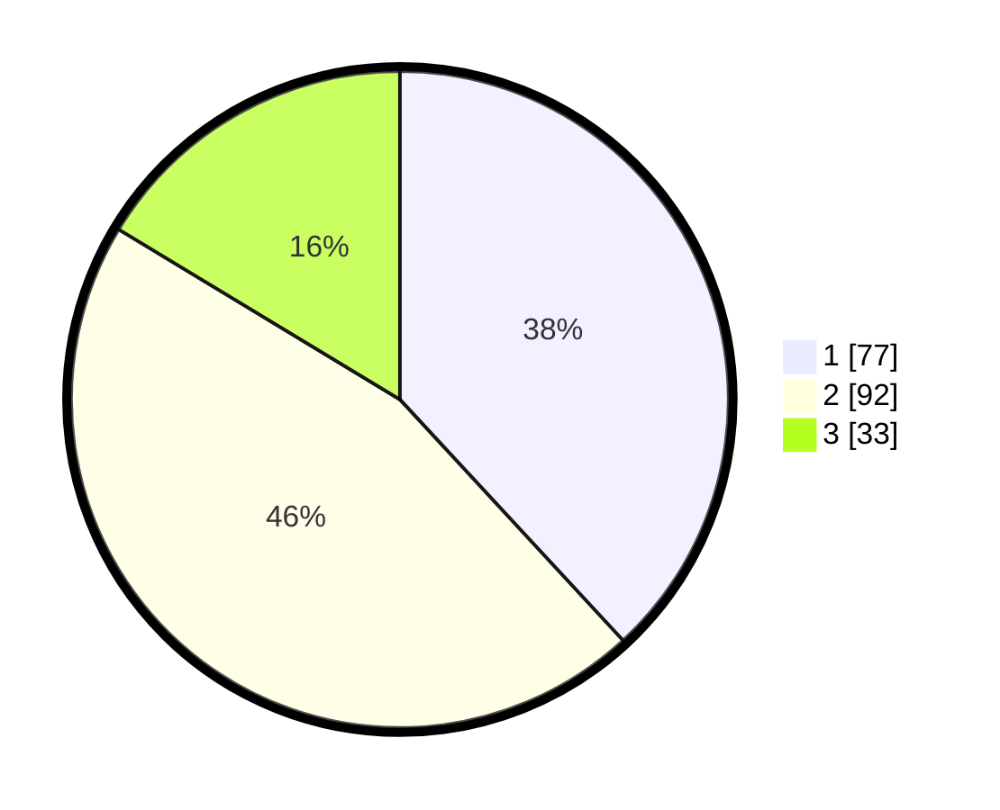

# Hasil

## Grafik

## Tabel

| No.    | Nama Paslon    | Suara | Suara (raw) | Persentase |
|:------ |:-------------- | -----:| -----------:| ----------:|
| 100025 | ANIES MUHAIMIN | 77    | [77][p-1]   | 38,12      |
| 100026 | PRABOWO GIBRAN | 92    | [92][p-2]   | 45,54      |
| 100027 | GANJAR MAHFUD  | 33    | [33][p-3]   | 16,34      |

[p-1]: https://github.com/gigit-pemilu/pemilu-2024/blob/main/pilpres/hitung-suara/sub/31-dki-jakarta/sub/74-jakarta-selatan/sub/05-kebayoran-lama/sub/1004-grogol-utara/sub/119-tps/sub/paslon-1.txt
[p-2]: https://github.com/gigit-pemilu/pemilu-2024/blob/main/pilpres/hitung-suara/sub/31-dki-jakarta/sub/74-jakarta-selatan/sub/05-kebayoran-lama/sub/1004-grogol-utara/sub/119-tps/sub/paslon-2.txt
[p-3]: https://github.com/gigit-pemilu/pemilu-2024/blob/main/pilpres/hitung-suara/sub/31-dki-jakarta/sub/74-jakarta-selatan/sub/05-kebayoran-lama/sub/1004-grogol-utara/sub/119-tps/sub/paslon-3.txt

## Foto C Plano

https://sirekap-obj-formc.kpu.go.id/a453/pemilu/ppwp/31/74/05/10/04/3174051004119-20240214-201009--3f5fb62d-8ab8-45ae-a4c6-9ab245accccc.jpg

https://sirekap-obj-formc.kpu.go.id/a453/pemilu/ppwp/31/74/05/10/04/3174051004119-20240214-201212--1fa32ee0-285f-4ee1-8d7d-a76396f0ef22.jpg

https://sirekap-obj-formc.kpu.go.id/a453/pemilu/ppwp/31/74/05/10/04/3174051004119-20240214-201747--50e64140-51cc-4a46-84fb-1110f8d154de.jpg

## Metadata

| Key        | Value               |
| ---------- | ------------------- |
| Time Stamp | 2024-02-24 22:31:28 |

