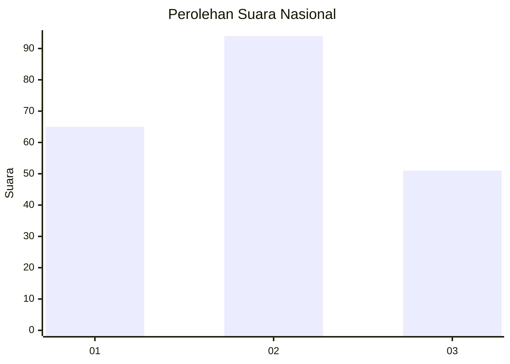
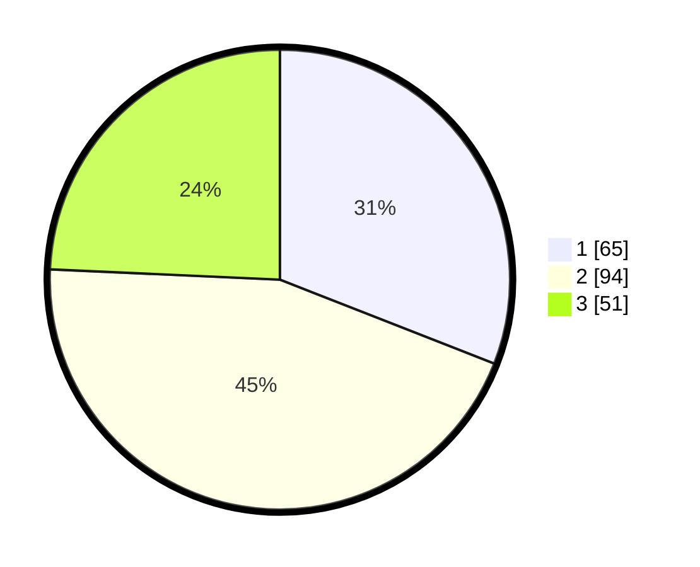

# Hasil

## Grafik

## Tabel

| No.    | Nama Paslon    | Suara | Suara (raw) | Persentase |
|:------ |:-------------- | -----:| -----------:| ----------:|
| 100025 | ANIES MUHAIMIN | 65    | [65][p-1]   | 30,95      |
| 100026 | PRABOWO GIBRAN | 94    | [94][p-2]   | 44,76      |
| 100027 | GANJAR MAHFUD  | 51    | [51][p-3]   | 24,29      |

[p-1]: https://github.com/gigit-pemilu/pemilu-2024/blob/main/pilpres/hitung-suara/sub/31-dki-jakarta/sub/74-jakarta-selatan/sub/05-kebayoran-lama/sub/1004-grogol-utara/sub/121-tps/sub/paslon-1.txt
[p-2]: https://github.com/gigit-pemilu/pemilu-2024/blob/main/pilpres/hitung-suara/sub/31-dki-jakarta/sub/74-jakarta-selatan/sub/05-kebayoran-lama/sub/1004-grogol-utara/sub/121-tps/sub/paslon-2.txt
[p-3]: https://github.com/gigit-pemilu/pemilu-2024/blob/main/pilpres/hitung-suara/sub/31-dki-jakarta/sub/74-jakarta-selatan/sub/05-kebayoran-lama/sub/1004-grogol-utara/sub/121-tps/sub/paslon-3.txt

## Foto C Plano

https://sirekap-obj-formc.kpu.go.id/c5d0/pemilu/ppwp/31/74/05/10/04/3174051004121-20240214-215703--c0562724-5bc3-440d-a98e-b2238bdf3e07.jpg

https://sirekap-obj-formc.kpu.go.id/c5d0/pemilu/ppwp/31/74/05/10/04/3174051004121-20240214-215442--78a65946-c8d6-4e6a-80d1-4f6f8dd64003.jpg

https://sirekap-obj-formc.kpu.go.id/c5d0/pemilu/ppwp/31/74/05/10/04/3174051004121-20240214-215600--ea5cd213-c8cf-4b63-9596-3b9988cc375e.jpg

## Metadata

| Key        | Value               |
| ---------- | ------------------- |
| Time Stamp | 2024-02-25 15:00:00 |

