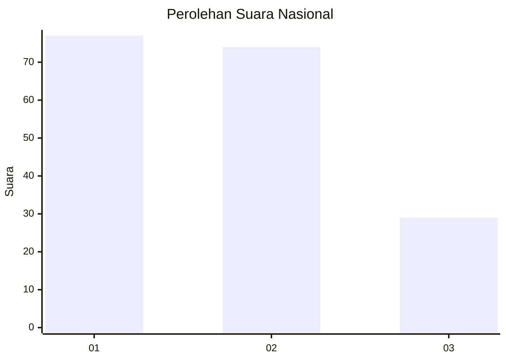
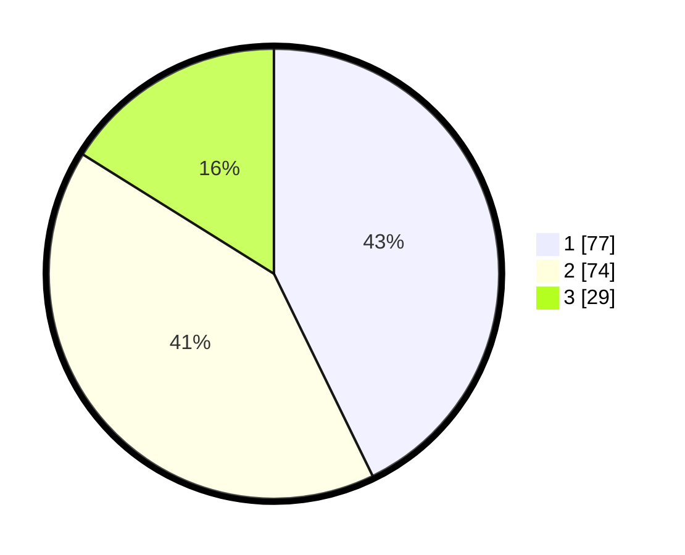

# Hasil

## Grafik

## Tabel

| No.    | Nama Paslon    | Suara | Suara (raw) | Persentase |
|:------ |:-------------- | -----:| -----------:| ----------:|
| 100025 | ANIES MUHAIMIN | 77    | [77][p-1]   | 42,78      |
| 100026 | PRABOWO GIBRAN | 74    | [74][p-2]   | 41,11      |
| 100027 | GANJAR MAHFUD  | 29    | [29][p-3]   | 16,11      |

[p-1]: https://github.com/gigit-pemilu/pemilu-2024/blob/main/pilpres/hitung-suara/sub/31-dki-jakarta/sub/74-jakarta-selatan/sub/05-kebayoran-lama/sub/1004-grogol-utara/sub/127-tps/sub/paslon-1.txt
[p-2]: https://github.com/gigit-pemilu/pemilu-2024/blob/main/pilpres/hitung-suara/sub/31-dki-jakarta/sub/74-jakarta-selatan/sub/05-kebayoran-lama/sub/1004-grogol-utara/sub/127-tps/sub/paslon-2.txt
[p-3]: https://github.com/gigit-pemilu/pemilu-2024/blob/main/pilpres/hitung-suara/sub/31-dki-jakarta/sub/74-jakarta-selatan/sub/05-kebayoran-lama/sub/1004-grogol-utara/sub/127-tps/sub/paslon-3.txt

## Foto C Plano

https://sirekap-obj-formc.kpu.go.id/8285/pemilu/ppwp/31/74/05/10/04/3174051004127-20240214-184528--4ba83f28-5927-40e8-93e8-688a945d9933.jpg

https://sirekap-obj-formc.kpu.go.id/8285/pemilu/ppwp/31/74/05/10/04/3174051004127-20240214-184950--8201b19e-ca3f-44bf-b4cb-d2167258b5b5.jpg

https://sirekap-obj-formc.kpu.go.id/8285/pemilu/ppwp/31/74/05/10/04/3174051004127-20240214-185523--83404a97-6951-4155-8702-64e7a7abf7f5.jpg

## Metadata

| Key        | Value               |
| ---------- | ------------------- |
| Time Stamp | 2024-02-24 22:31:28 |

