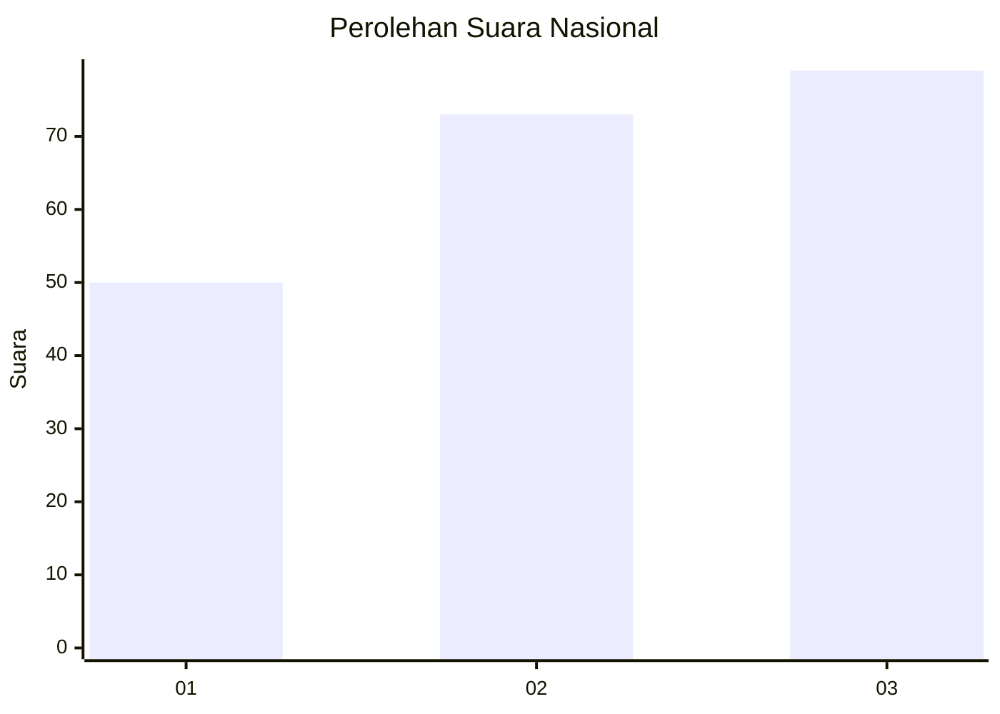
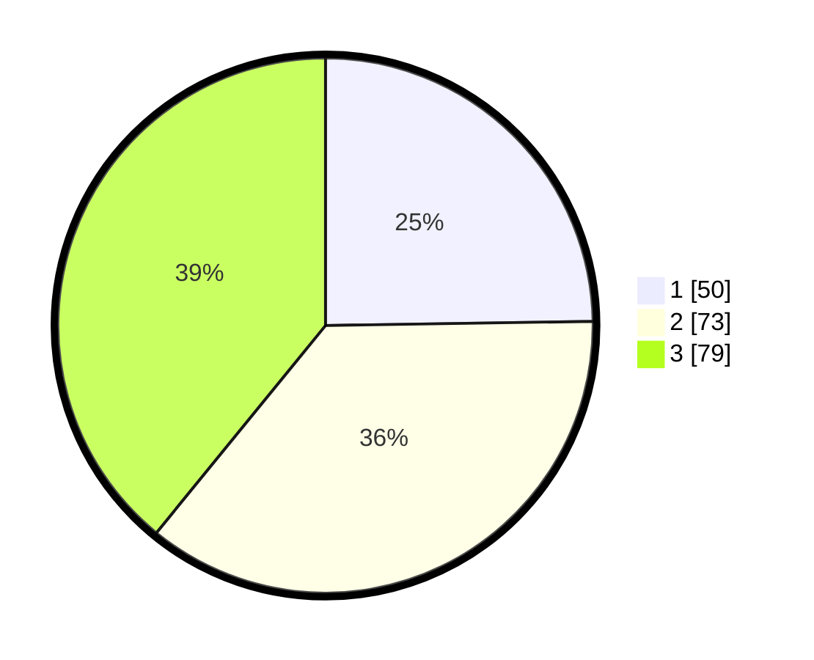

# Hasil

## Grafik

## Tabel

| No.    | Nama Paslon    | Suara | Suara (raw) | Persentase |
|:------ |:-------------- | -----:| -----------:| ----------:|
| 100025 | ANIES MUHAIMIN | 50    | [50][p-1]   | 24,75      |
| 100026 | PRABOWO GIBRAN | 73    | [73][p-2]   | 36,14      |
| 100027 | GANJAR MAHFUD  | 79    | [79][p-3]   | 39,11      |

[p-1]: https://github.com/gigit-pemilu/pemilu-2024/blob/main/pilpres/hitung-suara/sub/31-dki-jakarta/sub/74-jakarta-selatan/sub/05-kebayoran-lama/sub/1005-grogol-selatan/sub/013-tps/sub/paslon-1.txt
[p-2]: https://github.com/gigit-pemilu/pemilu-2024/blob/main/pilpres/hitung-suara/sub/31-dki-jakarta/sub/74-jakarta-selatan/sub/05-kebayoran-lama/sub/1005-grogol-selatan/sub/013-tps/sub/paslon-2.txt
[p-3]: https://github.com/gigit-pemilu/pemilu-2024/blob/main/pilpres/hitung-suara/sub/31-dki-jakarta/sub/74-jakarta-selatan/sub/05-kebayoran-lama/sub/1005-grogol-selatan/sub/013-tps/sub/paslon-3.txt

## Foto C Plano

https://sirekap-obj-formc.kpu.go.id/ea1a/pemilu/ppwp/31/74/05/10/05/3174051005013-20240214-224850--2b1d9632-de49-42d2-96a9-3f5ddd1b89ef.jpg

https://sirekap-obj-formc.kpu.go.id/ea1a/pemilu/ppwp/31/74/05/10/05/3174051005013-20240214-225029--7f3c0cf1-2ec8-40f8-bd73-31476caf77ef.jpg

https://sirekap-obj-formc.kpu.go.id/ea1a/pemilu/ppwp/31/74/05/10/05/3174051005013-20240214-225137--275fbac7-c15f-4ab3-bd55-535ebcbfa129.jpg

## Metadata

| Key        | Value               |
| ---------- | ------------------- |
| Time Stamp | 2024-02-24 22:31:28 |

