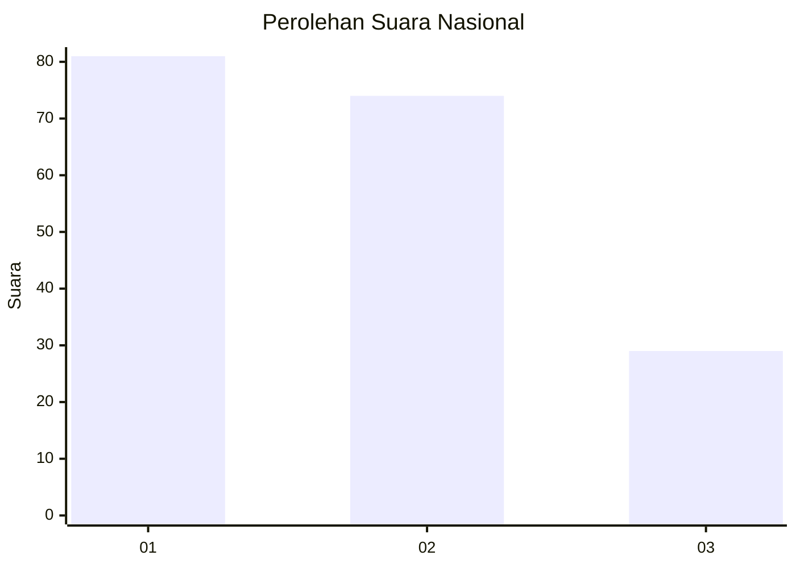
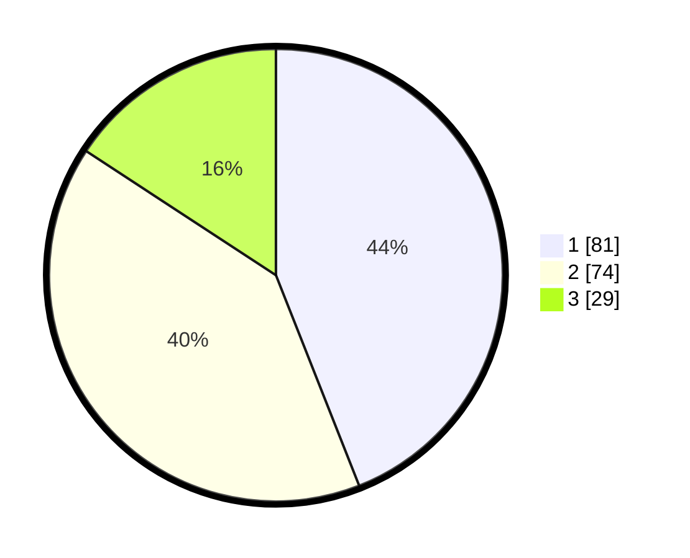

# Hasil

## Grafik

## Tabel

| No.    | Nama Paslon    | Suara | Suara (raw) | Persentase |
|:------ |:-------------- | -----:| -----------:| ----------:|
| 100025 | ANIES MUHAIMIN | 81    | [81][p-1]   | 44,02      |
| 100026 | PRABOWO GIBRAN | 74    | [74][p-2]   | 40,22      |
| 100027 | GANJAR MAHFUD  | 29    | [29][p-3]   | 15,76      |

[p-1]: https://github.com/gigit-pemilu/pemilu-2024/blob/main/pilpres/hitung-suara/sub/31-dki-jakarta/sub/74-jakarta-selatan/sub/05-kebayoran-lama/sub/1005-grogol-selatan/sub/022-tps/sub/paslon-1.txt
[p-2]: https://github.com/gigit-pemilu/pemilu-2024/blob/main/pilpres/hitung-suara/sub/31-dki-jakarta/sub/74-jakarta-selatan/sub/05-kebayoran-lama/sub/1005-grogol-selatan/sub/022-tps/sub/paslon-2.txt
[p-3]: https://github.com/gigit-pemilu/pemilu-2024/blob/main/pilpres/hitung-suara/sub/31-dki-jakarta/sub/74-jakarta-selatan/sub/05-kebayoran-lama/sub/1005-grogol-selatan/sub/022-tps/sub/paslon-3.txt

## Foto C Plano

https://sirekap-obj-formc.kpu.go.id/267c/pemilu/ppwp/31/74/05/10/05/3174051005022-20240214-222401--b2112781-0860-47ce-a7ef-dda833cd10ed.jpg

https://sirekap-obj-formc.kpu.go.id/267c/pemilu/ppwp/31/74/05/10/05/3174051005022-20240214-222634--91c2ded2-bb1a-49b0-ba3c-0f9f3a545123.jpg

https://sirekap-obj-formc.kpu.go.id/267c/pemilu/ppwp/31/74/05/10/05/3174051005022-20240214-222828--42e1b1b9-c5bd-4233-bfec-db1a98c3c5a1.jpg

## Metadata

| Key        | Value               |
| ---------- | ------------------- |
| Time Stamp | 2024-02-16 17:00:00 |

