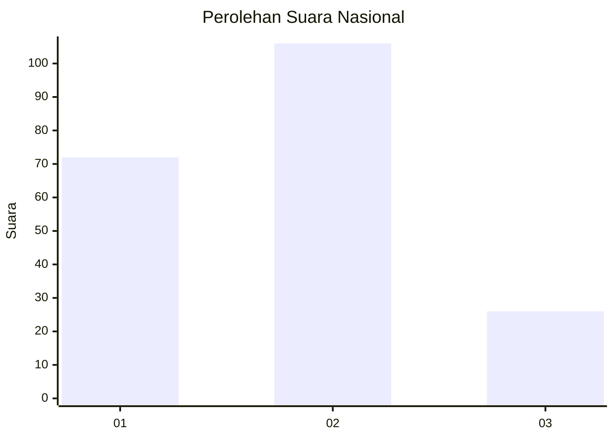
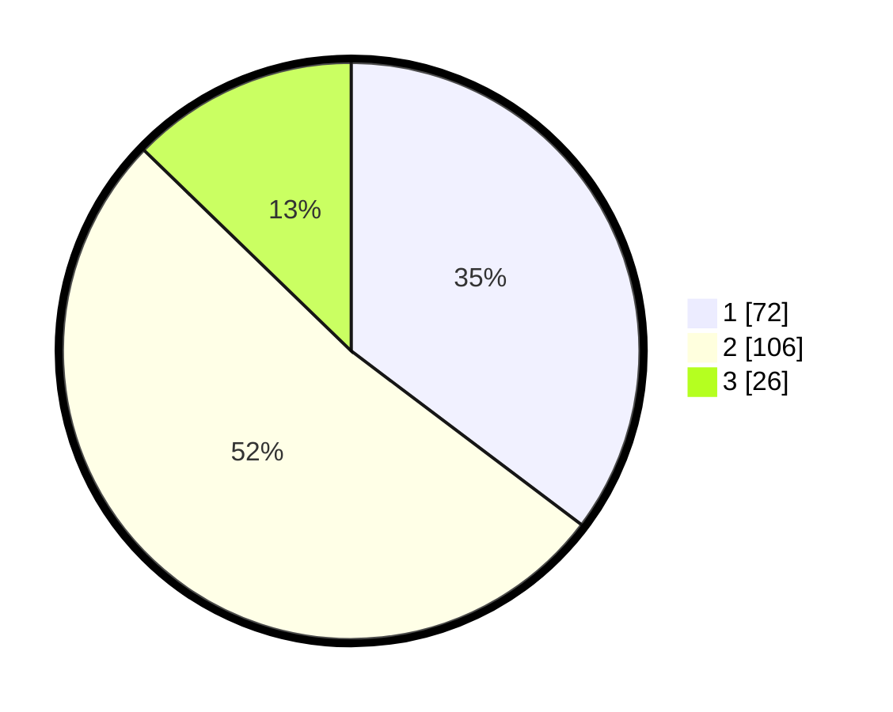

# Hasil

## Grafik

## Tabel

| No.    | Nama Paslon    | Suara | Suara (raw) | Persentase |
|:------ |:-------------- | -----:| -----------:| ----------:|
| 100025 | ANIES MUHAIMIN | 72    | [72][p-1]   | 35,29      |
| 100026 | PRABOWO GIBRAN | 106   | [106][p-2]  | 51,96      |
| 100027 | GANJAR MAHFUD  | 26    | [26][p-3]   | 12,75      |

[p-1]: https://github.com/gigit-pemilu/pemilu-2024/blob/main/pilpres/hitung-suara/sub/31-dki-jakarta/sub/74-jakarta-selatan/sub/05-kebayoran-lama/sub/1005-grogol-selatan/sub/023-tps/sub/paslon-1.txt
[p-2]: https://github.com/gigit-pemilu/pemilu-2024/blob/main/pilpres/hitung-suara/sub/31-dki-jakarta/sub/74-jakarta-selatan/sub/05-kebayoran-lama/sub/1005-grogol-selatan/sub/023-tps/sub/paslon-2.txt
[p-3]: https://github.com/gigit-pemilu/pemilu-2024/blob/main/pilpres/hitung-suara/sub/31-dki-jakarta/sub/74-jakarta-selatan/sub/05-kebayoran-lama/sub/1005-grogol-selatan/sub/023-tps/sub/paslon-3.txt

## Foto C Plano

https://sirekap-obj-formc.kpu.go.id/160a/pemilu/ppwp/31/74/05/10/05/3174051005023-20240214-194924--eaa804f0-99fe-4a2f-9ce9-c465f4c37468.jpg

https://sirekap-obj-formc.kpu.go.id/160a/pemilu/ppwp/31/74/05/10/05/3174051005023-20240214-194927--cd3059cf-5a59-4cc2-a331-eabfb9364c47.jpg

https://sirekap-obj-formc.kpu.go.id/160a/pemilu/ppwp/31/74/05/10/05/3174051005023-20240214-194931--548b0877-add0-4870-95b3-3eac820df3a0.jpg

## Metadata

| Key        | Value               |
| ---------- | ------------------- |
| Time Stamp | 2024-02-24 22:31:28 |

